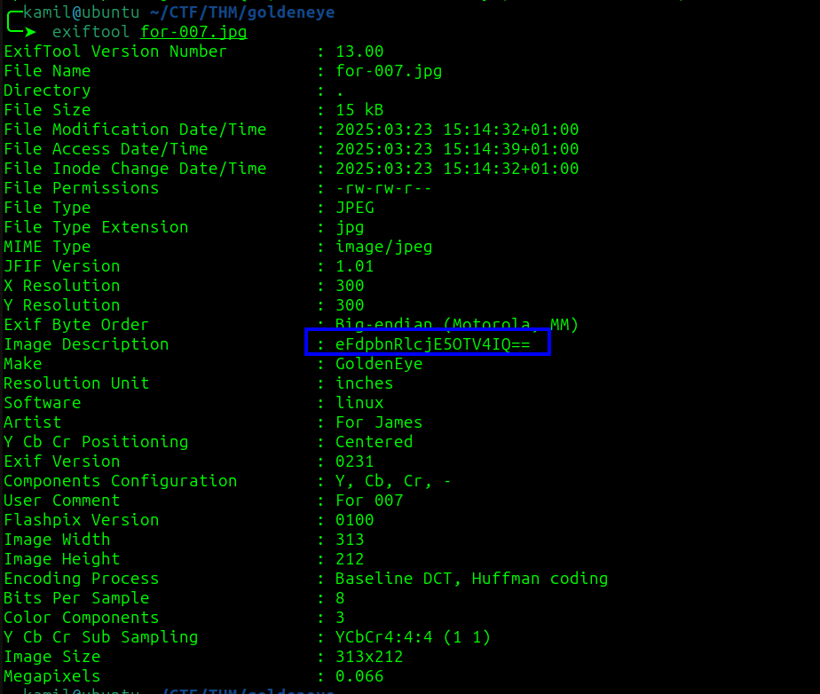

# GoldenEye CTF - TryHackMe Room
# **!! SPOILERS !!**
#### This repository documents my walkthrough for the **GoldenEye** CTF challenge on [TryHackMe](https://tryhackme.com/room/goldeneye). 
---

after scanning we see 4 open ports 25, 80, 55006, 55007


we can find interesting comment by going to `/terminal.js`, we also know about default password and encoded password, also there could be users `Boris` and `Natalya`


```
//
//Boris, make sure you update your default password. 
//My sources say MI6 maybe planning to infiltrate. 
//Be on the lookout for any suspicious network traffic....
//
//I encoded you p@ssword below...
//
//&#73;&#110;&#118;&#105;&#110;&#99;&#105;&#98;&#108;&#101;&#72;&#97;&#99;&#107;&#51;&#114;
//
//BTW Natalya says she can break your codes
//
```
we also know about `/sev-home/` login form


after decoding password from comment (its HTML entities) we got `InvincibleHack3r`

now we can log into the website, and we got information about pop3 service

after running more precise nmap scan we know that pop3 service is running on port 55007


i tried to login as boris with the same credentials but they doesnt seem to work, tryhackme suggest using hydra

i was stuck here for a while because `rockyou.txt` doesnt seem to work but i was sure we need to use brute-force, i used `fasttrack.txt` and it worked

```
hydra -l boris -P /usr/share/wordlists/fasttrack.txt pop3://10.10.166.110:55007 -v -t 64
```


after logging to pop3 as boris we see 3 emails


we can harvest few users: root, boris, natalya, alec, janus, Xenia

now using the hydra with all the users

```
hydra -L users -P /usr/share/wordlists/fasttrack.txt pop3://10.10.166.110:55007 -v -t 64
```


we first found natalya password

now we see 2 emails in natalya account

by looking at the mails we probably found another user credentials


now we need to follow steps on tryhackme, adding `severnaya-station.com` to /etc/hosts an visiting `http://severnaya-station.com/gnocertdir`

there is a moodle on the site and we can login as xenia !


after looking around moodle we found new users: admin and doak


trying to brute-force pop3 login once again, this time as doak

```
hydra -l doak -P /usr/share/wordlists/fasttrack.txt pop3://10.10.166.110:55007 -v -t 64
```


it worked, now we can login as doak to pop3, we have another set of credentials


we found a s3cret.txt in private files, from the file we know about another web location: `/dir007key/for-007.jpg`


after downloading the image we can use exiftool to find base64 encoded Image Description 



that looks like encoded password

now we can login as admin into moodle

now as admin we are told to examine Aspell plugin, we can add our command to execute our reverse shell instead and we also need to change the spellcheck engine, then we need to trigger the spell check


we can go to `My profile > Blogs > Add a new entry` and click on this button 


now we have shell as `www-data`


the kernel version is `3.13.0-32-generic`

now we can run linpeas


we need to use this exploit : `https://www.exploit-db.com/exploits/37292`


before transferring the file to victim we need to change the gcc to cc compiler


then we need to use

```
$ cc 37292.c -o ofs
$ ./ofs
```

we got root shell and found root flag


# MACHINE PWNED

