# Include CTF - TryHackMe Room
# **!! SPOILERS !!**
#### This repository documents my walkthrough for the **Include** CTF challenge on [TryHackMe](https://tryhackme.com/room/include). 
---

we see open ports: 110, 25, 22, 143, 995, 993, 4000 and 50000

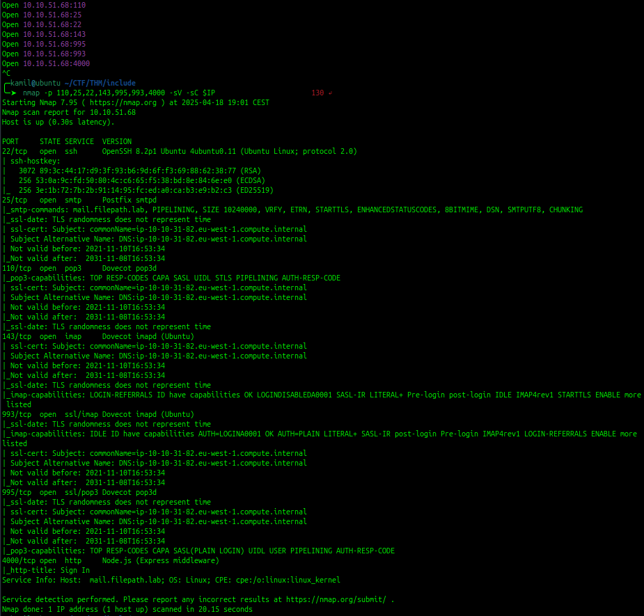

on port 4000 we see login page with some provided credentials guest:guest

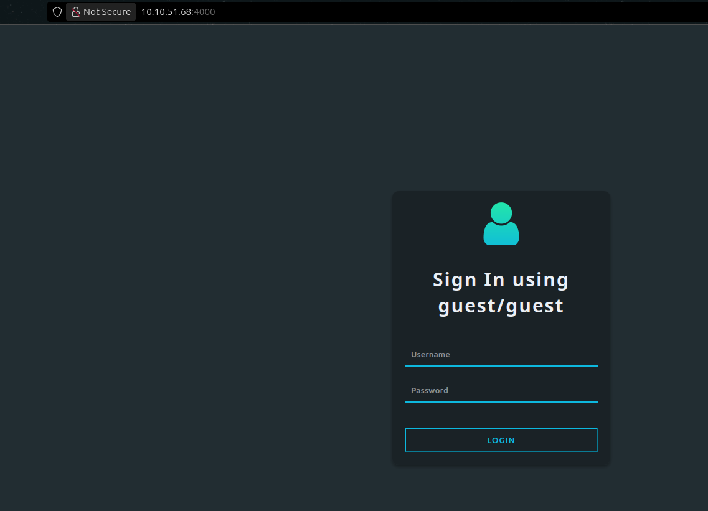

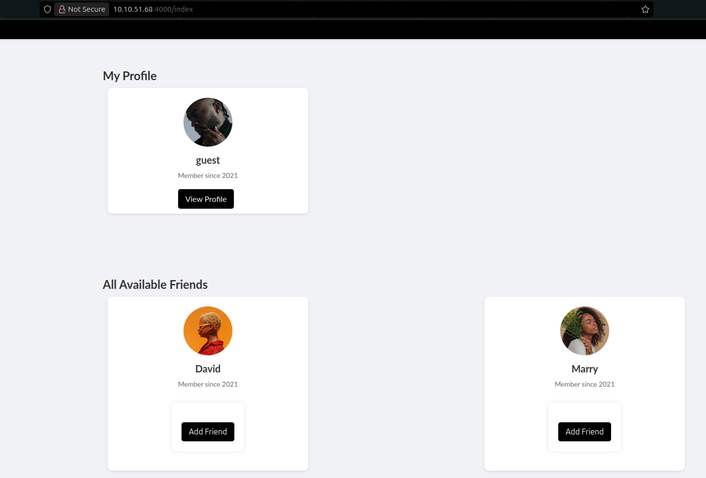

we see that we can `Recommend an Activity to guest` and that will add another detail to our profile like `f:"f"` 

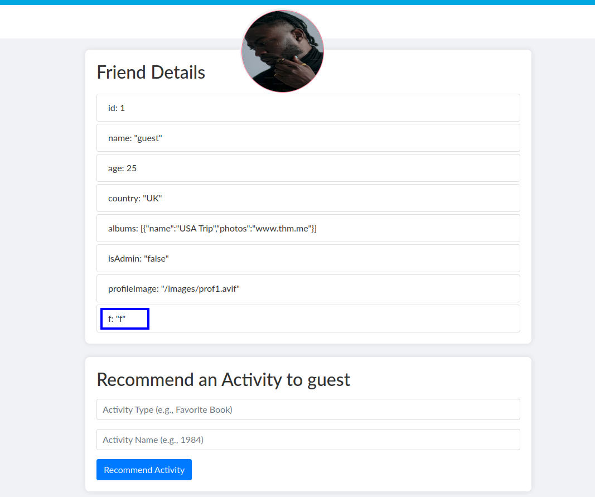

we see a isAdmin attribute, if we insert a new recomendation like `isAdmin true` it will overwrite false value, we can also do that to other accounts

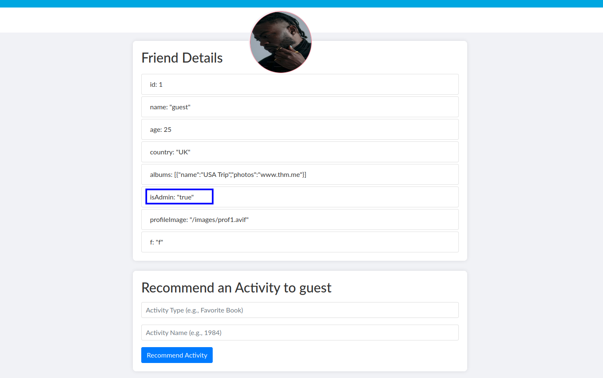

we also see(because we are now the admin) the API tab where we can see the other api calls that we can make

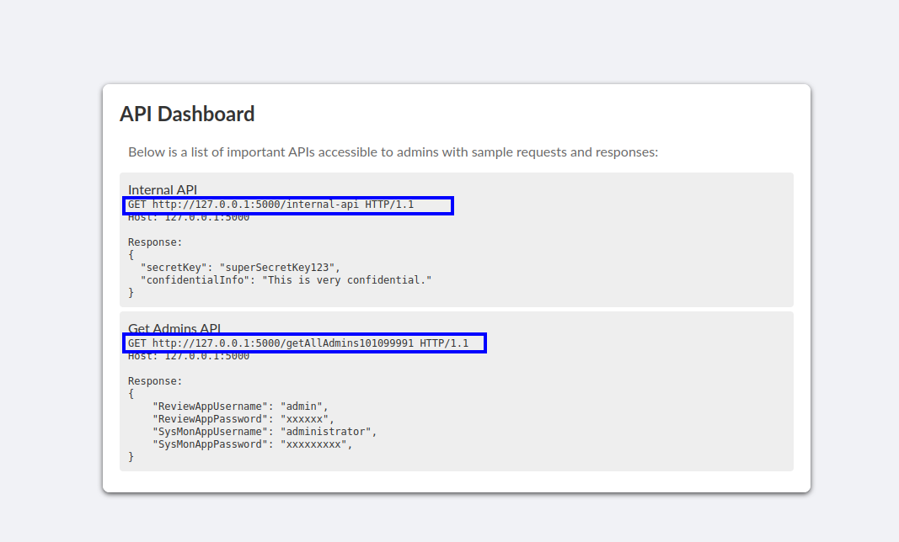

in settings we see a possibilty to update banner image by providing url

we now can try to access internal api by using url for localhost 127.0.0.1

the site returned some base64 encoded data by using `http://127.0.0.1:5000/internal-api`

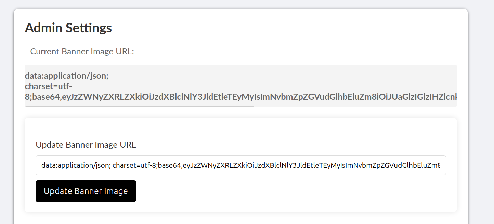

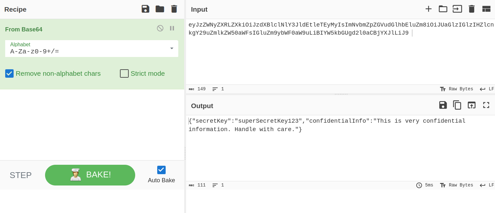

now by inputing: `http://127.0.0.1:5000/getAllAdmins101099991`, we got some more  interesting info

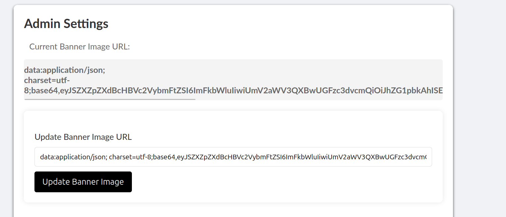

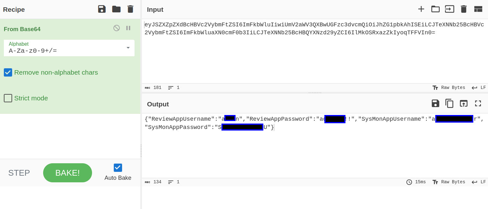

now we have credentials to SysMon on port 50000 and we got first flag

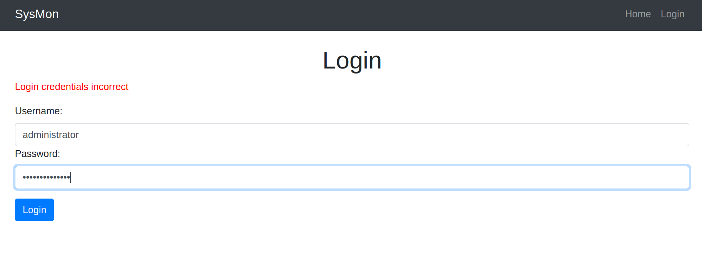

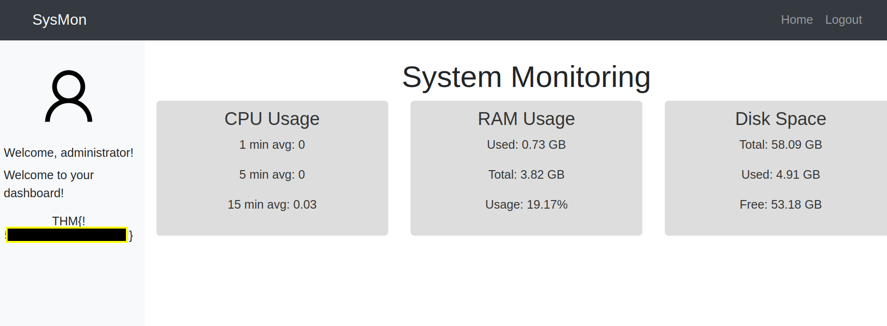

by inspecting the source code of the dashboard we see potential LFI factor in img src, to get the image the website uses get parameter, we can use ZAP proxy to fuzz for LFI

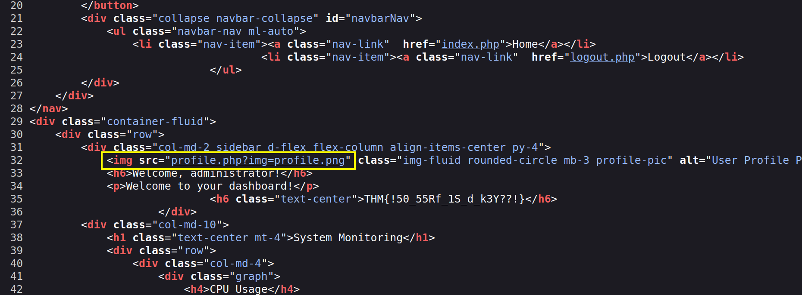

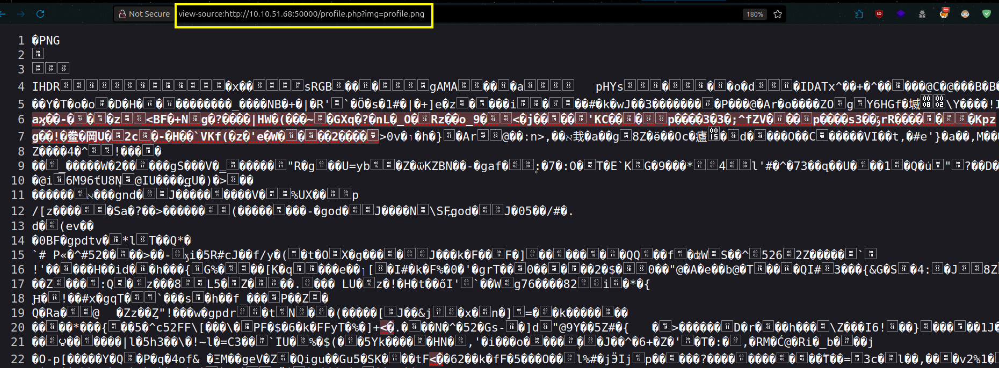

here is working payload for /etc/passwd

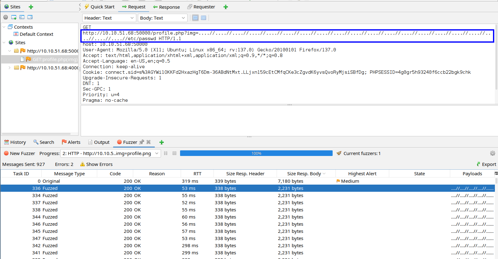

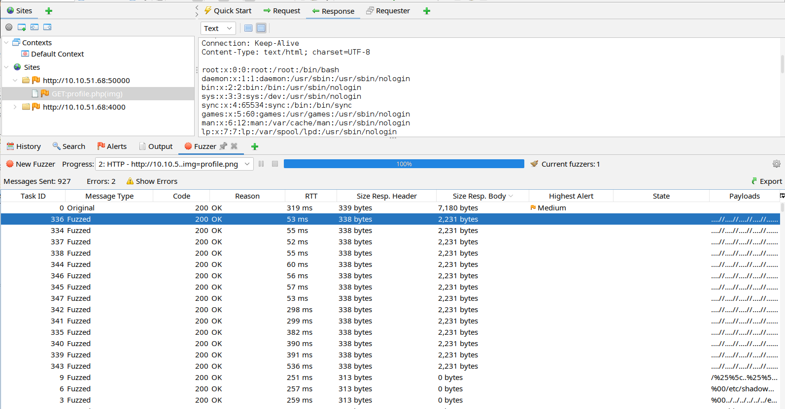

from /etc/passwd we know about users: charles and joshua

i couldnt find their ssh private keys so i tried hydra

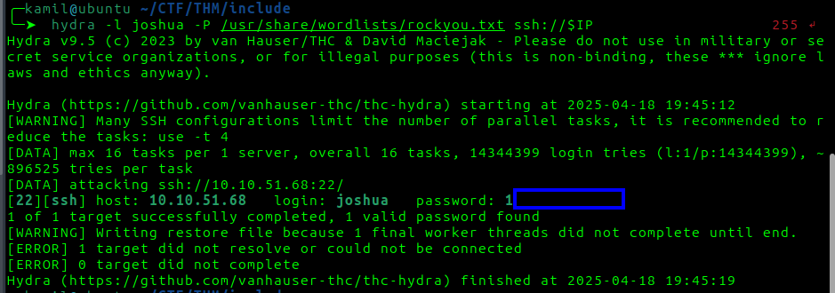

now we have user access 

we need to find hidden file in /var/www/html

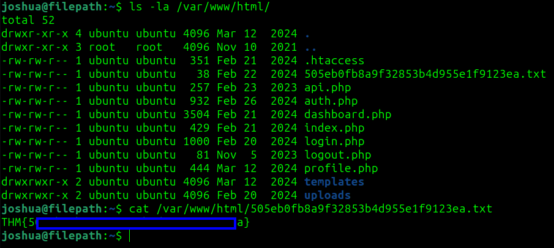

# FLAGS OBTAINED
