# Lian_Yu CTF - TryHackMe Room
# **!! SPOILERS !!**
#### This repository documents my walkthrough for the **Lian_Yu** CTF challenge on [TryHackMe](https://tryhackme.com/room/lianyu). 
---


found 3 open ports 21, 22, 80

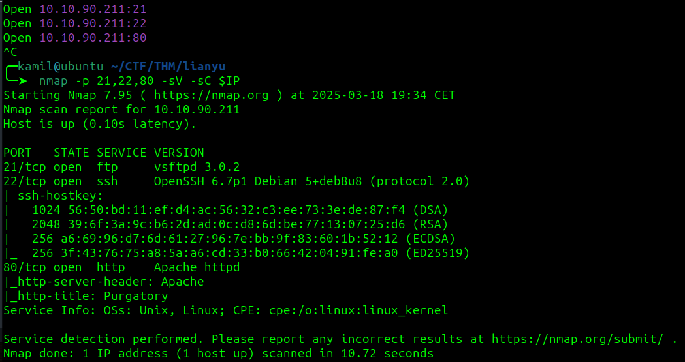

using feroxbuster to find hidden files

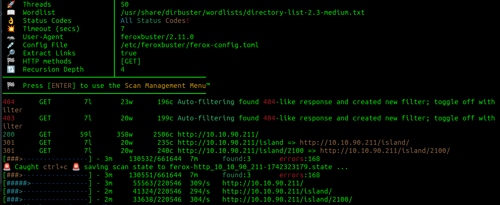

we found `/island` and `/island/2100`

we found `vigilante` code word and its valid login for ftp , now we need to find a password

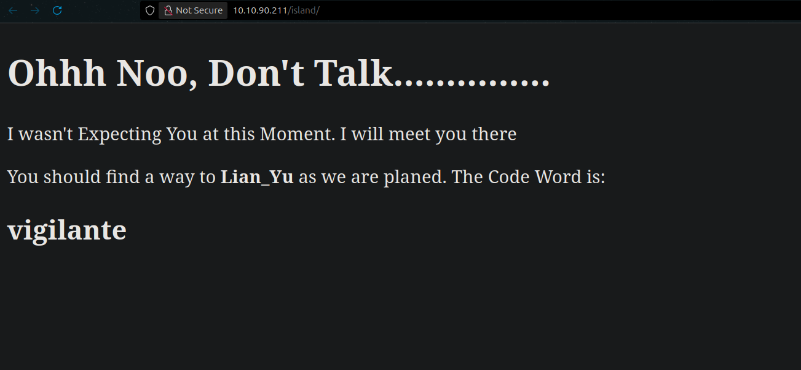

we see info about `.ticket` file, I will use ffuf to try to find this file

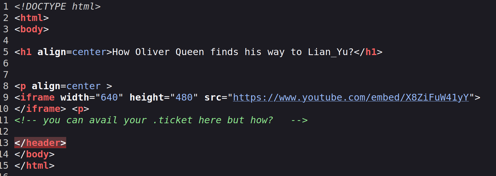

```
ffuf -w /usr/share/dirbuster/wordlists/directory-list-2.3-small.txt:FUZZ -u http://$IP/island/2100/FUZZ.ticket 
```

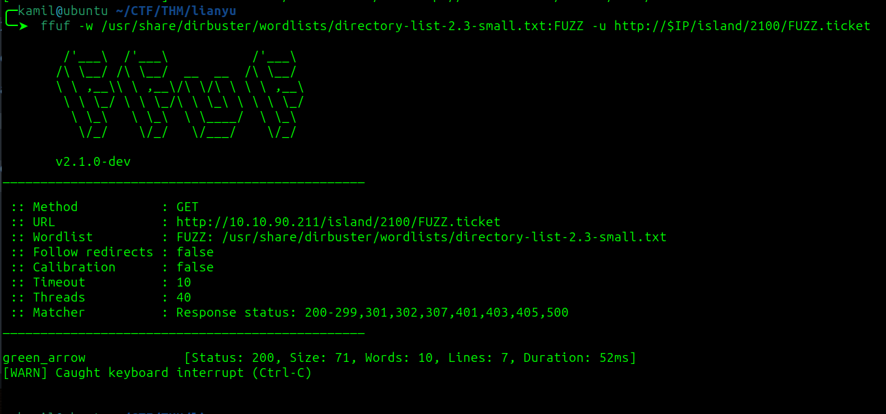

we found token, we got hint that the password might be base ecoded, i tested on cyberchef and found that ic could be base58

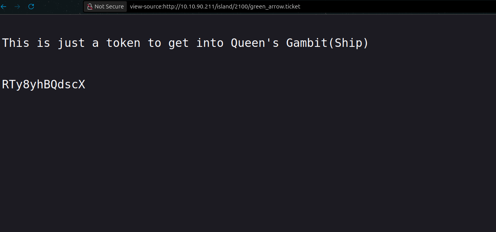

we can login to ftp now, and we found 3 files image

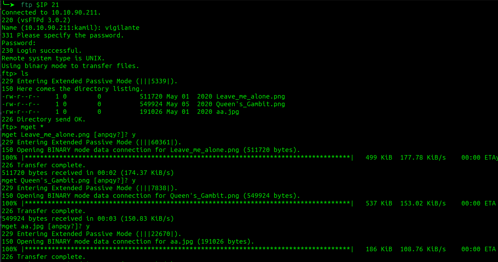

i also checked the folder parent folder in ftp `cd ..` and found 2 directories, one looks like the user we logged as and there is another now, maybe it will be our ssh login for next steps `slade`

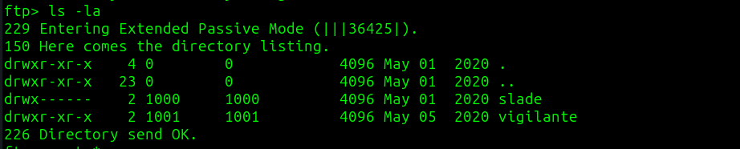

the `Leave_me_alone.png` was corupted, i used ghex to change the first bytes to match correct png standard, now we can open png as normal image

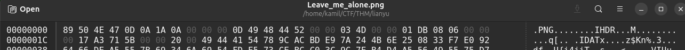

now we have password for something

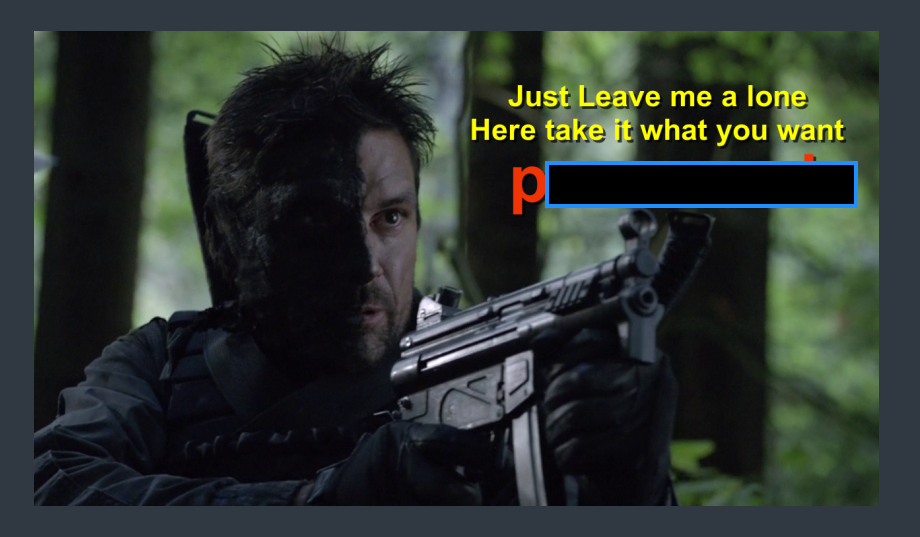

`.jpg` file stands out because you cant hide files inside png files with steghide

after using 

```
steghide extract -sf aa.jpg 
```

we found hidden `ss.zip` zip file

after extracting we found the hidden file name : shado, containing probably a password

we got user access and found user flag

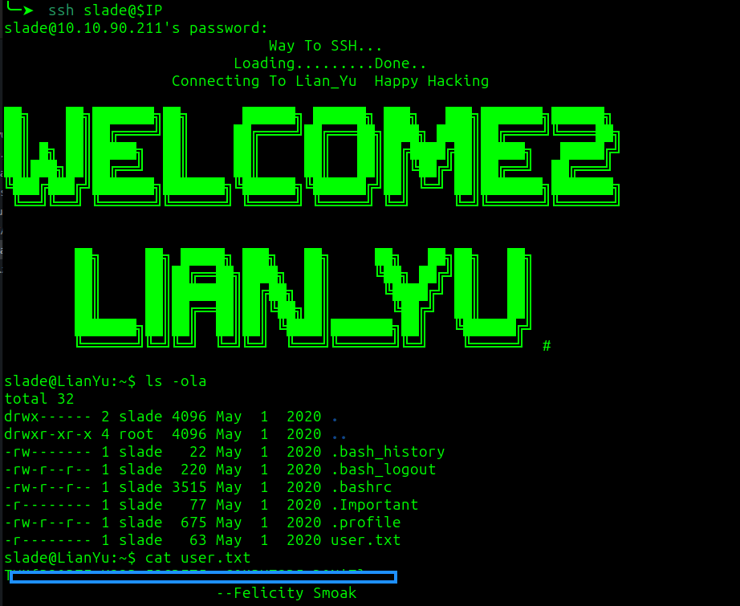

checking `sudo -l` and we might found our PE factor

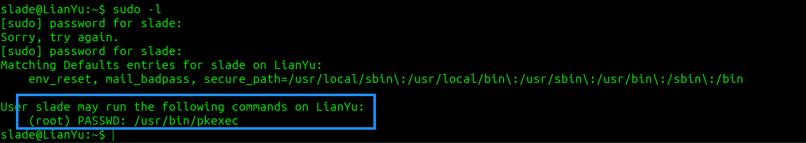

after checking GTFObins and using this one-liner

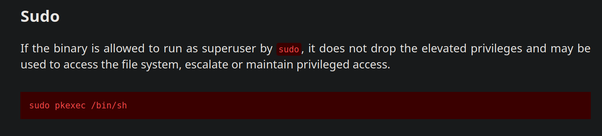

```
sudo /usr/bin/pkexec /bin/bash 
```

we have root access and root flag

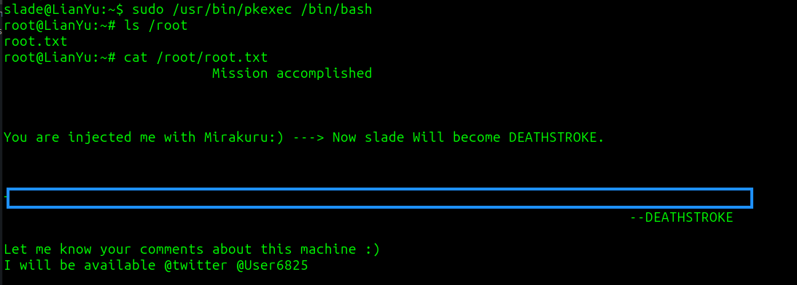

# MACHINE PWNED
