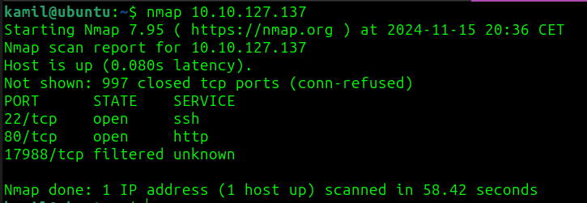
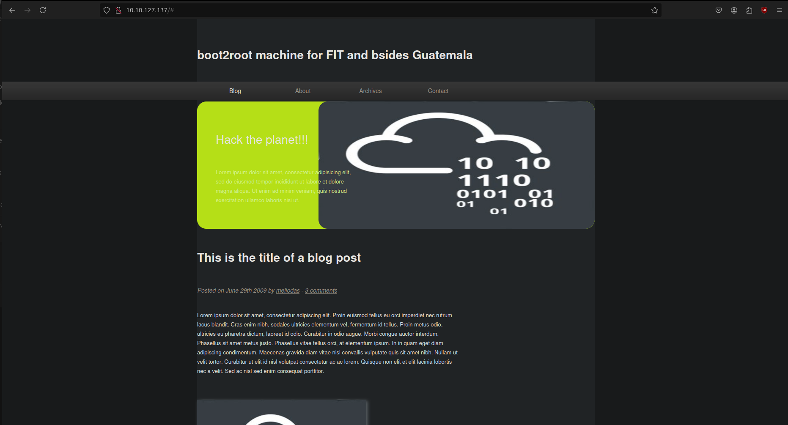
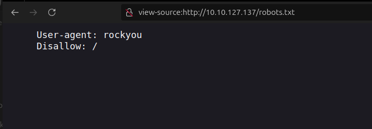
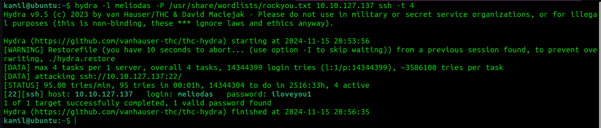
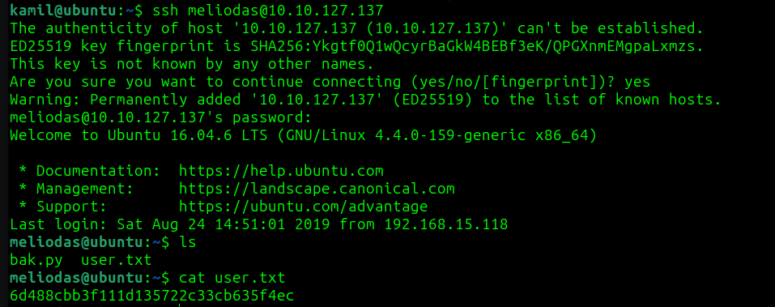
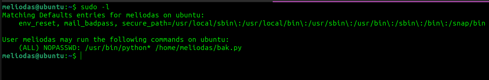
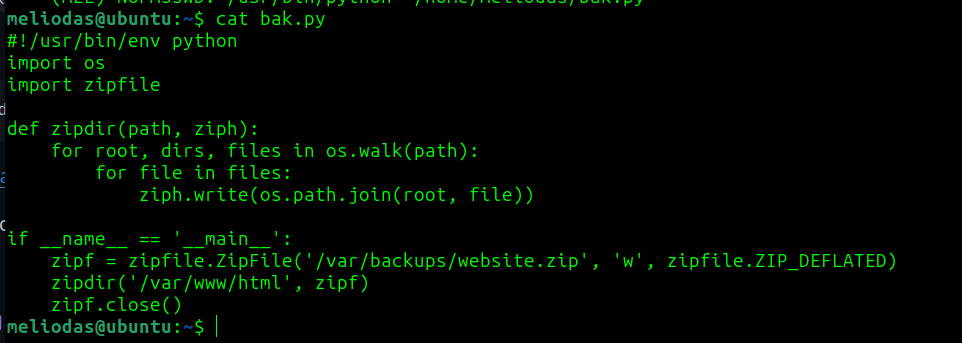
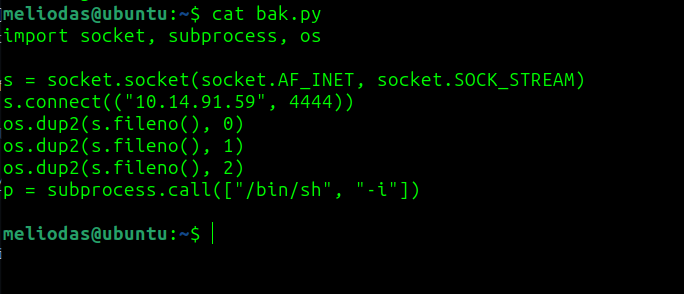
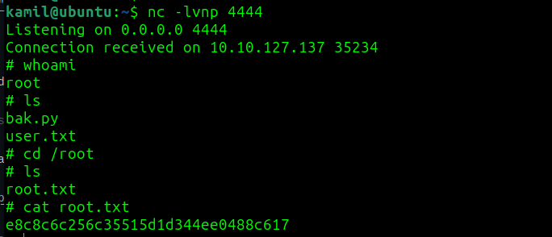

# Library CTF - TryHackMe Room
# **!! SPOILERS !!**
#### This repository documents my walkthrough for the **Library** CTF challenge on [TryHackMe](https://tryhackme.com/r/room/bsidesgtlibrary). 
---

Nmap scan




`22 ssh` and `80 http` ports open

Main page: 



`Robots.txt`:



`Rockyou` string might suggest easy crackable password

I will try to use `hydra` to try to login to `ssh` as meliodas

```
hydra -l meliodas -P /usr/share/wordlists/rockyou.txt 10.10.127.137 ssh -t 4
```



Hydra found a password : `iloveyou1`

SSH connection:




> [!IMPORTANT]
> `Meliodas` password : `iloveyou1`
> 
> First flag from `user.txt` : `6d488cbb3f111d135722c33cb635f4ec`

Using `sudo -l` to gain more info



The output of `sudo -l` shows that the user `meliodas` can run any Python interpreter `(/usr/bin/python*)` with the script `/home/meliodas/bak.py` as sudo without needing a password, potentially enabling privilege escalation if the script is modifiable.

`Bak.py`:



New `bak.py` will generate a `reverse shell` as `root`




Remember to use your own machine (the attacker) IP address and not the target machine in python script

Spawning reverse shell

```
sudo /usr/bin/python3 /home/meliodas/bak.py 
```
Root access and flag: 




> [!IMPORTANT]
> Second flag from `root.txt` : `e8c8c6c256c35515d1d344ee0488c617`

# MACHINE PWNED
