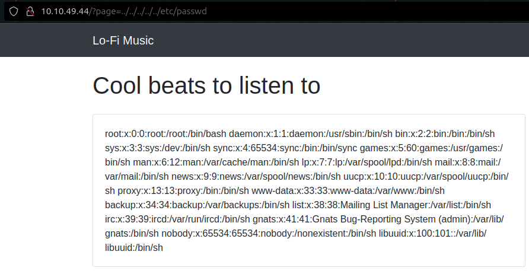
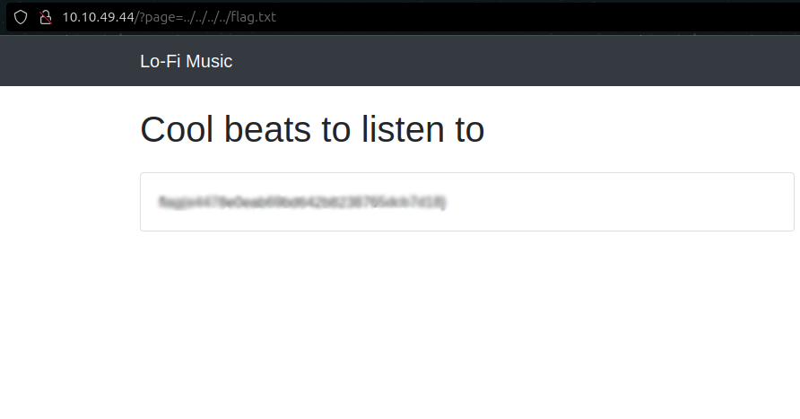

# Lo-Fi CTF - TryHackMe Room
# **!! SPOILERS !!**
#### This repository documents my walkthrough for the **Lo-Fi** CTF challenge on [TryHackMe](https://tryhackme.com/room/lofi). 
---
This is very simple task, we know that the website is vulnerable to **Path Traversal** and **Local File Inclusion (LFI)**. We also know that the flag is located at the root of the filesystem /

We can test for LFI by using simple trick

```
?page=../../../../../etc/passwd
```



Now we just need to change the page parameter to get the flag

```
?page=../../../../flag.txt
```



# FLAG OBTAINED
