# Looking Glass CTF - TryHackMe Room
# **!! SPOILERS !!**
#### This repository documents my walkthrough for the **Looking Glass** CTF challenge on [TryHackMe](https://tryhackme.com/room/lookingglass). 
---


after running a quick scan we see open port 22 for ssh and a lot of other open ports most of this ports are `Dropbear sshd`

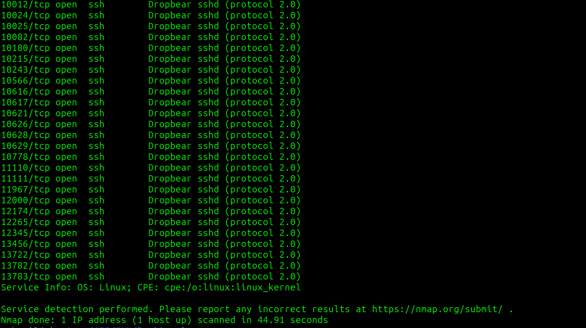

if we try to connect to for example to port 12000 we got note Higher 


the notes are reversed: if note says higher -> look for smaller port

```
ssh ssh-rsa@10.10.178.157 -p 12000 -oHostKeyAlgorithms=+ssh-rsa
```

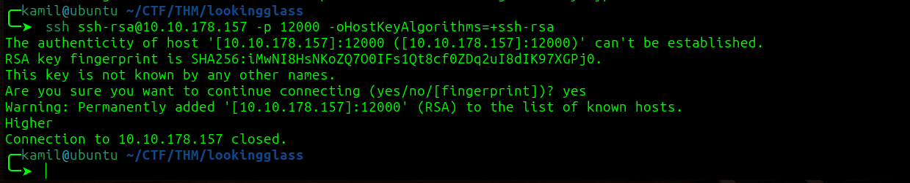

we need to find the right port using binary search, for me the working port was 11482, we see some text that looks like a poem

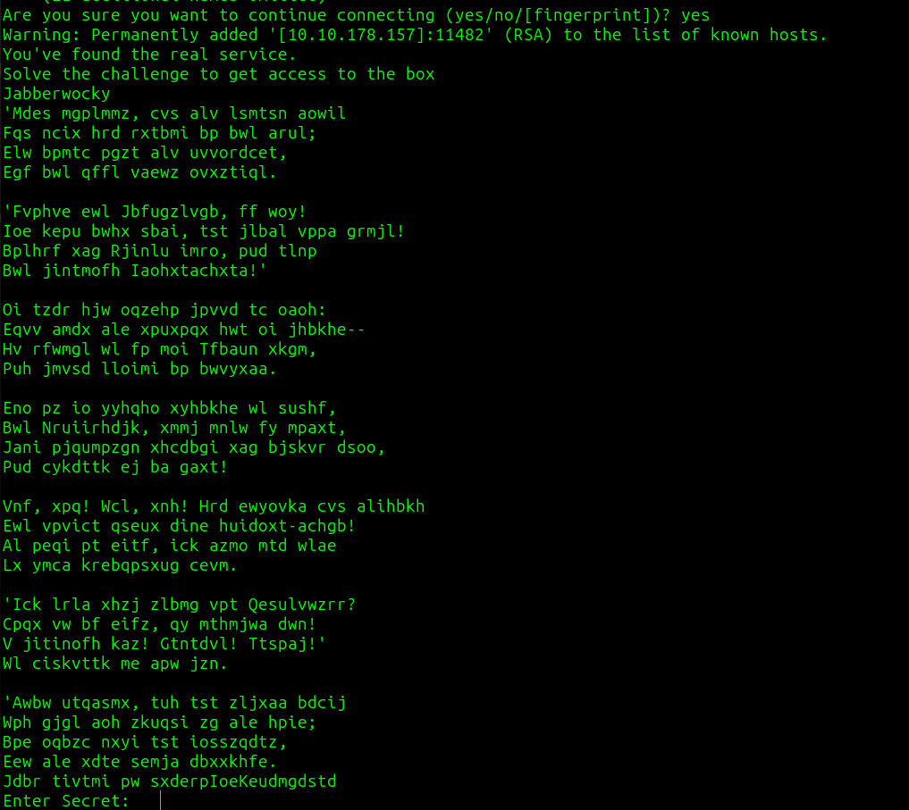

by using dcode we know this is vigenere cipher, i used this site `https://www.guballa.de/vigenere-solver` to decode the message

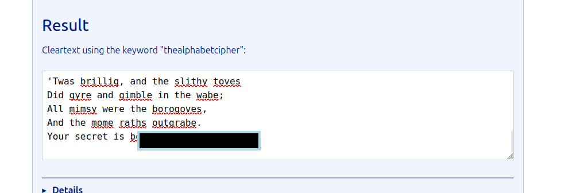

after inputing our secret we got credentials

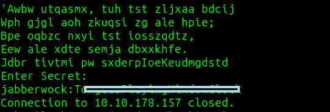

they worked and now we have user access and user flag that we have to unscramble 

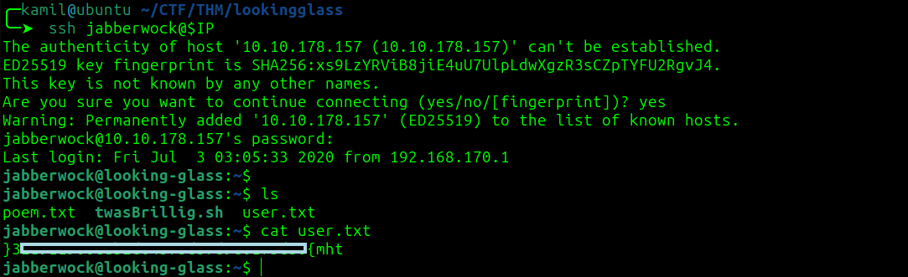

we see a few other users such as: alice, humptydumpty, tweedledee, tweedledum

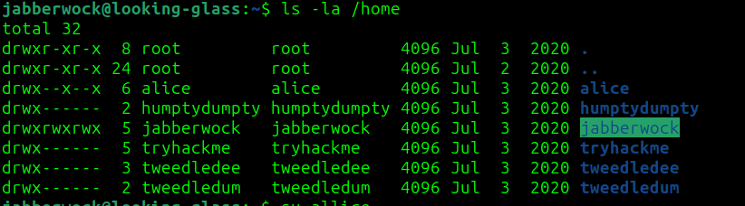

after looking at cron we see that the script will be executed as other user after reboot

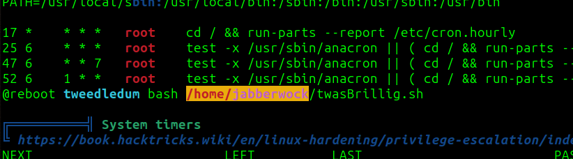

I'm putting the reverse shell into our script to gain shell as another user 

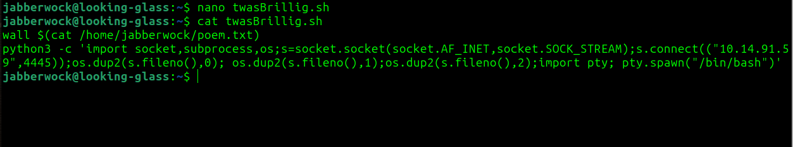

we also know about this sudo -l output, so we will be able to run `sudo /sbin/reboot` with no password

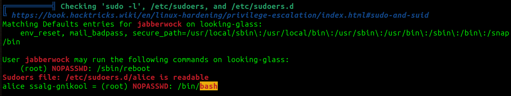

now we have to use `sudo /sbin/reboot`

we got shell as tweedledum

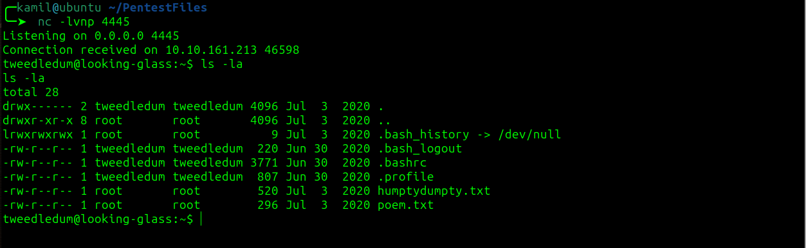

we see a humptydumpty.txt containing few hash values

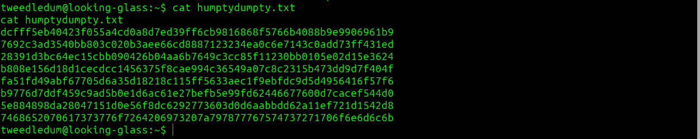

after using crackstation we got a hint `maybe one of these is the password` and one unknown hash

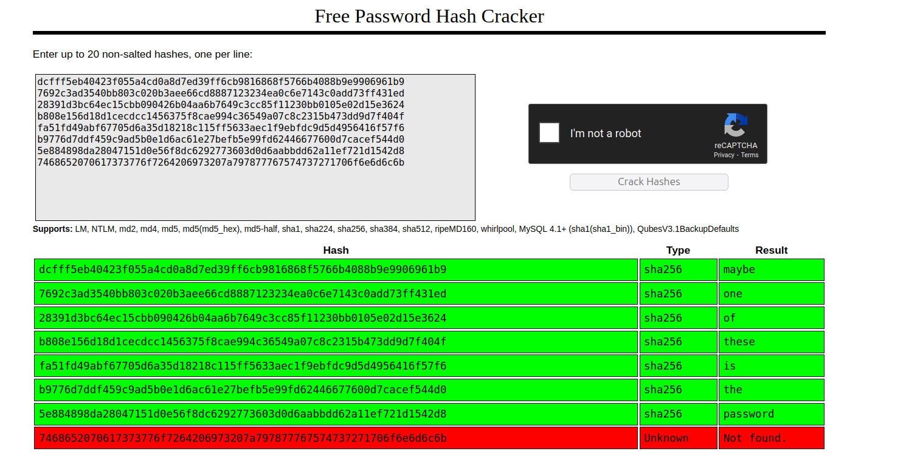

the last hash is just a hex value that gives plain text password 

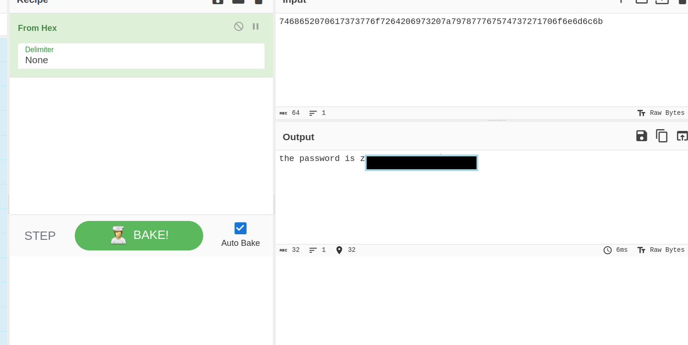

now we can switch user to humptydumpty

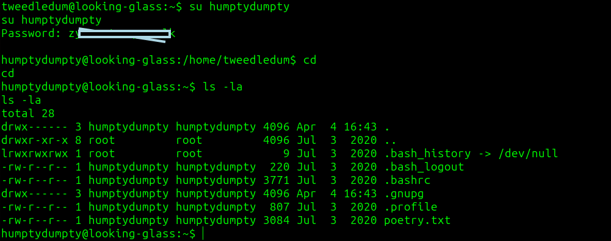

we can also just grab alice `/.ssh/id_rsa`, alice home folder has x permissions


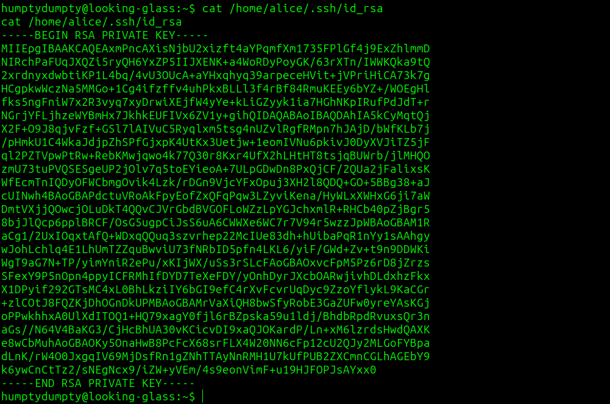

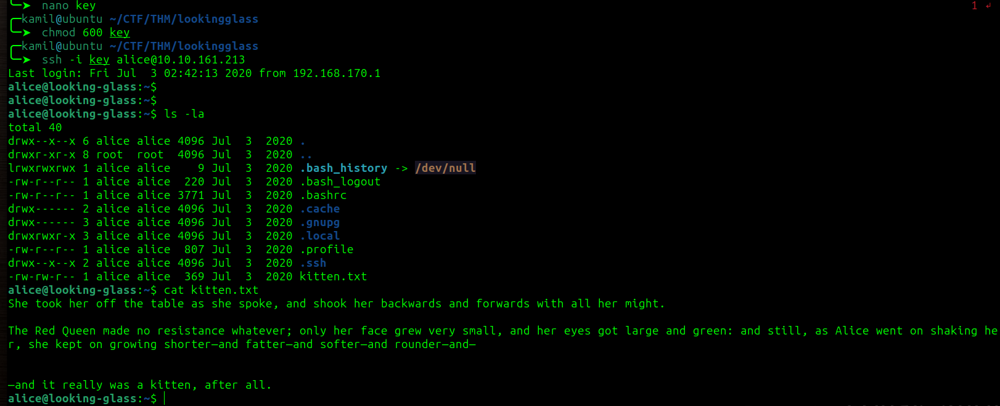

after inspecting the linpeas output we know that we can run `sudo /bin/bash` as alice on host ssalg-gnikool


now we can just use 

```
sudo -h ssalg-gnikool /bin/bash
``` 

now we have root access and root shell

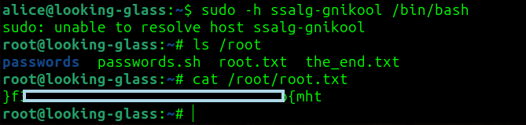

# MACHINE PWNED
