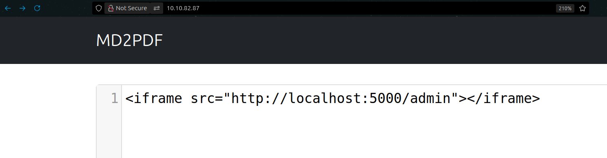

# MD2PDF CTF - TryHackMe Room
# **!! SPOILERS !!**
#### This repository documents my walkthrough for the **MD2PDF** CTF challenge on [TryHackMe](https://tryhackme.com/room/md2pdf). 
---

we see open ports 22, 80 and 5000


we can access the page on port 80, we see markdown to pdf converter


we can try to input some html tags to see the result (it is possible to use html tags in markdown)

i tried

```
<b>ttt</b>
<i>ttt</i>
ttt
```


it works


from ferobuster scan we see directory /admin


if we try to access /admin we see error saying that this page can only be seen by accessing localhost:5000


we can use iframe tag to see the content of /admin 

```
<iframe src="http://localhost:5000/admin"></iframe>
```



it works and we see the flag


# FLAG OBTAINED
