# Madness CTF - TryHackMe Room
# **!! SPOILERS !!**
#### This repository documents my walkthrough for the **Madness** CTF challenge on [TryHackMe](https://tryhackme.com/room/madness). 
---


after scanning we know about 2 open ports 80 and 22

there is default Apache page but with the twist, we can see hidden comment and photo

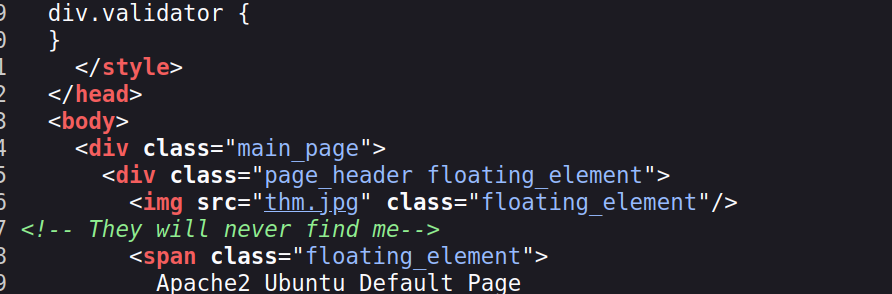

the picture cant be displayed because it contains errors

the file has extension .jpg but starts with hex values for png, using ghex to edit header to jpg

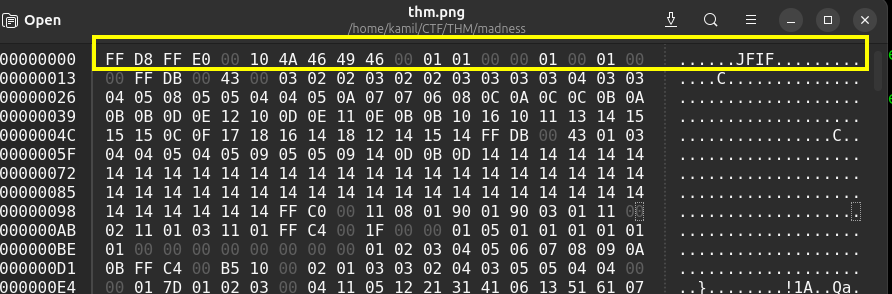

in the picture we see the name of hidden directory 

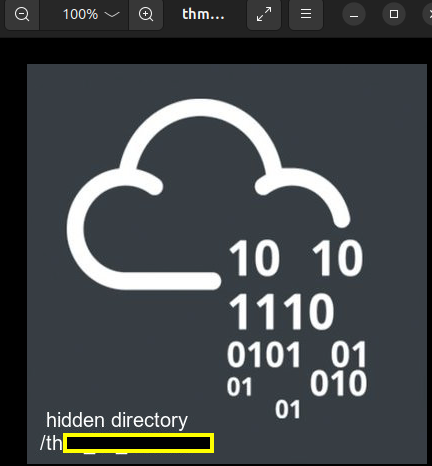

we need to find the secret which is a number between 0 and 99

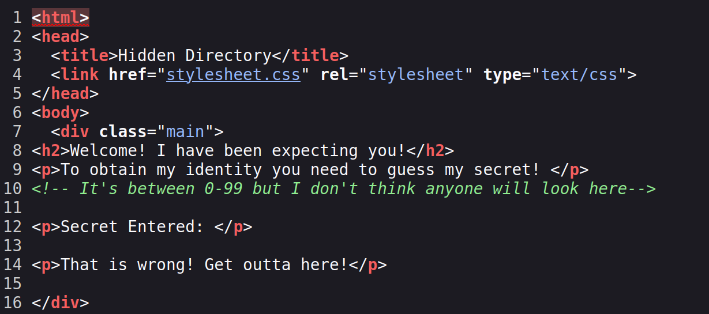

the secret is sent via get parameter `?secret=1`

by using ZAP fuzzer i found that the secret code is 73 because the body response is longer than others

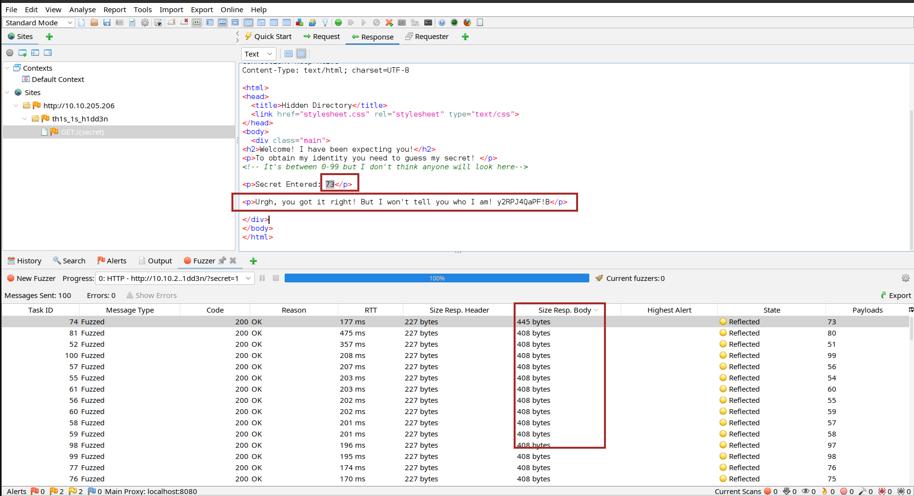

we found secret message

`<p>Urgh, you got it right! But I won't tell you who I am! y2RPJ4QaPF!B</p>
` 

i tested the weird string with cyberchef, dcode, and as another hidden directory, but didnt find nothing interesting, i scanned for other hidden directories with feroxbuster but with no success

i only got this page and the image so i decided to go back to it, maybe there is more info hidden and the string looks like it coulde be a password for hidden file inside the jpg image

```
steghide extract -sf thm.jpg
```

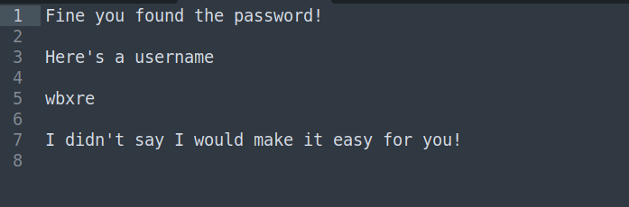

there was indeed hidden file containing username `wbxre` it translates to `joker` in ROT13 

ok so we got username, we need to find the password 

i was stuck for a while here, on the page challange page there is a note that we dont need to brute force the ssh login, so we must be missing something

here is the plot twist there is another image with hidden file, the image is hidden in the plain sight in the challange page on tryhackme, we can extract the file using steghide

```
steghide extract -sf 5iW7kC8.jpg
```

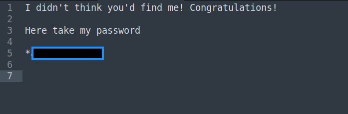


now we have password and we should be able to login via ssh 

we got user flag

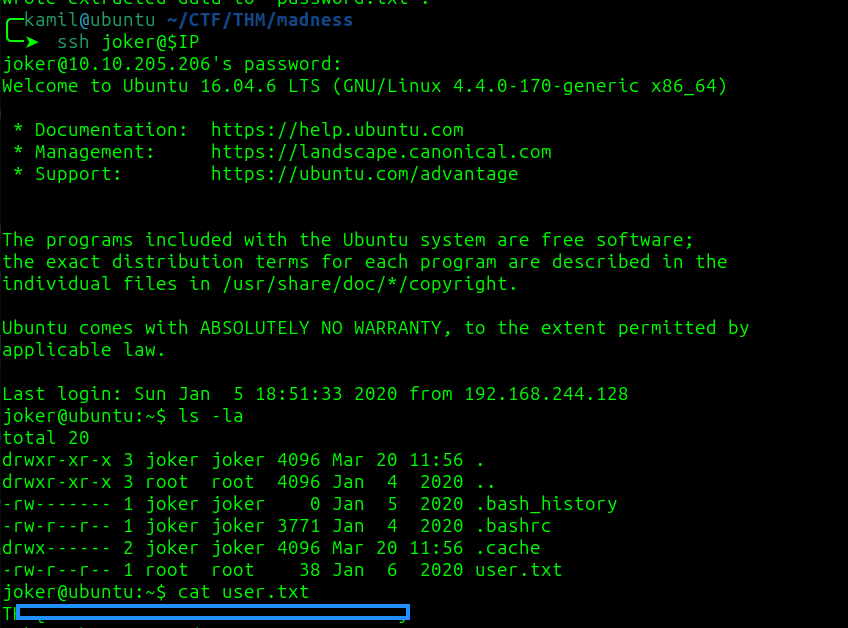

linpeas found some unknown SUID binaries, checking internet for exploit

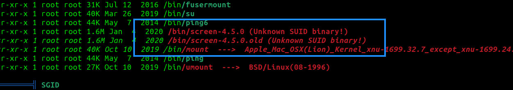

there is some code on exploit-db

i created the new file and copied the code from `https://www.exploit-db.com/exploits/41154`

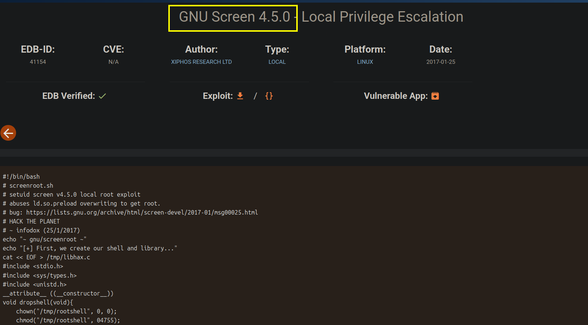

the whole process:

```
$ cd /tmp
$ touch root.sh
$ nano root.sh
$ chmod 777 root.sh
$ ./root.sh
```

now we got root access and root shell

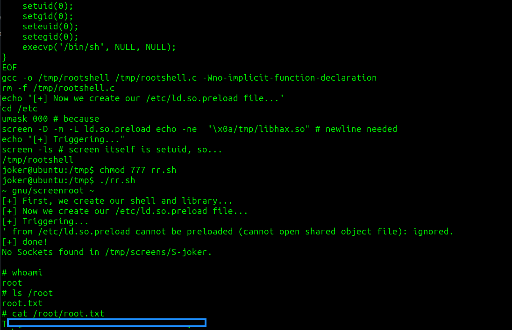

# MACHINE PWNED
