# Mnemonic CTF - TryHackMe Room
# **!! SPOILERS !!**
#### This repository documents my walkthrough for the **Mnemonic** CTF challenge on [TryHackMe](https://tryhackme.com/room/mnemonic). 
---

we see open ports 21, 80, and 1337

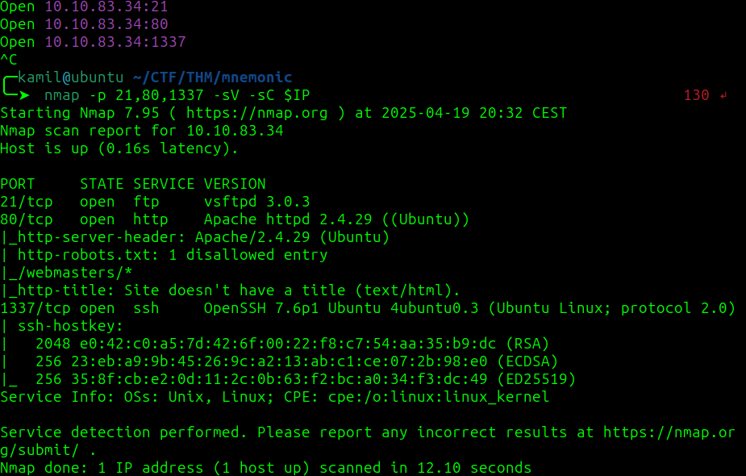

we see a robots.txt entry `/webmasters/*`

using feroxbuster to discover hidden folders

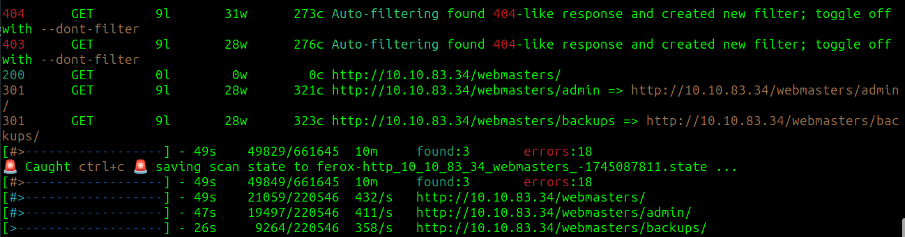

we found /admin and /backups

after scanning the /admin subfolder we found some files, but they arent helphul

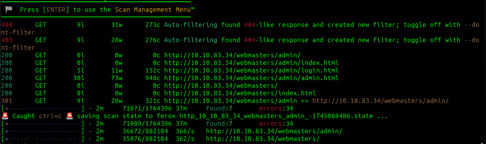

we need to find a hidden file with 3 letter extension so i tuned the feroxbuster to seek for txt, php, zip and log files, we found /webmasters/backups/backups.zip

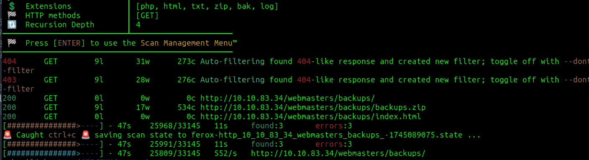

the zip file is password protected so we can use john to crack it 

```
$ zip2john backups.zip > hash.txt
$ john hash.txt --wordlist=/usr/share/wordlists/rockyou.txt
```

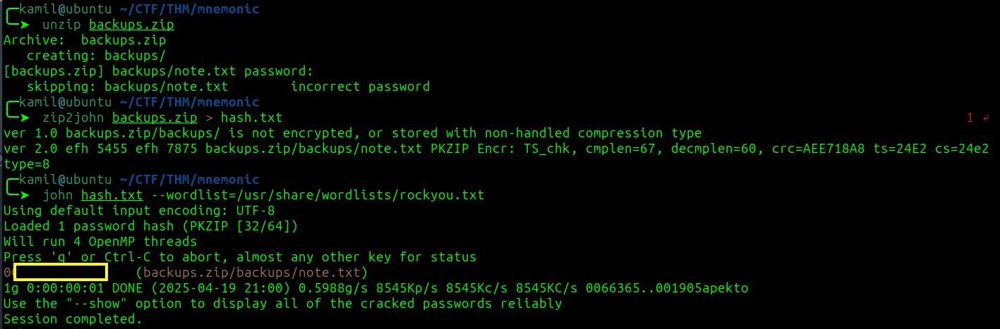

we found the note.txt inside, now we have username for ftp and we also need to find a password

using hydra to brute force password for ftp

```
hydra -l ftpuser -P /usr/share/wordlists/rockyou.txt ftp://$IP
```

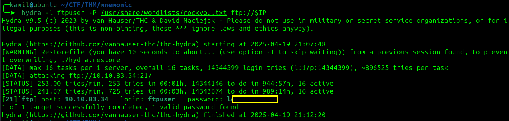

after logging into ftp we see few folders, but the data-4 seems to stand out

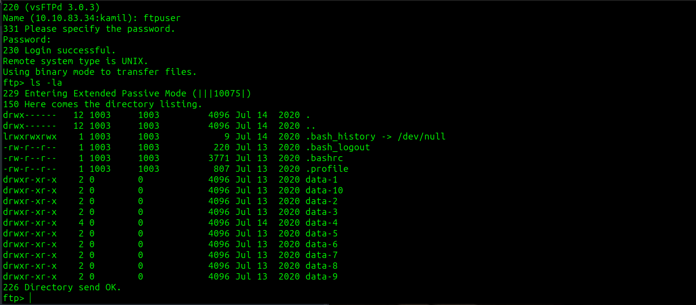

we found another note and rsa private key

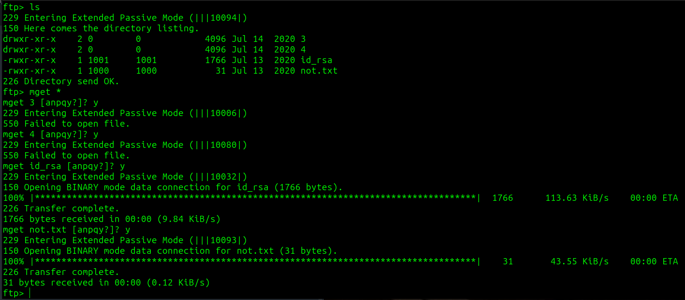

the key is passphrase protected so we need to crack it 

```
$ ssh2john id_rsa > rsahash
$ john rsahash --wordlist=/usr/share/wordlists/rockyou.txt
```

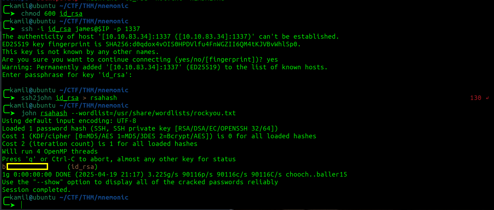

now to access the ssh on port 1337 we need to use 


```
ssh -i id_rsa james@$IP -p 1337
```

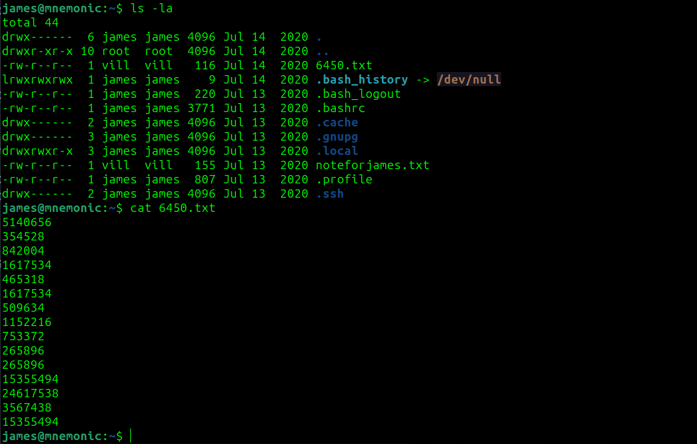

there is some system implemented that logs you out after some time simulating IDS/IPS, nice touch

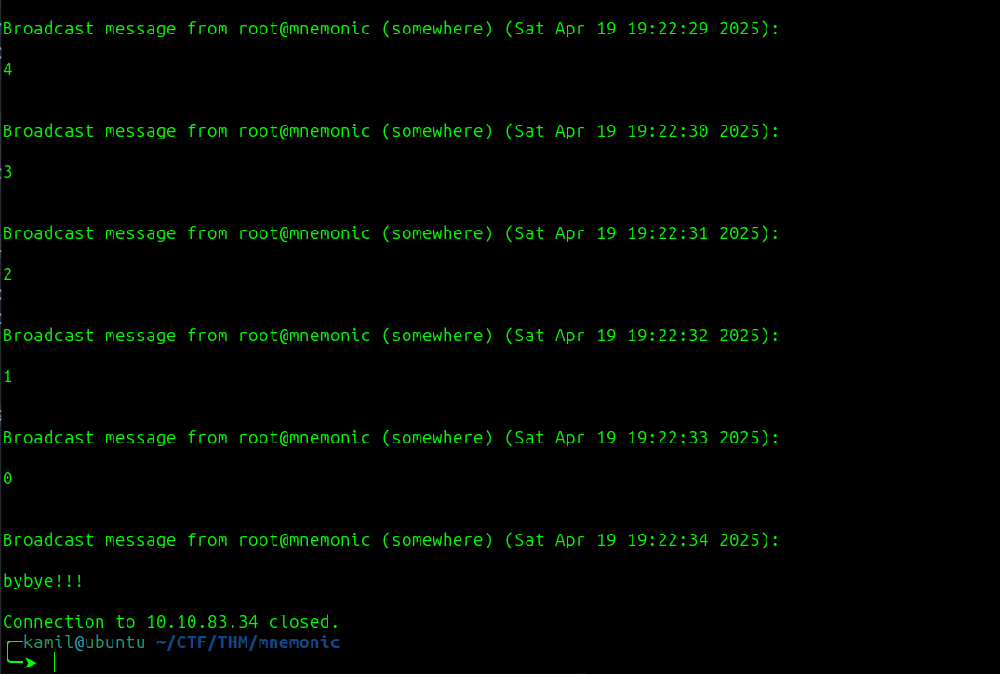

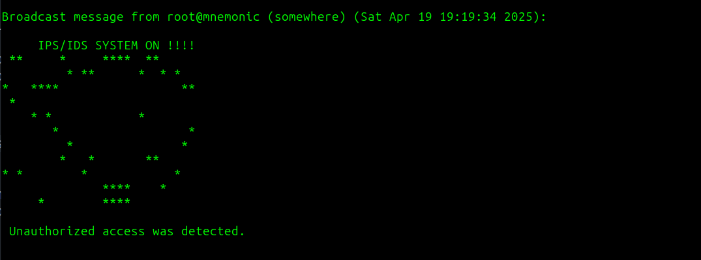

we found noteforjames.txt and 6450.txt

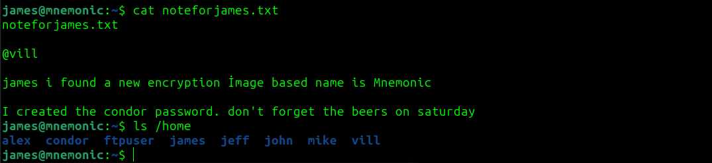

now we need to crack the encrypted message using some image based encryption Mnemonic, I think we need to use this `https://github.com/MustafaTanguner/Mnemonic`, after cloning and installing dependencies we now need some image file to create a key

while looking for james files i found some strings that look like base64 (probably not the intened way to obtain them)

```
find / -user james
```

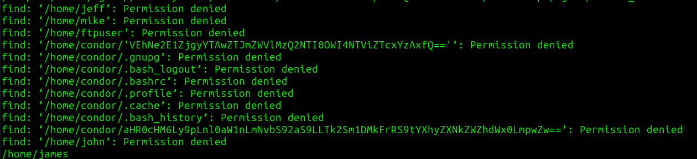

but we can simply find tem using `ls -la /home/condor`, one is a link(for the image) and the other is a user flag 

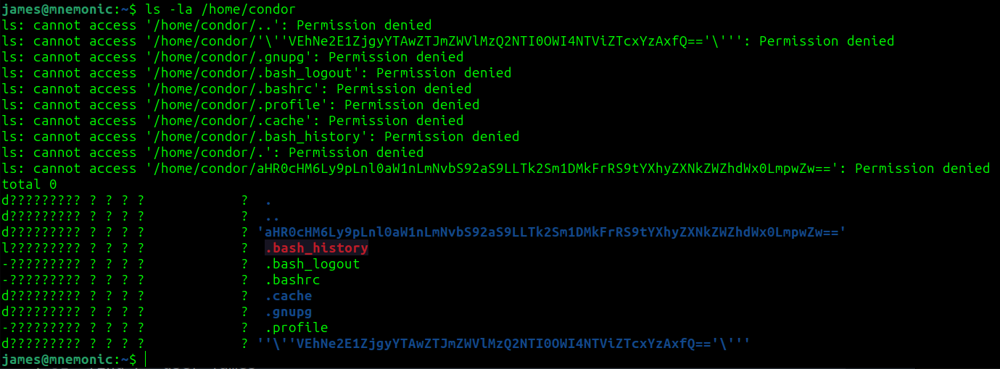

now we can use the code from github, we need to provide the path for the jpg file 

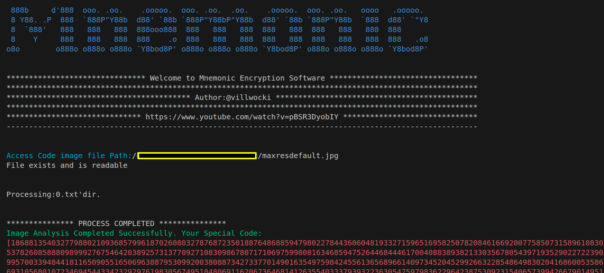

(to get rid off error we can change the code to this)

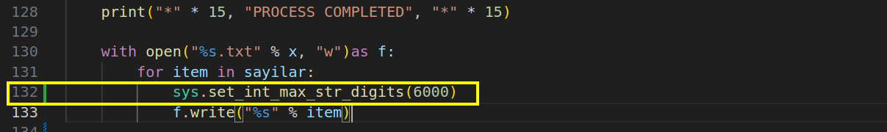

then we select option 2 and provide path to 6450.txt

and we got condor password

now looking at the sudo -l output we see that we can run python3 as sudo on /bin/examplecode.py

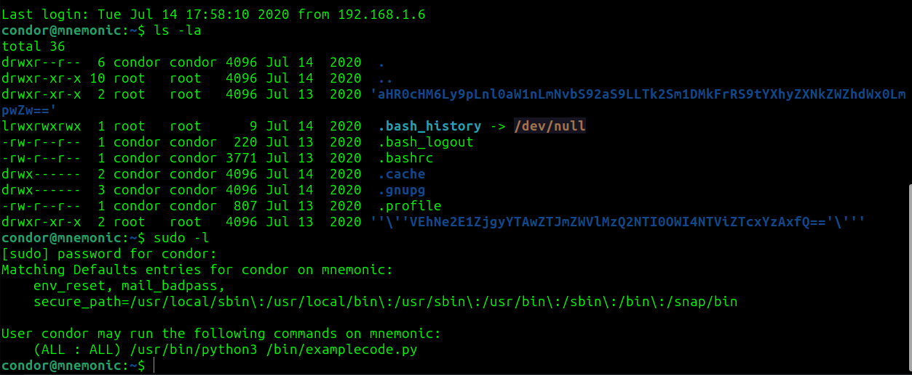

the fifth option looks nice but dont select it, it will reboot the machine (i did and I was very confused for a second (always read before executing!!))

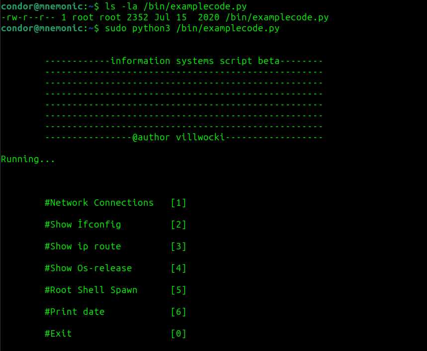

better option to chose is 0, we will be prompted if we want to quit, but we can input `.` and then we can type bash to gain root shell

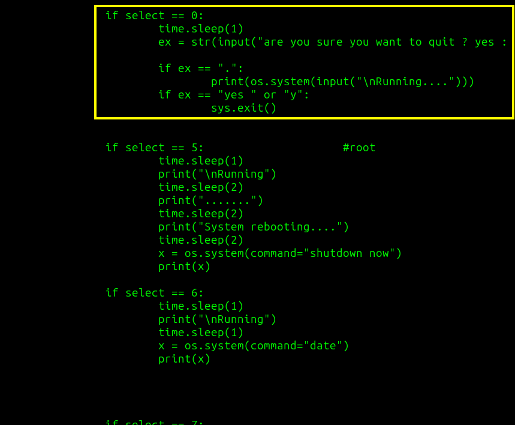

now we have root access and root flag

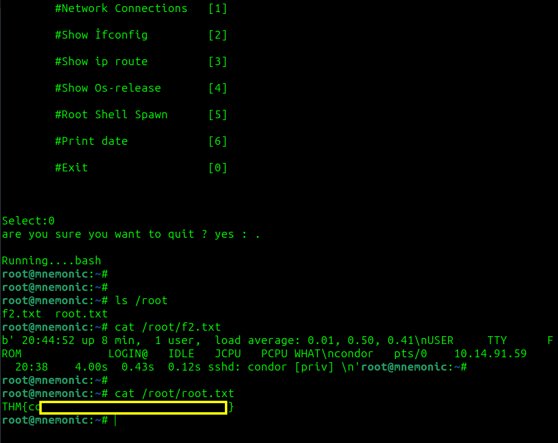

# MACHINE PWNED
