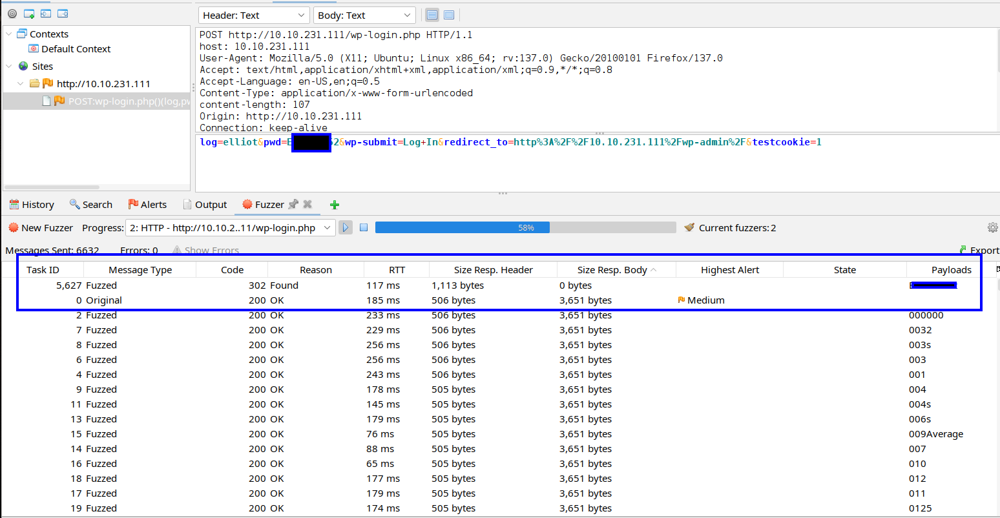
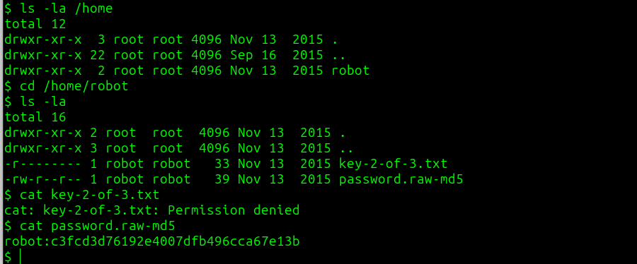

# Mr Robot CTF - TryHackMe Room
# **!! SPOILERS !!**
#### This repository documents my walkthrough for the **Mr Robot** CTF challenge on [TryHackMe](https://tryhackme.com/room/mrrobot). 
---

we see open ports 80 and 443


there is a lot of content on the website, we can check the robots.txt


we found 2 hidden files `fsocity.dic` and `key-1-of-3.txt`


using gobuster to enumerate hidden folders


the most interesting one is /wp-login suggesting the use of WordPress, using wpscan to enumerate users but it doesnt seem to work

if we try to login manually we see the error: Invalid username


we can try to use the dictionary file we found to test for potential username

after using ZAP to fuzz the username we see that there could be users: elliot and Elliot


there is a hint `There's something fishy about this wordlist... Why is it so long?` so i checked how many lines are unique, there are 11451 unique line (it is better than all 858160 lines)

```
sort fsocity.dic | uniq | wc -l
```


so now we can modify the wordlist to make it smaller

```
sort fsocity.dic | uniq > uniq.txt
```

now if we try to login as elliot we see other error about wrong password for our user (we fuzzed working user)


now after fuzzing the password we found one request that gives 302 status code so it could be a working password



now we are logged to wordpress dashboard


looking for ways to upload reverse shell file, we can use Appearance -> Editor and use 404.php, then we copy code and save the file


then we can go to `http://IP/tttt` and we should get our shell

we got shell as daemon


we can look around /home folder, we see robot user, we also see the second flag but we dont have permissions to read it, but we can read some md5 hash that looks like robot password



we can use crackstation to crack it


now we have access as robot and we can grab second flag


after running linpeas, we know about SUID for nmap


we can check GTFObins for PE factor


now we need to run nmap in interactive mode and execute a command to spawn a shell as root

```
$ /usr/local/bin/nmap --interactive
nmap> !sh
```

now we have root access and last flag


# MACHINE PWNED
