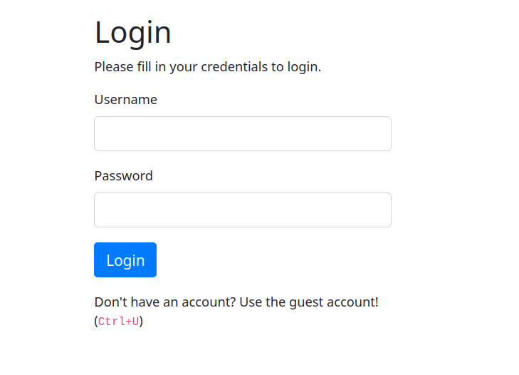
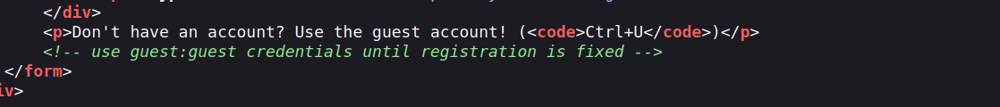
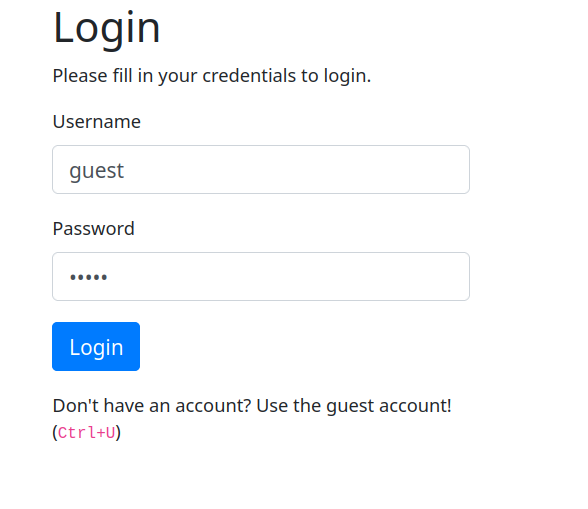
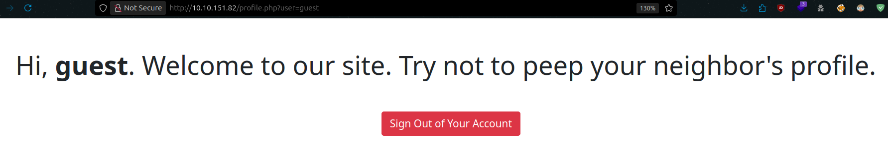
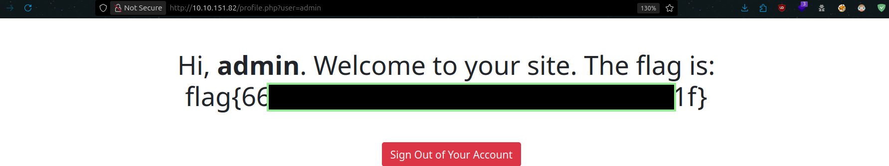

# Neighbour CTF - TryHackMe Room
# **!! SPOILERS !!**
#### This repository documents my walkthrough for the **Neighbour** CTF challenge on [TryHackMe](https://tryhackme.com/room/neighbour). 
---

we see simple login form

we also see something about guest account, and suggestion to use `Ctrl + U` to check source code 

from comment we see guest login credentials, we also have some info about admin account

we can now login as guest

we see a GET parameter user, we see that supplied value for this parameter is guest `?user=guest`

if we manipulate this parameter value to admin we see a flag

# FLAG OBTAINED
