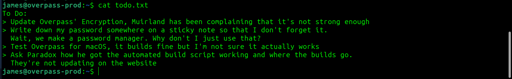
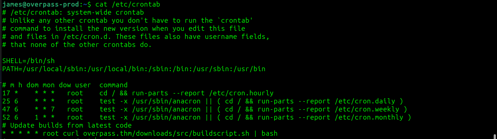

# Overpass CTF - TryHackMe Room
# **!! SPOILERS !!**
#### This repository documents my walkthrough for the **Overpass** CTF challenge on [TryHackMe](https://tryhackme.com/room/overpass). 
---

scan

found /admin login page

first tried SQLi, found files responisble for login handling `login.js` and `cookie.js`

i added cookie manually to check if it would work

gained access to /admin panel and got james ssh key

the key has a passphrase and the info on the panel says we should crack it

using `ssh2john > hash.txt` and then `john --wordlist=rockyou.txt hash` to crack a passphrase

now logged as james and grabbing user flag

`todo.txt`:

i checked hidden `.overpass` file to extract saved passwords, found one

checked for `sudo -l` with that password but we cant use it

checked the /etc/crontab and found script that might be our PE factor

the script makes web request to download file and then execute it with bash

the scirpt has host: overpass.thm so i checked the /etc/hosts, we can modify it, i will change the loopback address to my attacking machine address

we need to create the same file structure on local machine so creating `overpass/downloads/src` and inside it a reverse-shell script called buildscript.sh

started the simple python server in overpass and also starting nc listiner to catch revshell

now we need to wait for cron

we got root access and root flag

## SYSTEM PWNED
