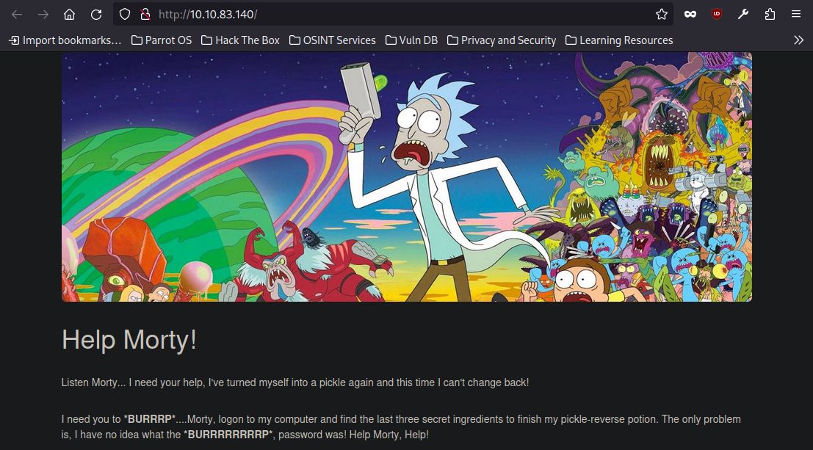
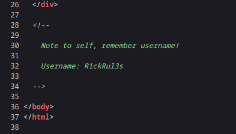
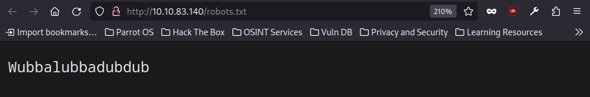
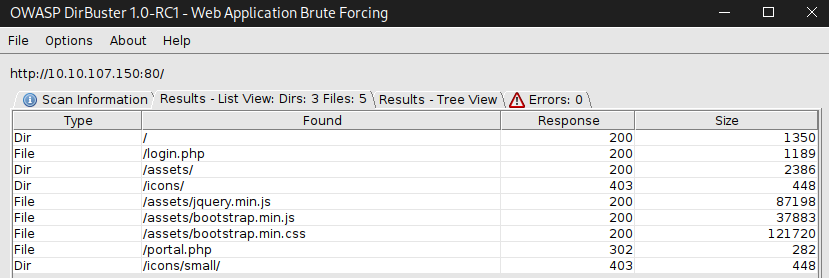
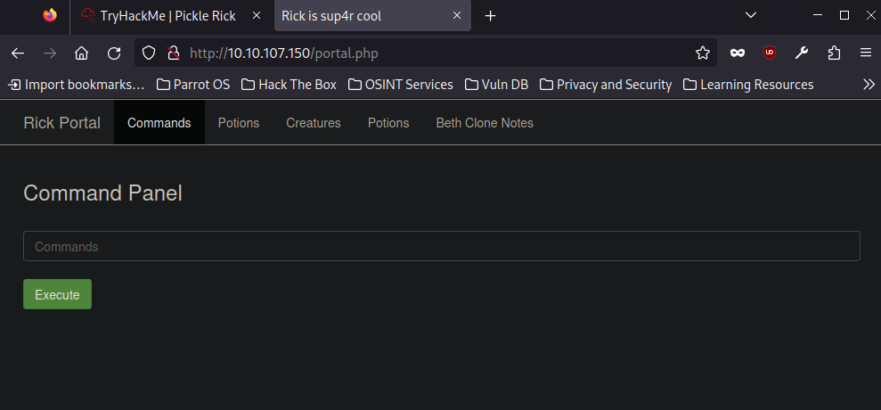
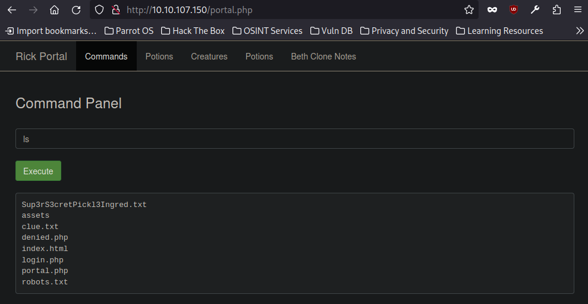
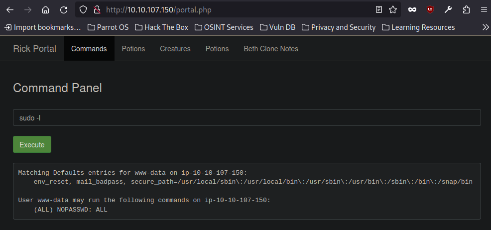
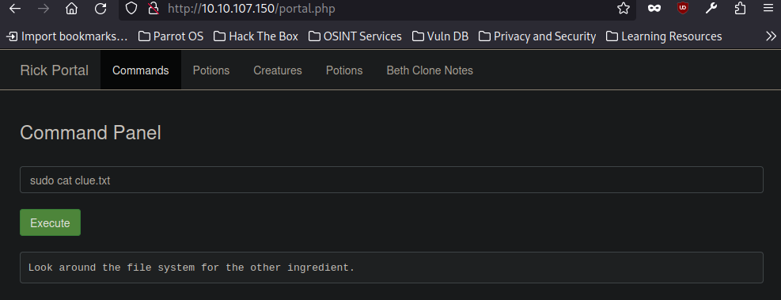
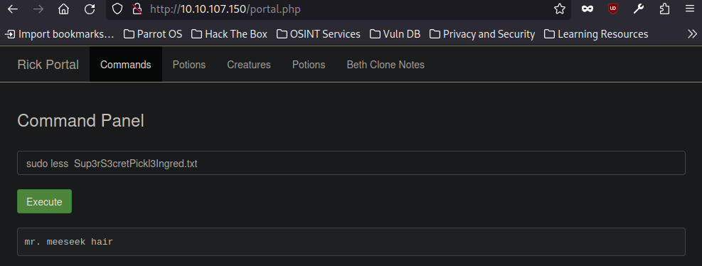

# Pickle Rick CTF - TryHackMe Room

#### This repository documents my walkthrough for the **Pickle Rick** CTF challenge on [TryHackMe](https://tryhackme.com/r/room/picklerick). 
---
## Simple nmap enumeration


```
nmap -sV TARGET_IP
```
Ports `22 ssh` and `80 http` open

This is how the website looks





Znalazłem interesujacy fragment kodu zródłowego, ktos zostawił komentarz który może sugerować login do serwisu `login: R1ckRul3s`




I always check `robots.txt` to see if there is something interesting



In robots.txt there is `Wubbalubbadubdub` string


I use `dirbuster` to check hidden directories




Found `portal.php` and `login.php`

In login form I use previously obtained words as `login: R1ckRul3s password: Wubbalubbadubdub` and i gain access, Im redirected to `portal.php`



Gained access to command line, great ! 

 `ls` and `sudo -l` to check what is going on





> [!IMPORTANT]
> Perfect we can run `sudo` without password

First we read the `clue.txt` and `Sup3rS3cretPickl3Ingred.txt`, but there is a problem the `cat`, `head`, `tail` commands are blocked

`less` command seems to work, we can also use `grep . *`


```
sudo less clue.txt
```


```
sudo less Sup3rS3cretPickl3Ingred.txt
```

> [!IMPORTANT]
> We obtained our first `FLAG 1 : mr. meeseek hair`
