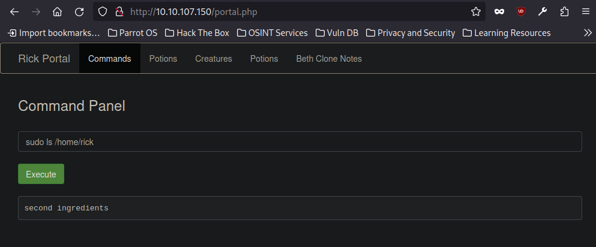
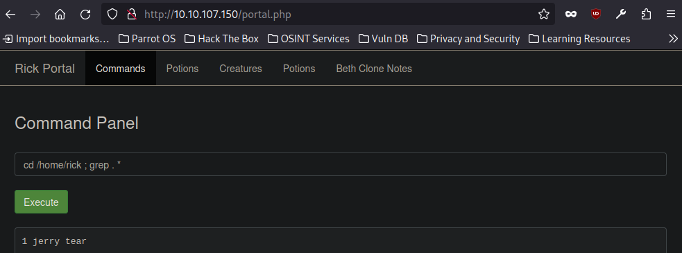
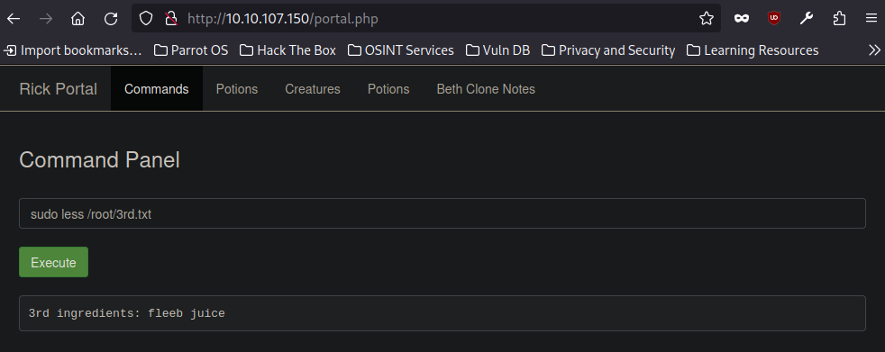

# Pickle Rick CTF - TryHackMe Room

#### This repository documents my walkthrough for the **Pickle Rick** CTF challenge on [TryHackMe](https://tryhackme.com/r/room/picklerick). 
---
#### I will be using *nmap* and *Dirbuster* to enumerate target, but we can also use my own tool [QuickEnumTool](https://github.com/KamilCzajczyk/QuickEnumTool).


```
nmap -sV TARGET_IP
```
Ports `22 ssh` and `80 http` open

This is how the website looks


Somebody left a comment that suggest that there is a user with `login: R1ckRul3s`


I always check `robots.txt` to see if there is something interesting


In robots.txt there is `Wubbalubbadubdub` string


I use `dirbuster` to check hidden directories


Found `portal.php` and `login.php`

In login form I use previously obtained words as `login: R1ckRul3s password: Wubbalubbadubdub` and i gain access, Im redirected to `portal.php`


Gained access to command line, great ! 

 `ls` and `sudo -l` to check what is going on


> [!IMPORTANT]
> Perfect we can run `sudo` without password

First we read the `clue.txt` and `Sup3rS3cretPickl3Ingred.txt`, but there is a problem the `cat`, `head`, `tail` commands are blocked

`less` command seems to work, we can also use `grep . *`


```
sudo less clue.txt
```

> [!NOTE]
> We should look around file system for other flags


```
sudo less Sup3rS3cretPickl3Ingred.txt
```

> [!IMPORTANT]
> We obtained flag `FLAG 1 : mr. meeseek hair` !!!

After checking home folder with `sudo ls /home` I found rick's home folder




There seems to be next flag 

Now we just need to read the file




```
cd /home/rick ; grep . *
```

> [!IMPORTANT]
> Next flag is `FLAG 2 : 1 jerry tear` !!!

Now I check root folder with `sudo ls /root` and it seems there is another flag

Next i use `sudo less /root/3rd.txt`




> [!IMPORTANT]
> Last flag is `FLAG 3 : fleeb juice` !!!

## MACHINE PWNED
