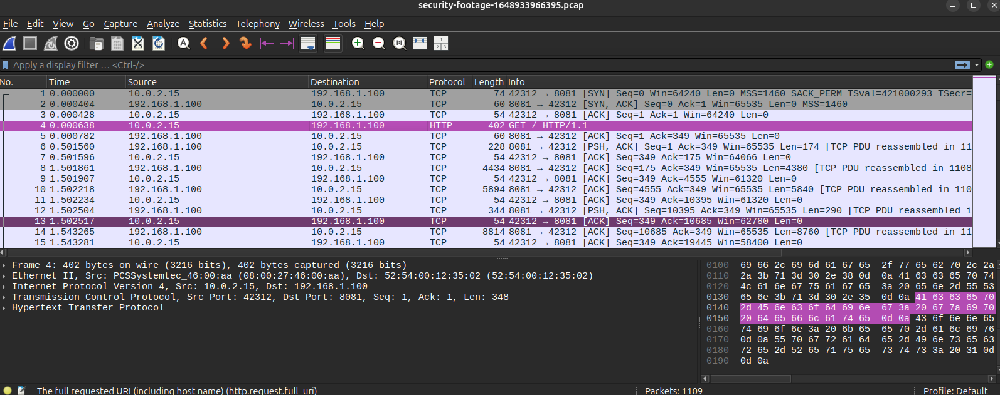
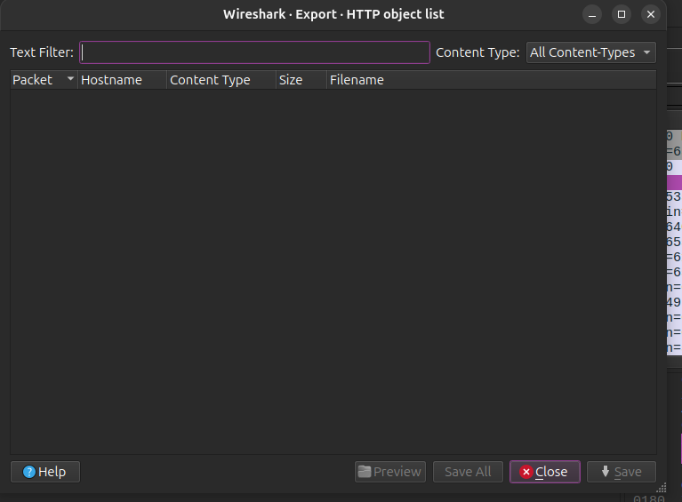
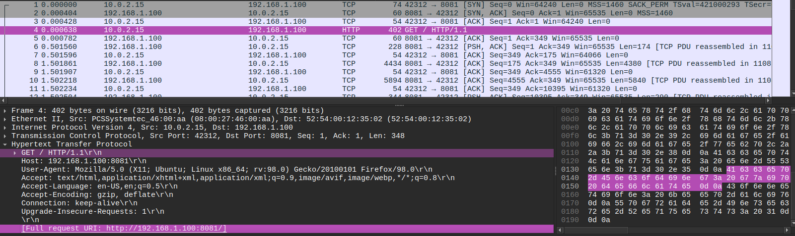
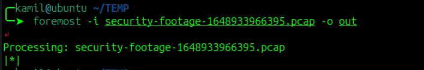
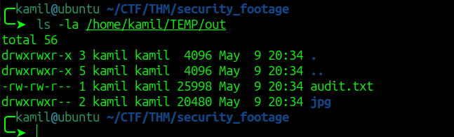
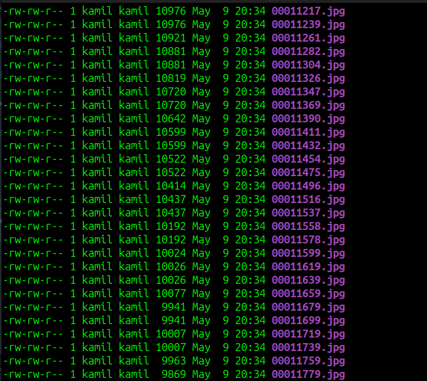
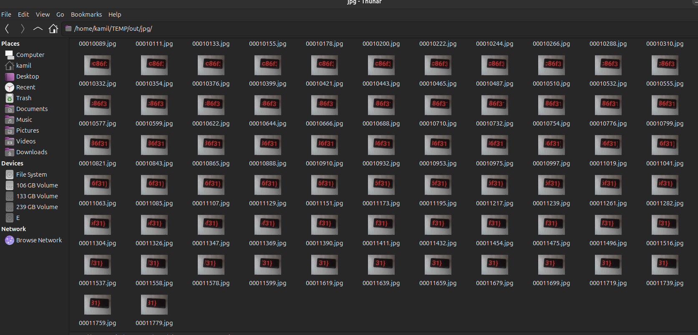
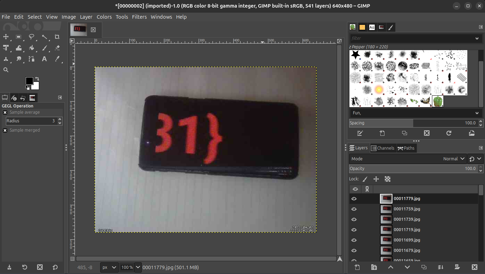
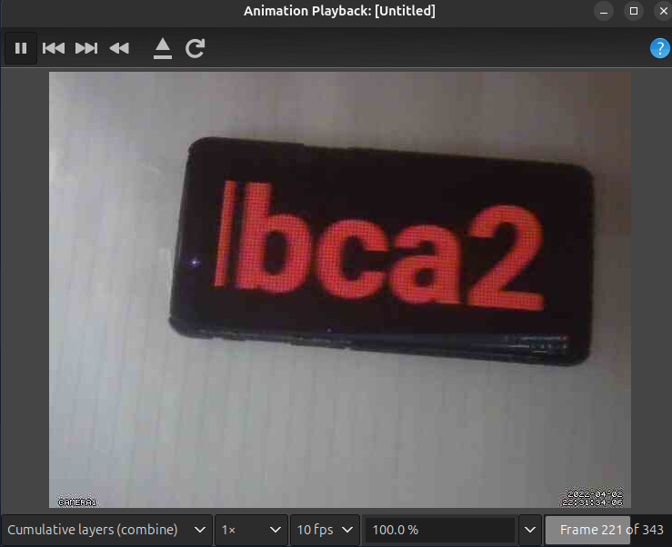

# Security Footage CTF - TryHackMe Room
# **!! SPOILERS !!**
#### This repository documents my walkthrough for the **Security Footage** CTF challenge on [TryHackMe](https://tryhackme.com/room/securityfootage). 
---

after downloading we see that the file extension is .pcap so we can try to investigate it with wireshark



we can first try to export HTTP objects 



we dont see nothing interesting

we see some http request with content-type header: image



we can use tool called foremost to try to extract the files

first we create the folder for files to extract, then we run the command

```
$ mkdir out
$ foremost -i security-footage-1648933966395.pcap -o out
```









we see a lot of images so the program worked, if we use some file explorer like Thunar, we see that those files are indeed valid image files by looking at the thumbnail

we can now use GIMP to create GIF with those images

first we `File -> Open as Layers` and we select all the files, then we have to wait for files to upload



then we use `Filters -> Animation -> Optimize (for GIF)` and we wait for GIF to assemble

next we use `Filter -> Animation -> PLayback...` and we can watch our flag being displayed



# FLAG OBTAINED
