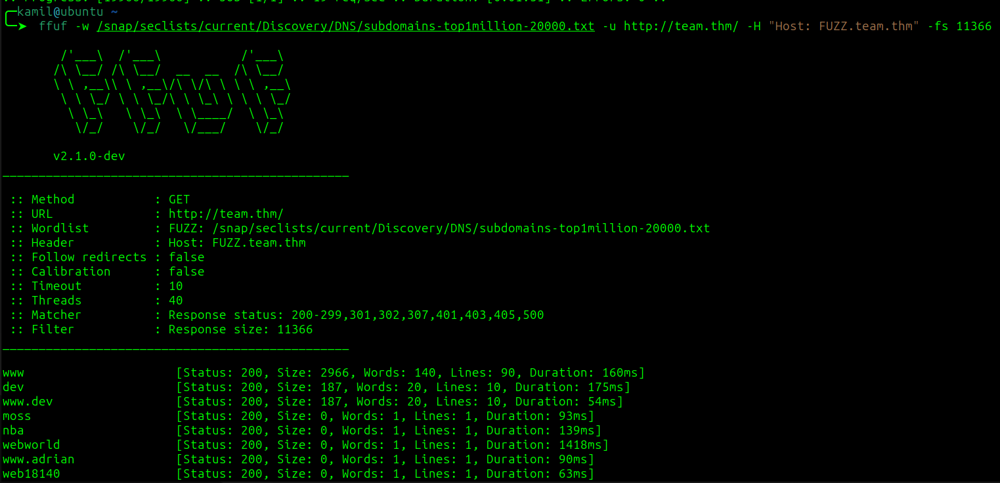
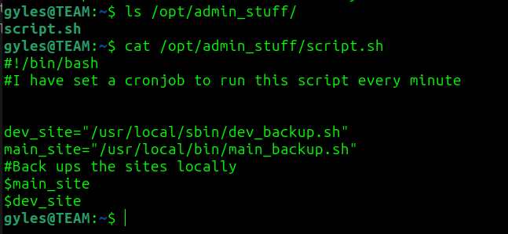

# Team CTF - TryHackMe Room
# **!! SPOILERS !!**
#### This repository documents my walkthrough for the **Team** CTF challenge on [TryHackMe](https://tryhackme.com/r/room/teamcw). 
---
Using nmap to find open ports


Open ports `21 ftp`,`22 ssh` and `80 http`

Using gobuster to find directories

```
gobuster dir -w /snap/seclists/current/Discovery/Web-Content/common.txt -u http://10.10.130.165   
```


No interesting directories

Main page is Apche default page but with a twist, the `<title>` is changed


Adding team.thm to /etc/hosts


team.thm webpage


Using gobuster again

```
gobuster dir -w /snap/seclists/current/Discovery/Web-Content/common.txt -u http://team.thm
```


Gobuster found `robots.txt` with `dale` string 


Using ffuf to enumerate vhosts

```
ffuf -w /snap/seclists/current/Discovery/DNS/subdomains-top1million-20000.txt -u http://team.thm/ -H "Host: FUZZ.team.thm" -fs 11366
```



Editing /etc/hosts again and adding `dev.team.htm`

dev.team.thm webpage


Possible file inclusion, changing URL to /etc/passwd as example


```
http://dev.team.thm/script.php?page=/etc/passwd
```


notable users `dale` and `gyles`

I tried diffrent common configuration files for FTP and SSH and found Dale `openSSH private key`

```
http://dev.team.thm/script.php?page=/etc/ssh/sshd_config
```


Login to ssh with a private key as dale, remember to `chmod 600` key


> [!IMPORTANT]
> User flag from `user.txt`: `THM{6Y0TXHz7c2d}`


now we can do

```
sudo -u gyles /home/gyles/admin_checks
```

We can exploit this file, in first input we can type anything, but in second we can type `bash` to spawn a shell as gyles, then we can use python3 to stabilize it

```
python3 -c 'import pty; pty.spawn("/bin/bash")'
```


In /opt there is interesting folder `admin_stuff` that contains `script.sh`



Now i check those files mentioned in script.sh

The main_backup.sh is writeable


Now i edit main_backup to generate reverse shell as root, the script is run by cronjob every minute. **This privilege escalation stage could be done in various ways.**


> [!IMPORTANT]
> Root flag from `root.txt`: `THM{fhqbznavfonq}`

# MACHINE PWNED
