# Valley CTF - TryHackMe Room
# **!! SPOILERS !!**
#### This repository documents my walkthrough for the **Valley** CTF challenge on [TryHackMe](https://tryhackme.com/room/valleype). 
---
First nmap scan

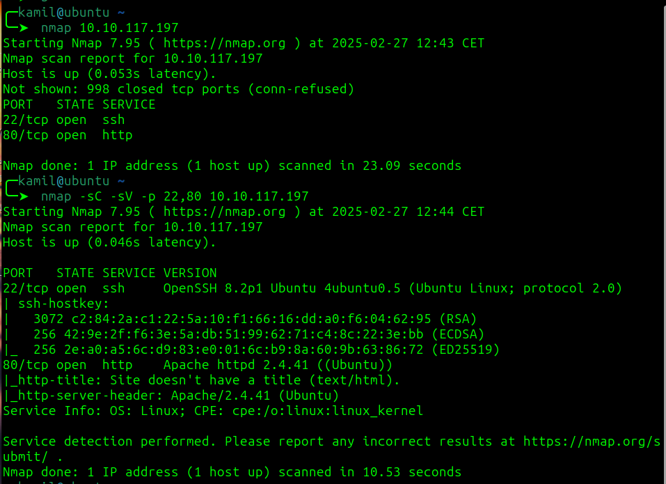

Now scanning / of website 

```
feroxbuster -u http://10.10.X.X/ -w /usr/share/seclists/Discovery/Web-Content/common.txt 
```

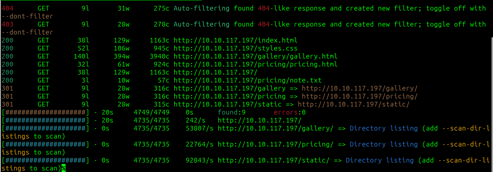

feroxbuster found interesting file note

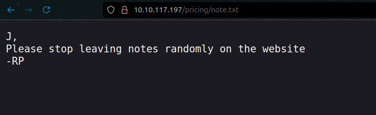

now i will scan the /static with feroxbuster

```
feroxbuster -u http://10.10.X.X/static/ -w /usr/share/seclists/Discovery/Web-Content/common.txt --scan-dir-listings
```

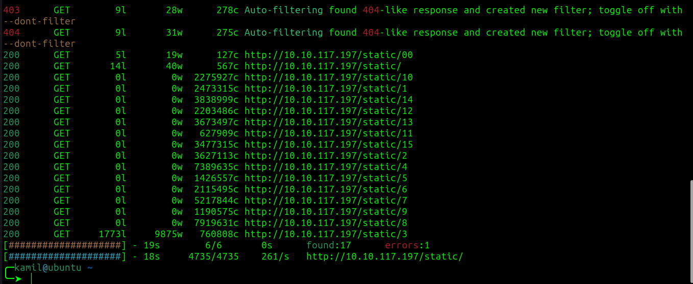

i started checking from 00 and already found next note

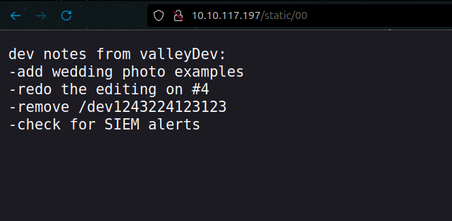  

note mentions /dev1243224123123 directory, i will alos check it with feroxbuster

```
feroxbuster -u http://10.10.117.197/dev1243224123123/ -w /usr/share/seclists/Discovery/Web-Content/common.txt --scan-dir-listings

```

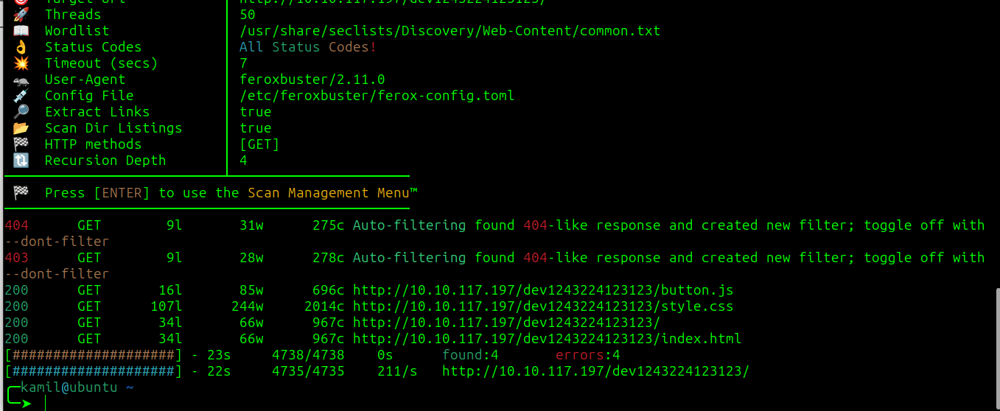

nothing interesting for now

in /dev1243224123123 directory there is login page, but it seems weird i checked source code and found odd `dev.js` js file containing login credential

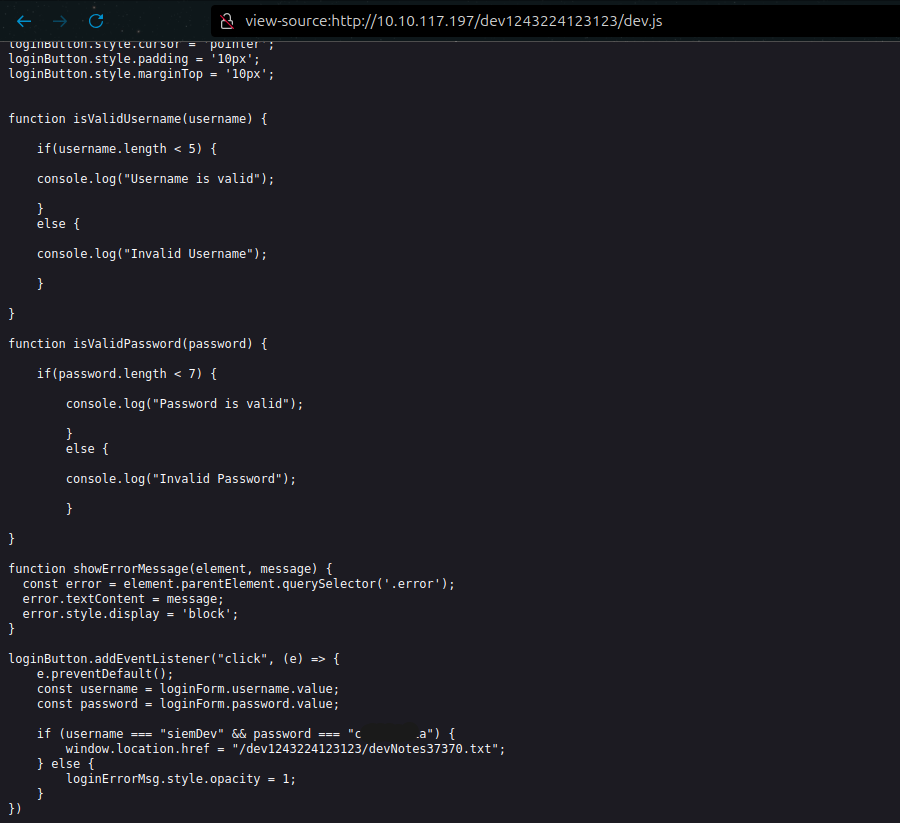   

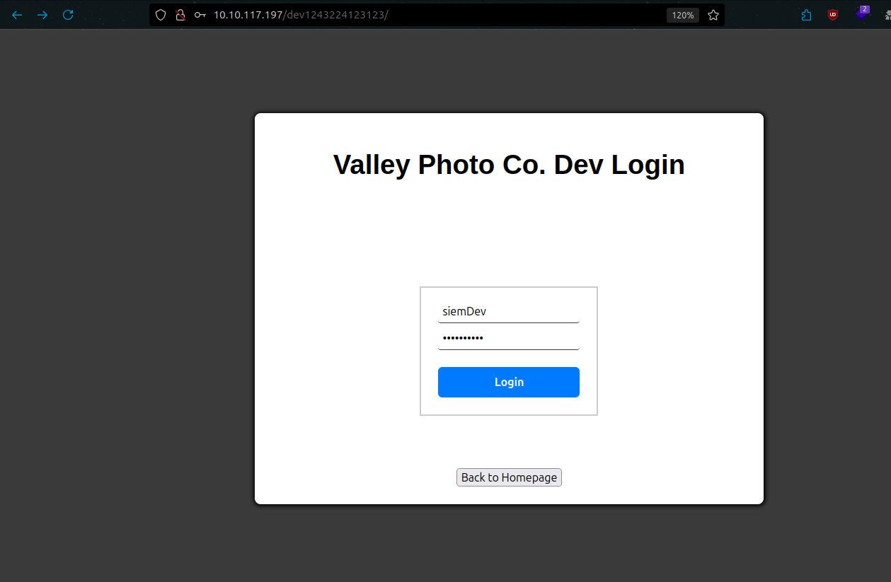 

we succesfully login and get next note

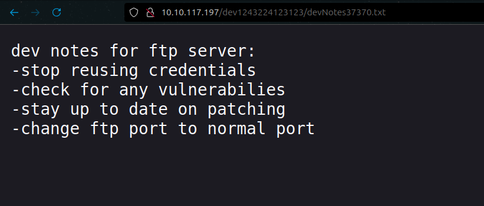 

there should be ftp server on odd port so i will use diffrent tool to searh for it, i created simple go program to fast scan open ports [SuperFastScanner](https://github.com/KamilCzajczyk/go-SuperFastScan)

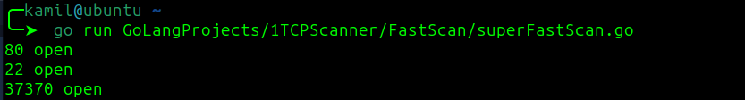  

go program found open `37370` port

trying to log to ftp as anonymous doesnt work so tried logging as `siemDev` like in login form and it worked

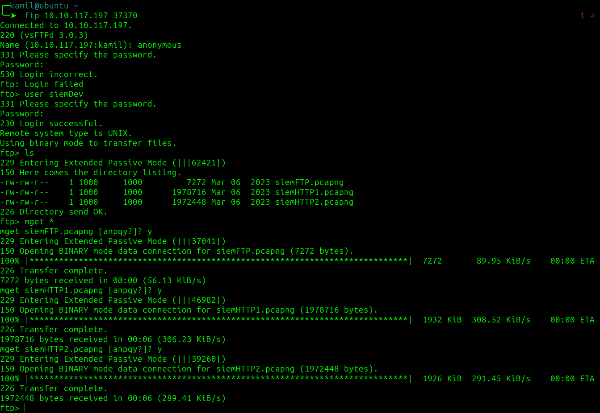

i downloaded and analysed all files but only `siemHTTP2.pcapng` seems to contain valuebale information

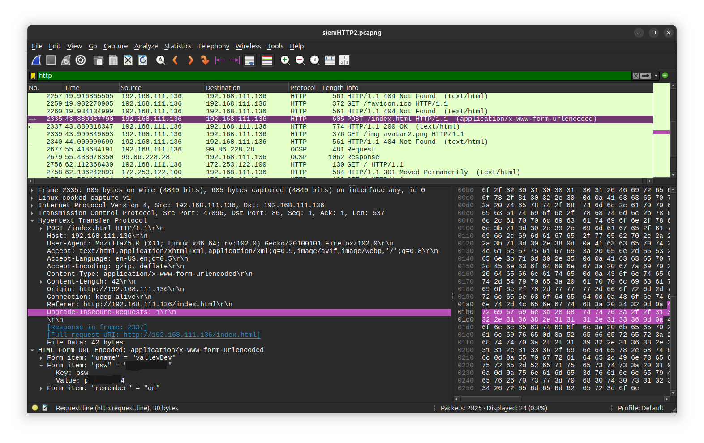

i found another credentials, tried to login via ssh with them and grabbed the user flag

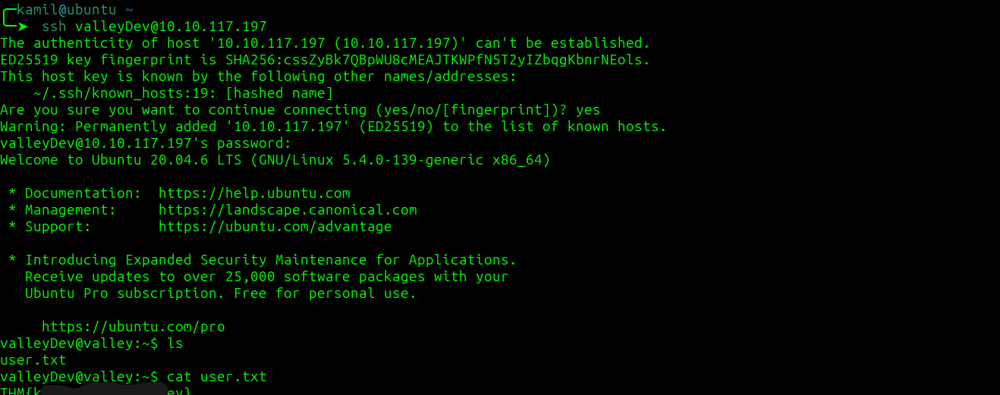

i checked /home directory and found weird file , this file seems to be compressed with `upx` based on first few lines 

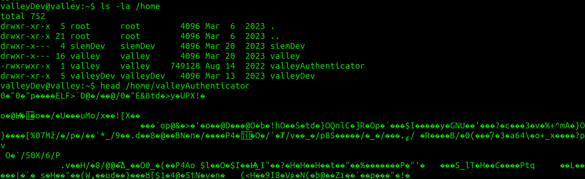  

i downloaded upx to unpack the executable

`upx -t` to check if file is actually compressed and `upx -d ` to decompress

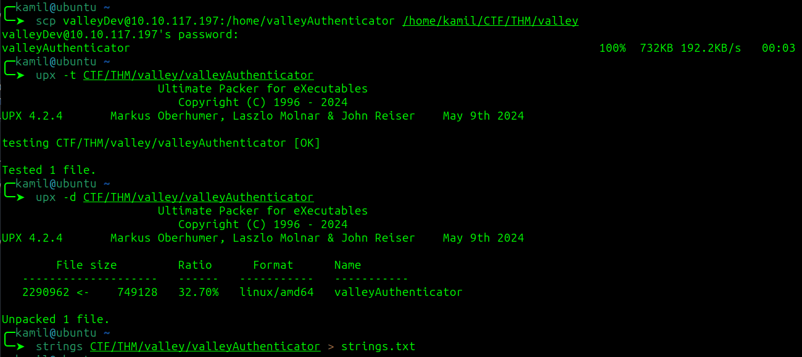  

i decided to export strings from this file 

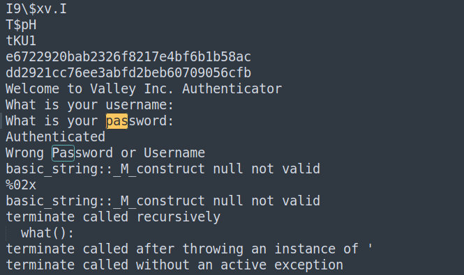  

i started to look for `pass` with `Ctrl + F` and found 2 strings that seemed like password hashes

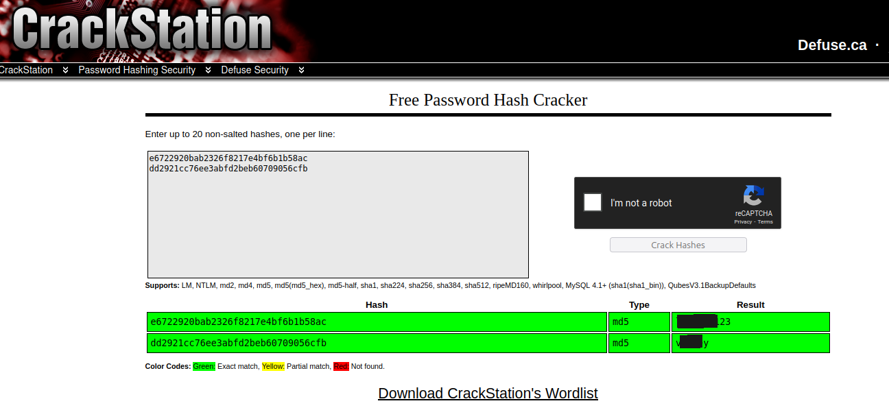  

crackstation cracked both of them and now we have next user and password

now i was stuck for a while there was no `sudo -l` so i checked crontab

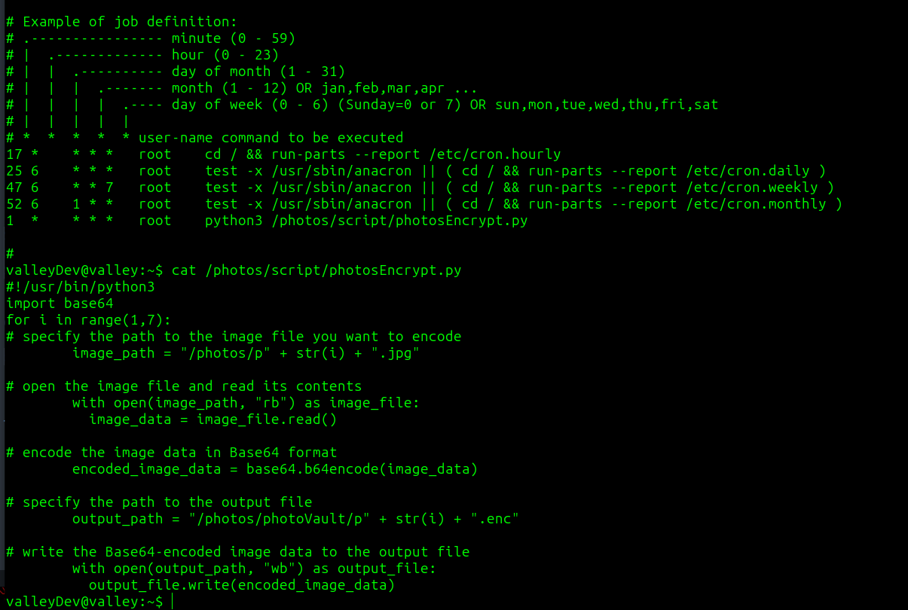  

there is record that will execute python code in `/photos/script/photosEncrypt.py` but sadly we dont have permission to edit the file

i also copied linpeas to check for priv esc factor and found weird `base64.py` file that is writeable, it will also be executed by our script in crontab

```
$ scp linpeas.sh valleyDev@10.10.25.193:/tmp/
$ chmod +x /tmp/linpeas.sh
$ /tmp/linpeas.sh 
```

 

now we need to modify the base64.py with python reverse shell

script will be executed as root so we should get root shell

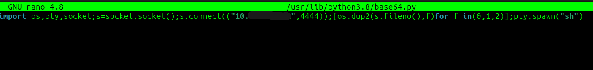  

now we wait while netcat is listinig `nc -lvnp 4444`

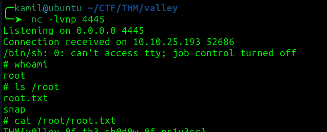  

we got root access and root flag

#MACHINE PWNED
