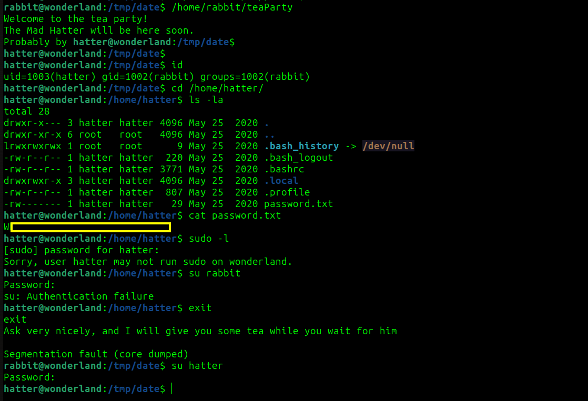

# Wonderland CTF - TryHackMe Room
# **!! SPOILERS !!**
#### This repository documents my walkthrough for the **Wonderland** CTF challenge on [TryHackMe](https://tryhackme.com/room/wonderland). 
---

first scanning


nothing interesting in the source code, title says we need to follow the White Rabbit

after scanning with feroxbuster we have some idea how to find hidden folders


after going to `http://IP/r/a/b/b/i/t` we find some hidden credentials

alice:Ho...[REDACTED]...il


credentials worked we successfully logged as alice via ssh, we see python script `walrus_and_the_carpenter.py` that generates random poem after executing, after inspecting `/home` folder we can also see other users: `hatter` and `rabbit`

i send linpeas on the victim machine to check for PE

we found some interesting `sudo -l` output


chatGPT suggested that if our script is importing external modules we could create our own version of this module and supply malicious path into PYTHONPATH variable, first we are creating simple script spawning bash shell into `random.py`

```
echo 'import os; os.system("/bin/bash")' > /home/alice/random.py

```

then we use this one-liner to use python module from our malicious path, we use sudo -u as rabbit and run our script  

```
PYTHONPATH=/home/alice sudo -u rabbit /usr/bin/python3.6 /home/alice/walrus_and_the_carpenter.py

```


we gain shell as rabbit, we see SETUID, SETGID teaParty script


 we dont have strings command but chatGPT suggested an alternative, we could use 

```
hexdump -C teaParty
```

in hexdump i found that script uses `date` command so i created my own version to spawn a shell as hatter


```
$ cd /tmp && mkdir date
$ touch date
$ echo "/bin/bash" > date
$ chmod +x date
$ export PATH=/tmp/date:$PATH
$ /home/rabbit/teaParty
```




we logged as hatter in the home folder of hatter we see `password.txt` file containing pass: 
`Wh...[REDACTED]...sk?` this is ineed hatter account password, we cant run sudo -l but i think we will be needing this password for something else 

after running linpeas againg i started to look at this fragment and found that we could exploit this


i found commands on GTFObins, we can use this one-liner to gain root shell:


```
/usr/bin/perl -e 'use POSIX qw(setuid); POSIX::setuid(0); exec "/bin/sh";'
```

now we have root access, we can collect user flag in `/root`


and root flag in `/home/alice`


# MACHINE PWNED


