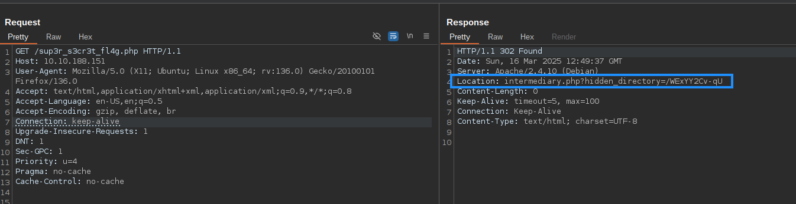
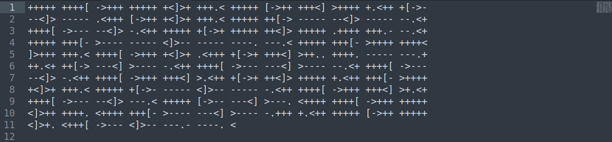

# Year of the Rabbit CTF - TryHackMe Room
# **!! SPOILERS !!**
#### This repository documents my walkthrough for the **Year of the Rabbit** CTF challenge on [TryHackMe](https://tryhackme.com/room/yearoftherabbit). 
---


after scanning we see 3 open ports 21, 22, 80


checking ftp frist

we cant login as anonymous

checing hidden folders with feroxbuster 


ferox found hidden folder `/asstes/` with style.css and a rickroll

we can find a comment in css file


```
Nice to see someone checking the stylesheets.
Take a look at the page: /sup3r_s3cr3t_fl4g.php
```     

after using curl we arent getting any response so we might be redirected


checking the request with burpsuite



we found another hidden location `http://10.10.X.X/WExYY2Cv-qU/Hot_Babe.png`


 
we found png maybe it has some secret message, using binwalk, steghide and exiftool doesnt show anything

using strings


we found ftp user (ftpuser) and list of passwords

now we need to brute force with hydra

```
hydra -l ftpuser -P passwords ftp://10.10.188.151
```


we found matching credentials

examining ftp server

nice we found `Eli's_creds.txt` file which looks like brainf\*\*k code  



it was indeed brainf\*\*k and we got eli creds 


after logging as eli we are met with a message from root, we know that user flag is in gwendoline home folder


after using linpeas i found the hidden message in `/usr/games/s3cr3t/.th1s_m3ss4ag3_15_f0r_gw3nd0l1n3_0nly!`


ok we might got gwendoline password by looking at the secret message


password works and we got user flag


after looking on linpeas result once again we now have oportunity to run sudo as any user except root /usr/bin/vi on /home/gwendoline/user.txt


i tried few diffrent command variations based on GTFObins hints but they doesnt seem to work


```
sudo -u eli /usr/bin/vi -c ':!/bin/sh' /home/gwendoline/user.txt
```

but finally i found command that did work

it was

```
sudo -u#-1 /usr/bin/vi /home/gwendoline/user.txt
```

after being send to vi we need to hit : `!/bin/bash`

and we got root shell and root flag


# MACHINE PWNED
