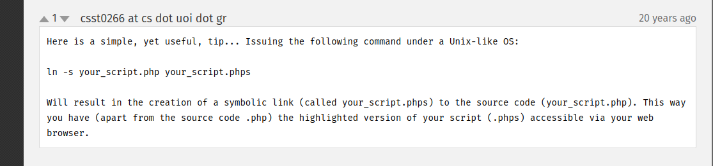

# biteme CTF - TryHackMe Room
# **!! SPOILERS !!**
#### This repository documents my walkthrough for the **biteme** CTF challenge on [TryHackMe](https://tryhackme.com/room/biteme). 
---


we see open ports 22 and 80


we see deafult apache page, from feroxbuster scan we get hidden `/console/` folder


on the site we also see js function handleSubmit


i used chatGPT and dcode to deobfuscate the code 


we see 

```
@fred I turned on php file syntax highlighting for you to review jason
```

if we google `php file syntax highlighting` we see a tip in php manual about a good way to handle the syntax highliting accessible via web browser



we have file /console/index.php we can try `/console/index.phps`


and it works we see some php code, we see that the code includes functions.php, we can test if e can reach it or reach functions.phps


in this code there is include to config.php so we can again try config.phps


now by using cyberchef and converting from hex we have a user: jason_test_account


after looking at the code we need to find a password that after using md5 on it will produce 001 as last characters

here is simple python code to do that


now we need to complete multi-factor authentication with 4 digit code, we can try multiple times so we can use fuzzer to guess the correct digits (i use ZAP proxy)


we found odd looking response with 302 status code suggesting redirect correct code was 1121


now we have access to file browser and file viewer


we can test file browser by inputing / and we see whole filesystem root folder


we also have access to file viewer, we can test by using /etc/passwd


we can users: fred and jason


we can use this interface to find user flag


after looking around i found jason ssh private key in /home/jason/.ssh/id_rsa


now we need do crack the passphrase

```
$ ssh2john key > hash.txt
$ john hash.txt --wordlist=/usr/share/wordlists/rockyou.txt
```


now we have user access !


checking the sudo -l output


we are in sudo group by sadly we dont know the password, but we cas switch user to fred by using 

```
sudo -u fred /bin/bash
```

now as fred looking again at sudo -l output we see that we can execute `systemctl restart fail2ban`


we can use this command to find fail2ban

```
find /lib/systemd /etc/systemd -name "fail2ban*"
```

there is 1 file writeable by fred `/etc/fail2ban/action.d/iptables-multiport.conf`


now we can use `nano /etc/fail2ban/action.d/iptables-multiport.conf` to edit the file and change actionban to `actionban = cp /bin/bash /tmp && chmod 4755 /tmp/bash`


then we restart the fail2ban service using `sudo systemctl restart fail2ban`, then we need to provoke the ban, we can use hydra like `hydra -l root -P rockyou.txt ssh://10.10.x.x`, after a few seconds we should see bash in /tmp folde with SUID

then we need to use `/tmp/bash -p`, now we have root access 


we have root flag


# MACHINE PWNED
