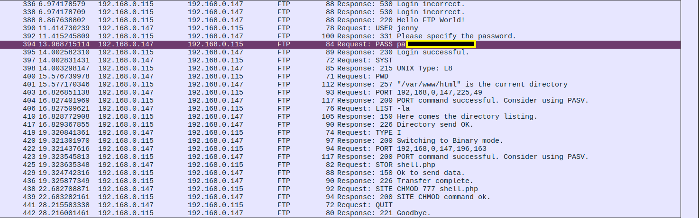
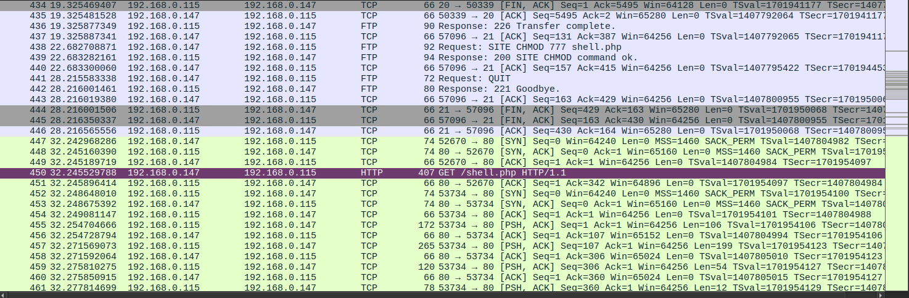
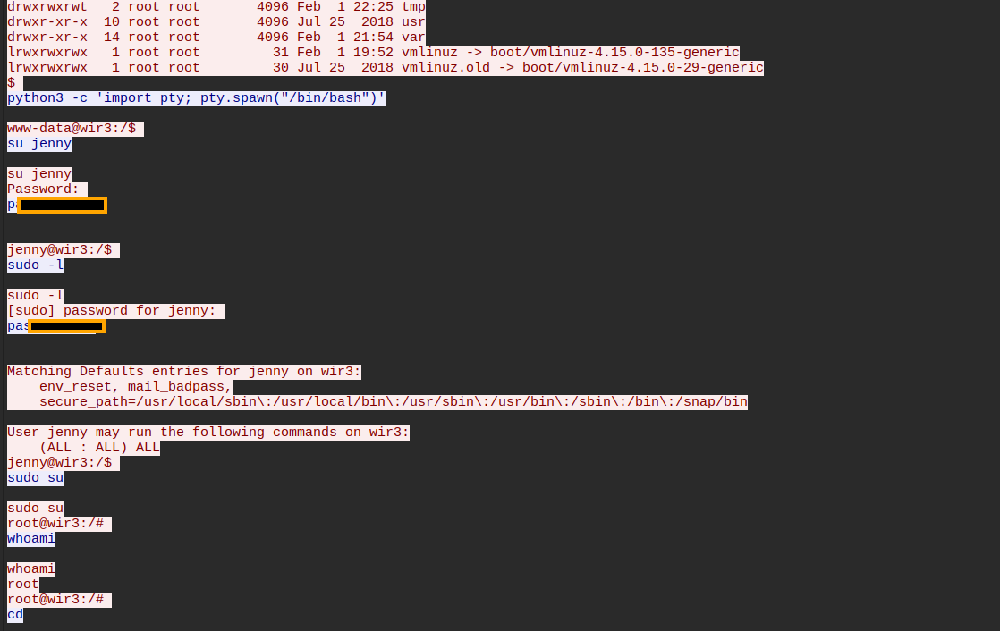
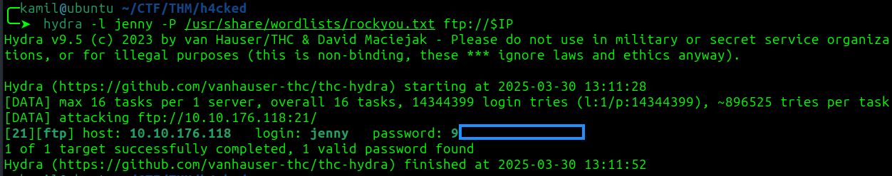
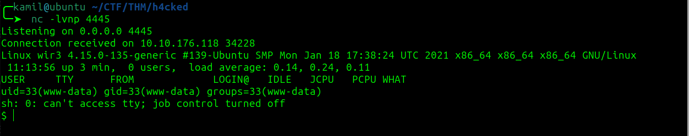
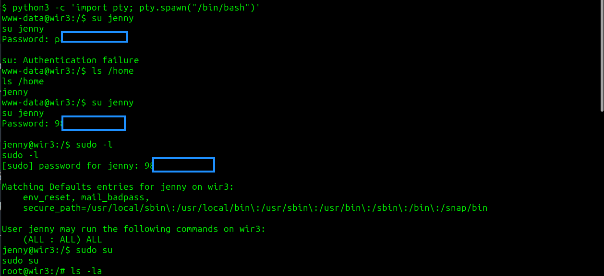
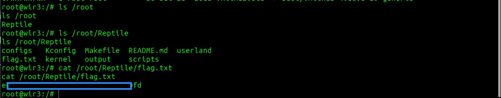

# h4cked CTF - TryHackMe Room
# **!! SPOILERS !!**
#### This repository documents my walkthrough for the **h4cked** CTF challenge on [TryHackMe](https://tryhackme.com/room/h4cked). 
---


## PART 1 - Wireshark

here we can see the successfull login attempt to FTP servers, we also see that attacker uploaded shell.php (PentestMonkey reverse shell)



here we see attacker accessing the /shell.php via http



if we select packet 452 and click Follow -> TCP stream we can the whole shell interaction between victim and attacker



here we see how the attacker become root 

## PART 2 - Attack

we need to replicate steps from .pcap file 

using hydra to brute force ftp login

```
hydra -l jenny -P /usr/share/wordlists/rockyou.txt ftp://$IP
```




now we login to ftp and we can use `put shell.php` to upload file

now by going to `http://10.10.x.x/shell.php` we get rev shell



now we need to spawn bash, then switch to jenny, then we sudo su to become root



now we have root shell and root flag



# MACHINE PWNED
