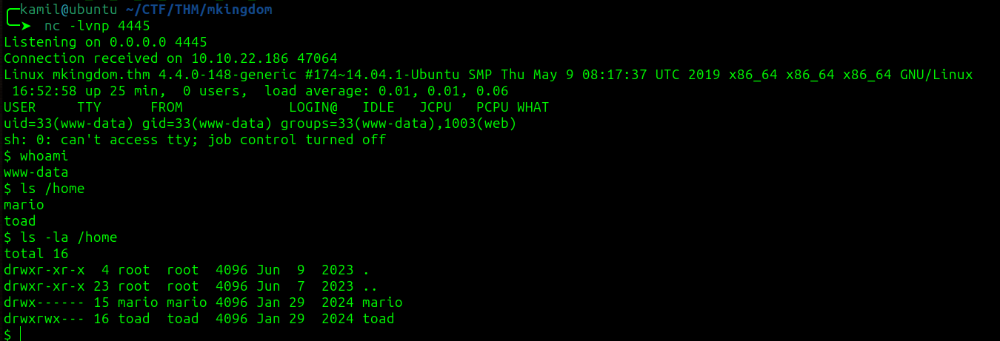
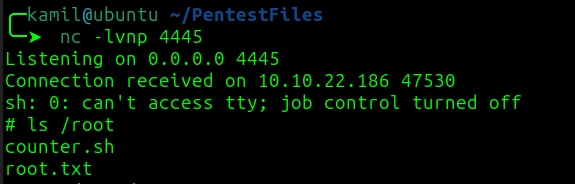

# mKingdom CTF - TryHackMe Room
# **!! SPOILERS !!**
#### This repository documents my walkthrough for the **mKingdom** CTF challenge on [TryHackMe](https://tryhackme.com/room/mkingdom). 
---

we only see one open port 85

scanning with feroxbuster we see `/app` directory

after clicking the button we are redirected to `/app/castle`, afer scanning again and checking Wappalyzer we know that website uses `Concrete CMS 8.5.2`

there is a login page, i used admin:password and it worked we have access to dashboard

by going to `System & Settings -> Files -> Allowed File Types` we are able to add .php to allowed file types

i then created folder called shell then went to `Files -> Upload File` and uploaded pentestmonkey reverse shell 

site generated our link
`http://10.10.22.186:85/app/castle/application/files/2817/4189/9056/shell.php ` and now we just need to access it

it worked we have reverse shell as www-data

in `/var/www/html/app/castle/application/config` there is database.php file containing credentials

we can use that to login as user `toad`

linpeas found PWD_token encoded in base64 that translates to 
`...[REDACTED]...`

linpeas also found SUID for /bin/cat

i used this string to switch to user `mario` 

i copied pspy64 to victim and found hidden cronjob executed by root

now we need to do few things, first changing /etc/hosts to point to our IP (if you want to edit with nano you need stable shell)

then create `app/castle/application` in there we create `counter.sh` file with simple reverse shell, then starting python server remembering about changing port to 85,then we just wait for connection (victim will automatically grab malicious file from our server)

we got root shell

now we can grab root and user flag

# MACHINE PWNED
