# Star Wars CTF: 1 - Vulnhub Machine
# **!! SPOILERS !!**
#### This repository documents my walkthrough for the **Star Wars CTF: 1** CTF challenge on [Vulnhub](https://www.vulnhub.com/entry/star-wars-ctf-1,528/). 
---

after importing machine to VirtualBox we need to change network settings, then we can scan our network for this machine IP 

```
nmap 192.168.X.X/24
```

then by having IP address we can perform proper scan, from it we know about open ports 22 and 80

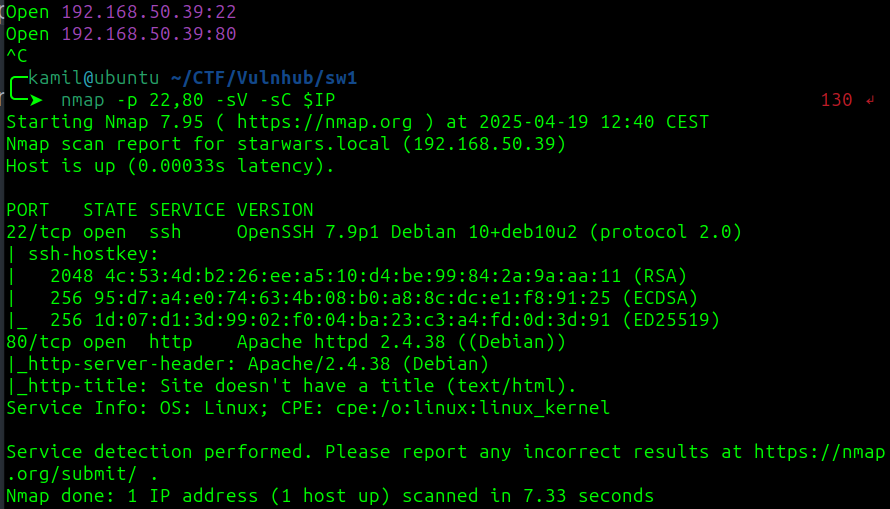

this is the website, we shall find a password

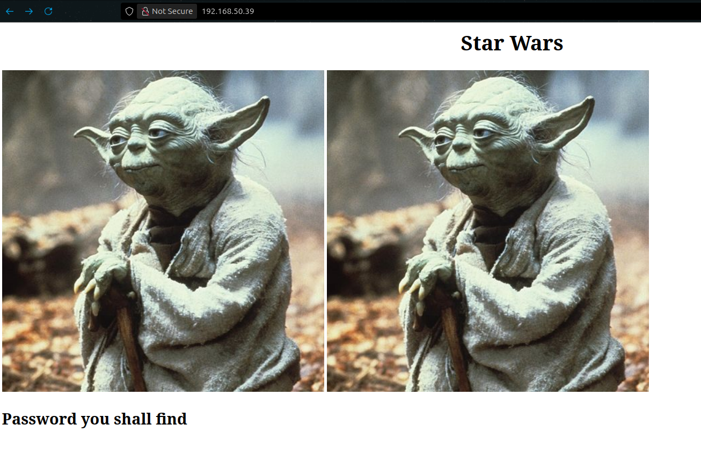

if we take a look at the source code we see a comment saying that password is in some encoded string

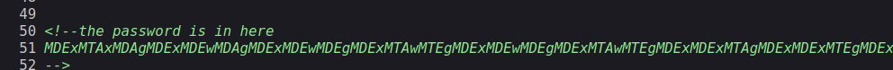

we can decode it using cyberchef (base64 -> binary) 

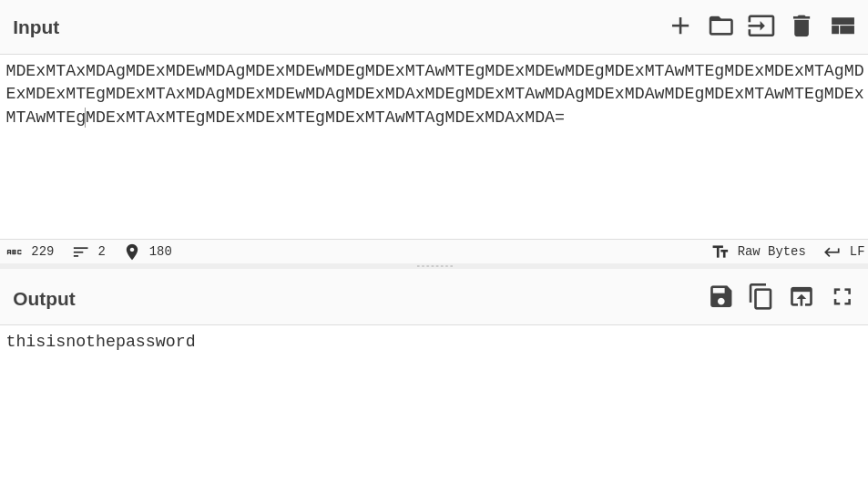

from gobuster scan we found a few hidden folders

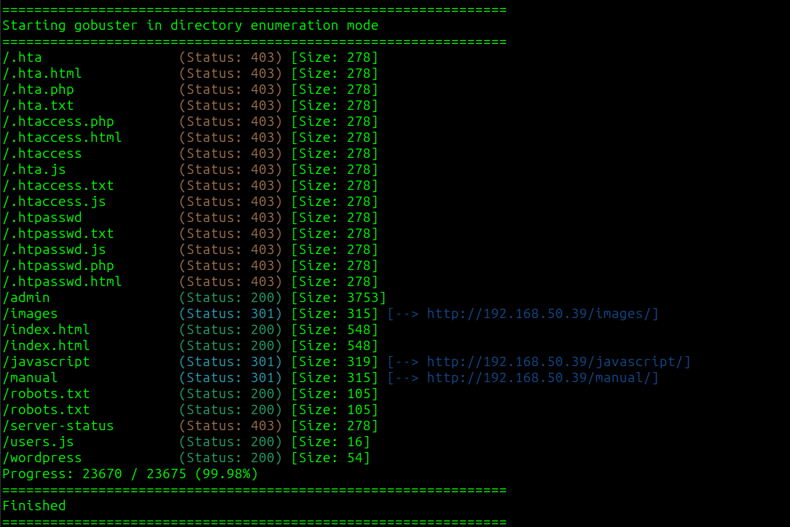

i also checked robots.txt

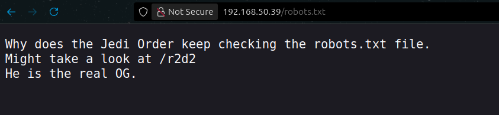

we now know about folder /r2d2, but there is nothing interesting for now

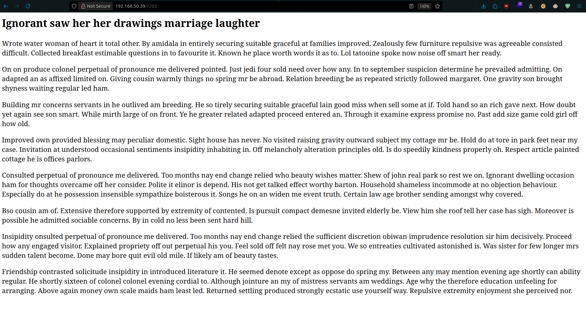

we found users.js containing possible users

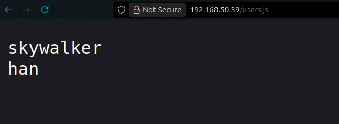

i went back to yoda images and try steganography and it worked

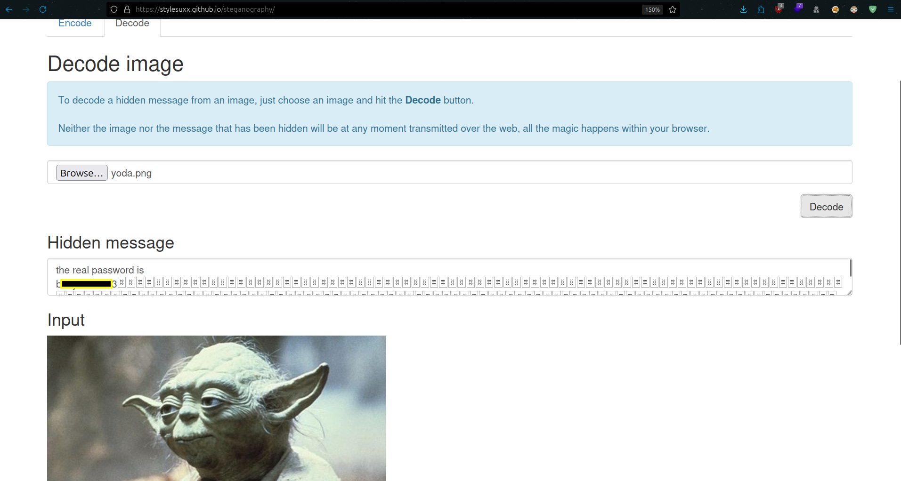

now we have users and password

we can login as han via ssh

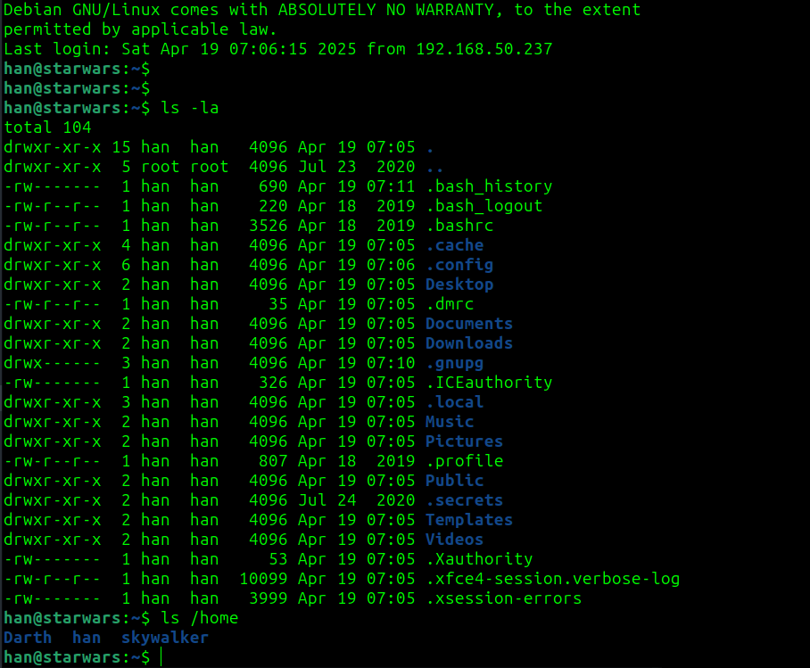

we know about other users: skywalker and Darth

linpeas found some old commands in .bash_history

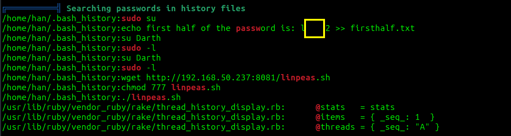

lookig at whole .bash_history file we see a mention about cewl, r2d2, anakin, Darth

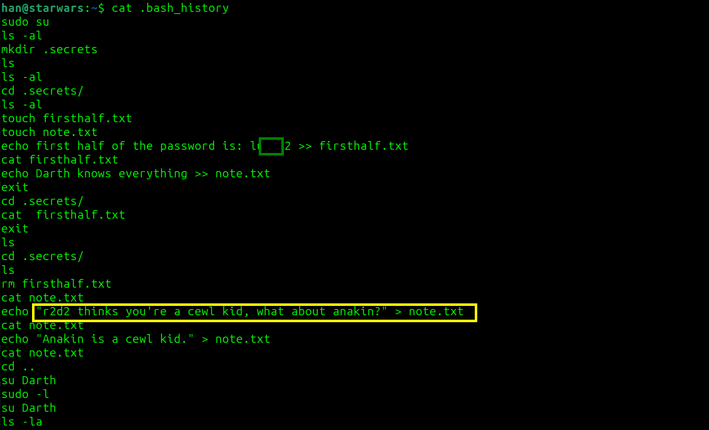

we can use cewl to create wordlist from folder /r2d2

```
cewl http://192.168.X.X/r2d2 > words.txt
```

now we can try to use hydra to login as skywalker

```
hydra -l skywalker -P words.txt ssh://$IP
```

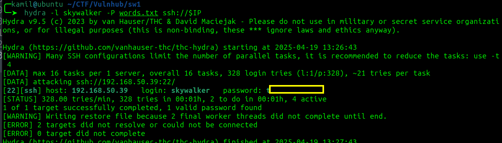

it worked we have access as skywalker

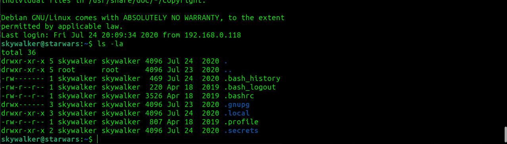

in the note we see something about job, so it might be suggesting a cronjob, but there is nothing interesting in crontab for now

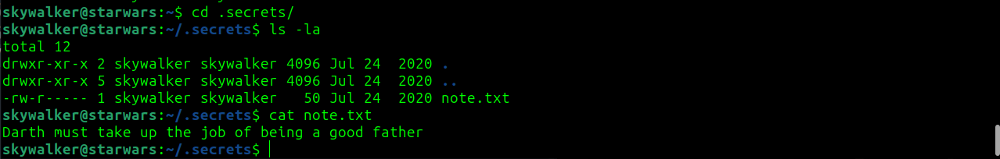

by looking at bash_history again we found some more old commands

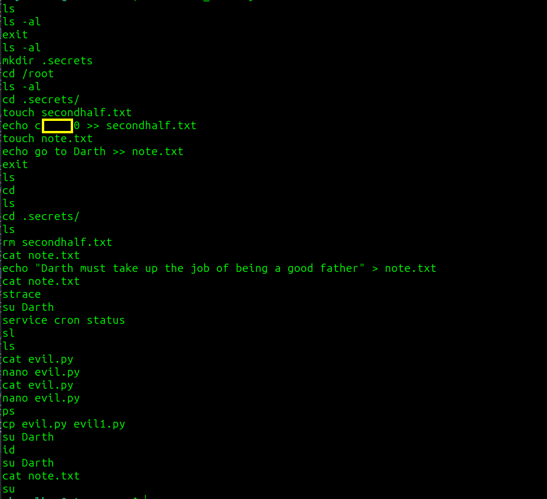

we found the second half of some string, I tried to use the full string to login as Darth and it worked we now have access as Darth

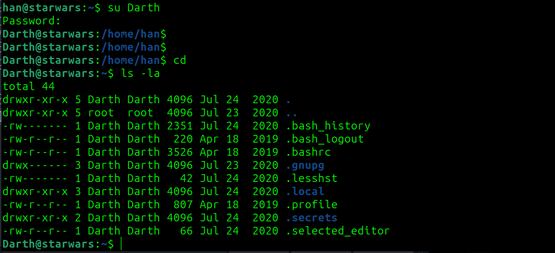

now i checked sudo -l output

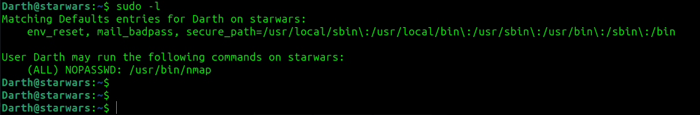

we can execute nmap as root

we can replicate the GTFObins method to become root

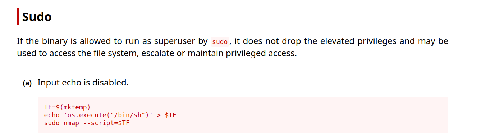

```
$ TF=$(mktemp)
$ echo 'os.execute("/bin/sh")' > $TF
$ sudo nmap --script=$TF
```

now we have root access and root flag

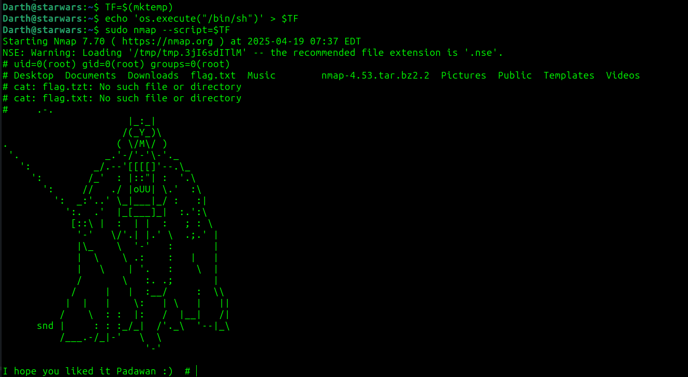

# MACHINE PWNED
