# The Planets: Mercury CTF - Vulnhub Machine
# **!! SPOILERS !!**
#### This repository documents my walkthrough for the **The Planets: Mercury** CTF challenge on [Vulnhub](https://www.vulnhub.com/entry/the-planets-mercury,544/). 
---

we see open ports 22 and 8080

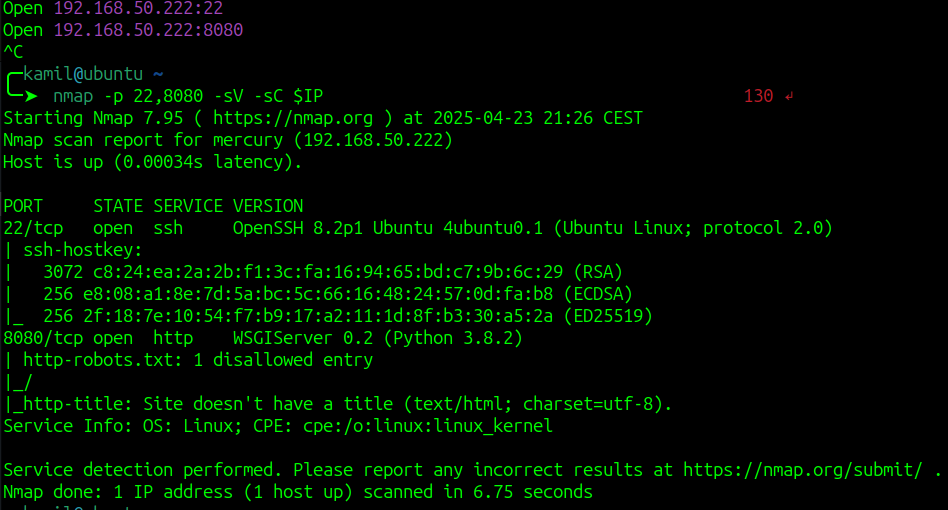

here is the main page

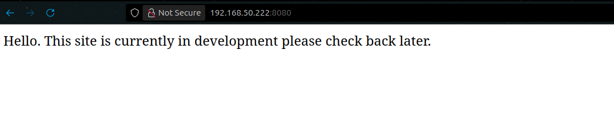

scanning for hidden directories doesnt seem to work

i first google exploits for `WSGIServer 0.2` and came across some command injection, i tried to replicate the request but i didnt work, however i found some directory in 404 error page: `mercuryfacts/`

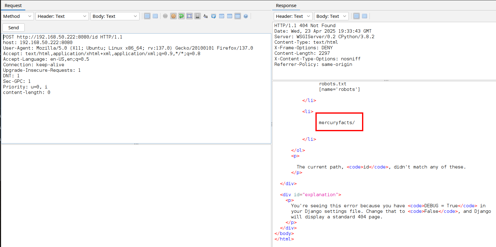

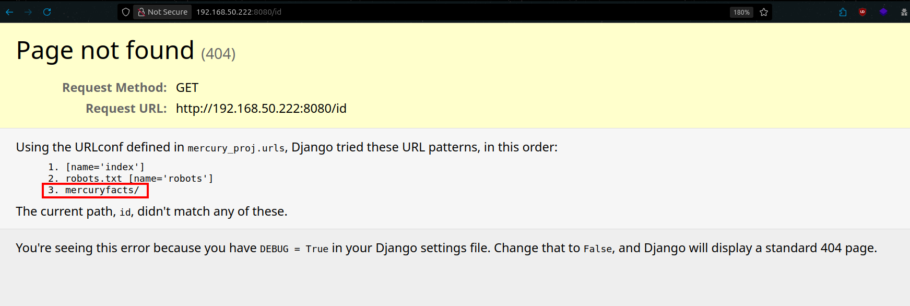

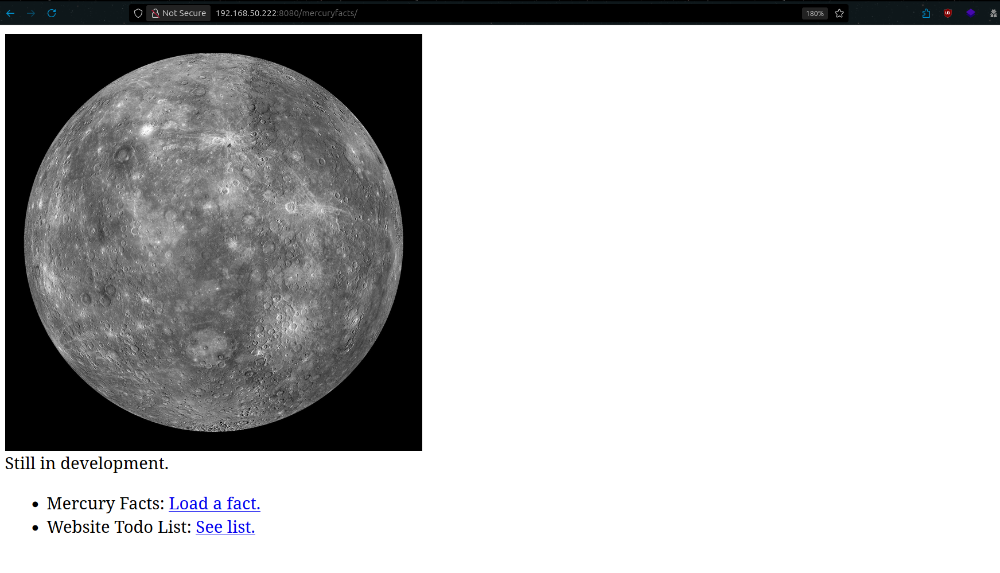

there is some load facts option that i tried to fuzz but found nothing interesting

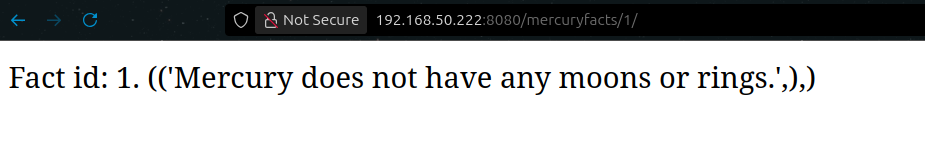

from simple todo message we know about possible sql calls and table `users`

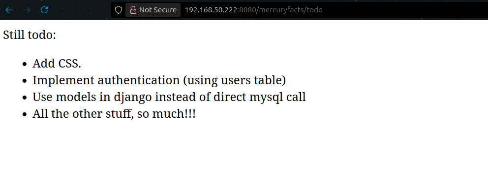

if we try simple sqli we got some error from django

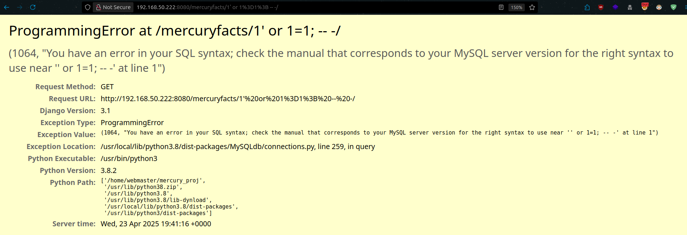

i used ZAP proxy to fuzz for possible SQLi and it worked we see that with some simple examples we dumped whole facts table

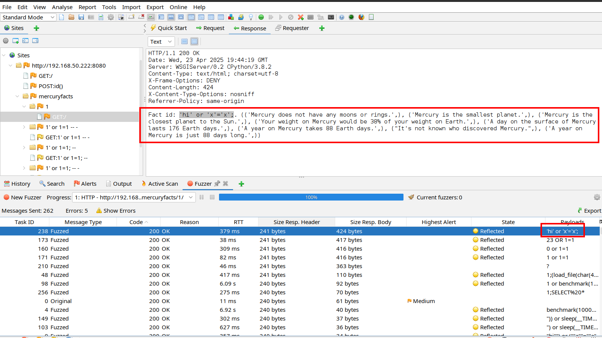

we can use sqlmap to dump tables

```
sqlmap -u "http://192.168.X.X:8080/mercuryfacts/1" --batch --dump
```

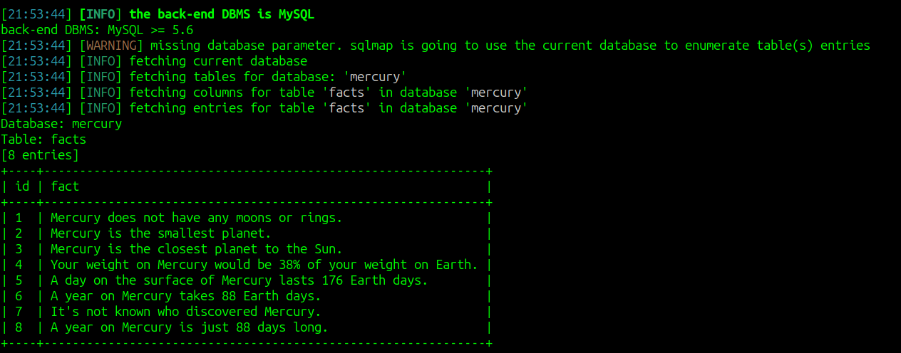

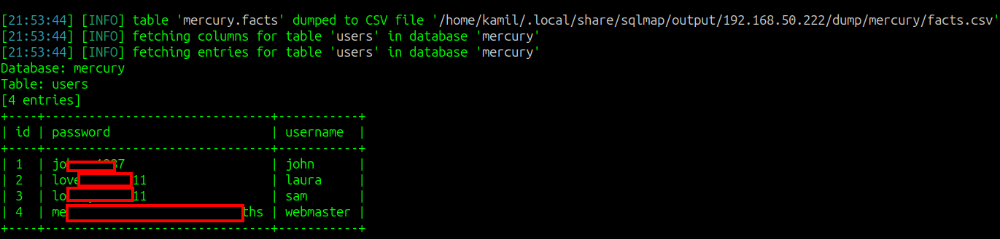

it worked and now we have some users and passwords

i tested the ssh login and we can login as webmaster and we got user flag

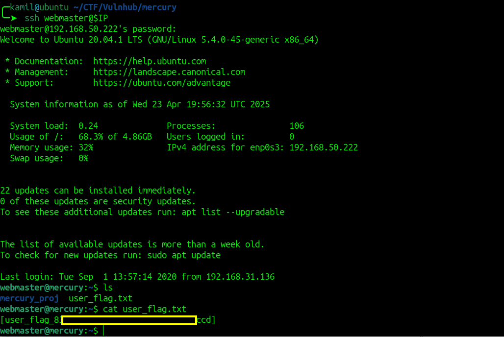

in /home/mercury_proj we can find notes.txt file which contains password for other user linuxmaster

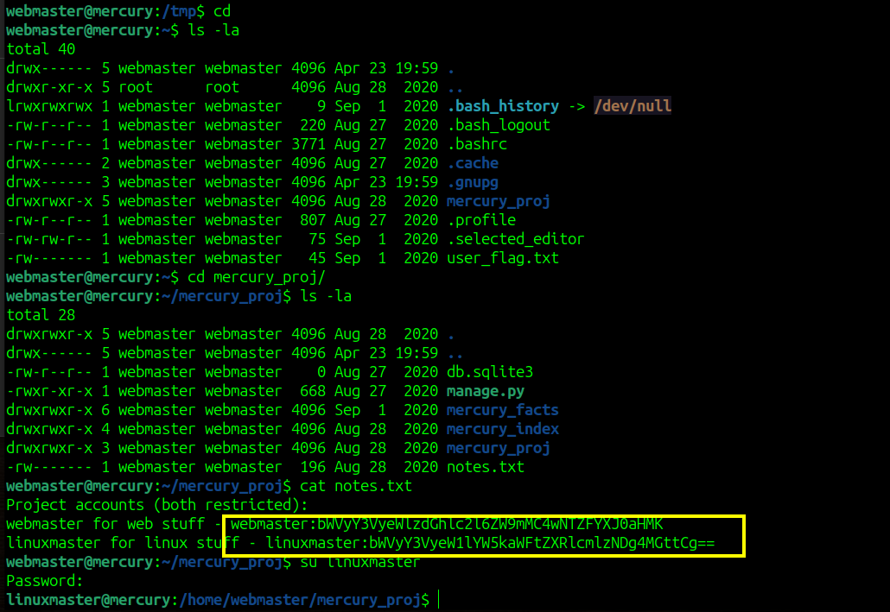

now as linuxmaster we can check sudo -l output

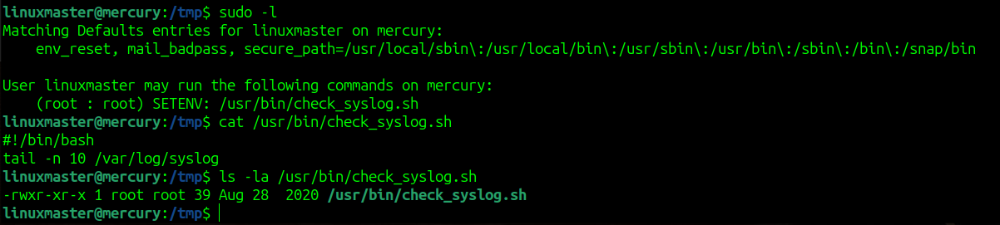

it is looking great, the script that we can run as sudo uses command tail, we also can modify the path for the script, so we can create malicious version of command tail to escalate to root

```
$ cd /tmp
$ mkdir tail
$ cd tail
$ nano tail

CONTENT OF TAIL:
---
#!/bin/bash 
cp /bin/bash /tmp/rootbash 
chmod +s /tmp/rootbash
---

$ chmod +x tail
$ sudo -u root PATH=/tmp/tail:$PATH /usr/bin/check_syslog.sh
$ /tmp/rootbash -p
```

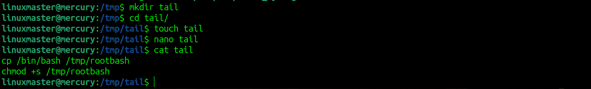

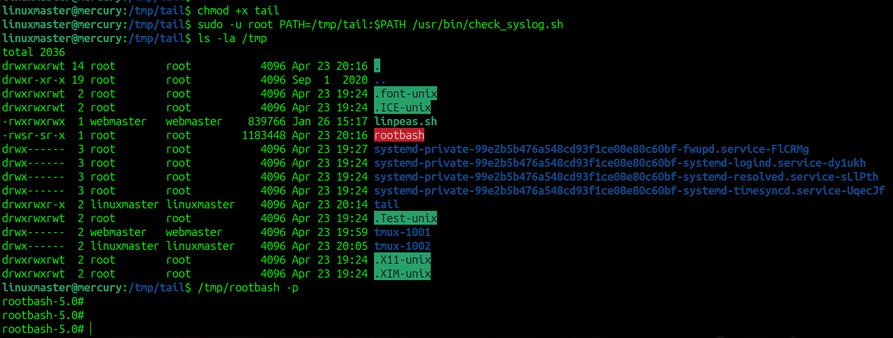

now we have root access and root flag 

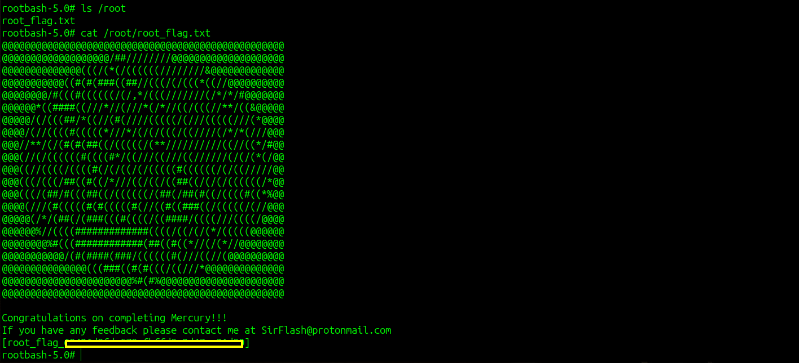

# MACHINE PWNED
